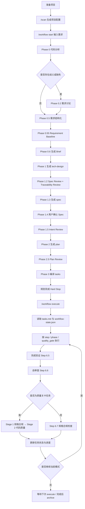
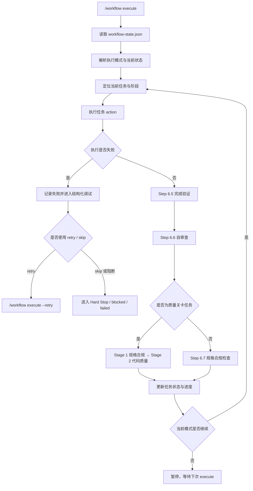

# Claude Code 工作流体系指南

> 以 `workflow` skill 为核心的 AI 编码工作流说明文档

**文档版本**：v10.3.0
**最后更新**：2026-03-26
**适用仓库**：`@justinfan/agent-workflow` v4.0.0

---

## 目录

- [1. 文档定位](#1-文档定位)
- [2. 安装与同步](#2-安装与同步)
- [3. workflow skill 总览](#3-workflow-skill-总览)
- [4. workflow 完整流程](#4-workflow-完整流程)
- [5. `/workflow start` 规划流程详解](#5-workflow-start-规划流程详解)
- [6. 规划侧 Review Loop 与治理关口](#6-规划侧-review-loop-与治理关口)
- [7. `/workflow execute` 执行流程详解](#7-workflow-execute-执行流程详解)
- [8. 运行中的辅助命令](#8-运行中的辅助命令)
- [9. 工作流产物与状态文件](#9-工作流产物与状态文件)
- [10. 其他 skills 的核心功能](#10-其他-skills-的核心功能)
- [11. 推荐使用方式](#11-推荐使用方式)
- [12. 常见问题](#12-常见问题)
- [附录：命令速查](#附录命令速查)

---

## 1. 文档定位

这份文档以 `workflow` skill 为重点，说明整个工作流体系中最核心、最推荐的使用方式：先通过 `workflow` 完成需求理解、需求追溯建模、规格沉淀、计划生成与任务执行，再按需接入其他专项 skill 完成 UI 还原、代码审查、调试、测试或批量缺陷处理。

如果只记一个入口，请记住下面这一组命令：

```bash
/workflow start "需求描述"
/workflow execute
/workflow status
/workflow delta
/workflow archive
```

其中：

- `start` 负责从需求进入规划。
- `execute` 负责按编排后的任务继续推进。
- `status` 负责查看当前进度和阻塞点。
- `delta` 负责处理需求变更、PRD 更新和 API 变更。
- `archive` 负责在完成后归档工作流。

整个体系的定位可以概括为一句话：`workflow` 负责主线，其他 skill 负责专项增强。

---

## 2. 安装与同步

本指南不再以 npm 全局安装为主，而是改为推荐直接克隆仓库后执行同步命令。

### 2.1 克隆项目

```bash
git clone <仓库地址> claude-workflow
cd claude-workflow
npm install
```

### 2.2 执行同步

首次安装推荐直接运行：

```bash
npm run sync
```

如果需要把 skill 同步到指定 Agent，可追加参数：

```bash
npm run sync -- -a claude-code,cursor
```

如果需要项目级安装：

```bash
npm run sync -- --project
```

如果需要无交互同步到所有已检测到的 Agent：

```bash
npm run sync -- -y
```

### 2.3 同步后你会得到什么

同步动作会完成以下事情：

1. 将模板内容写入 canonical 位置。
2. 为不同 AI 编码工具建立受管挂载。
3. 将 `skills` 逐个挂载到对应工具目录。
4. 将 `commands`、`prompts`、`utils`、`specs` 作为目录级资源提供给工具使用。

### 2.4 常用本地 CLI 调用方式

如果你是在仓库目录中本地使用 CLI，可以直接执行：

```bash
node bin/agent-workflow.js status
node bin/agent-workflow.js doctor
node bin/agent-workflow.js sync -a claude-code,cursor
```

### 2.5 推荐初始化顺序

完成同步后，推荐按下面顺序开始：

```bash
/scan
/workflow start "需求描述"
/workflow execute
```

其中 `/scan` 用于生成项目配置，能让后续 `workflow`、`bug-batch`、`figma-ui` 等 skill 获得稳定的项目信息。

---

## 3. workflow skill 总览

`workflow` 是整个体系的主控 skill，负责把“一个模糊需求”变成“可执行、可追踪、可恢复”的工作流。

它不是简单的任务清单生成器，而是一个包含以下能力的结构化执行系统：

- 需求分析与上下文检索
- 交互式需求澄清
- Requirement Baseline 建模
- Acceptance & Implementation Brief 生成
- 技术设计、Spec 与 Plan 沉淀
- 任务编排与执行模式控制
- 质量关卡、验证铁律与追溯守卫
- 状态持久化与恢复
- 增量变更处理
- 完成归档

### 3.1 workflow 的核心原则

`workflow` 当前版本不只是强调“把文档写完整”，而是强调 **Traceability-first**，也就是：原始需求必须在整个流程里持续可追溯。

这意味着：

- 长 PRD 不会直接被下游文档自由概括，而是会先归一化为 Requirement Baseline。
- 每条需求都需要明确范围状态，例如 `in_scope`、`partially_in_scope`、`out_of_scope`、`blocked`。
- 容易丢失的细节约束，例如按钮文案、字段名、表格列、命名规则、条件分支、数量限制、显隐规则，都需要被显式保留。
- `brief`、`tech-design`、`spec`、`plan`、`tasks` 都需要消费 baseline，而不是各自重新摘要原始 PRD。
- Spec Review 与 Plan Review 现在不仅检查结构完整性，也检查追溯完整性与关键约束保留情况。

### 3.2 workflow 的六层规划工件

| 层级 | 产物 | 作用 |
|------|------|------|
| 基线层 | `requirement-baseline.md` | 定义 requirement IDs、scope status、critical constraints，是需求真相源 |
| Brief 层 | `brief.md` | 将 baseline 编译为按模块组织的验收标准、测试模板与实现提示 |
| 设计层 | `tech-design.md` | 定义架构决策、边界、风险、技术约束，并体现 traceability |
| 规范层 | `spec.md` | 定义最终范围、行为、模块与验收映射 |
| 计划层 | `plan.md` | 定义实施顺序、原子步骤、验证要求 |
| 编排层 | `tasks.md` | 定义运行时任务、依赖推进、质量关卡，并保留 requirement 映射 |

### 3.3 workflow 的核心命令

```bash
/workflow start "需求描述"
/workflow start docs/prd.md
/workflow start --no-discuss docs/prd.md
/workflow start -f "覆盖已有流程"

/workflow execute
/workflow execute --retry
/workflow execute --skip

/workflow status
/workflow status --detail

/workflow delta
/workflow delta docs/prd-v2.md
/workflow delta "新增导出功能，支持 CSV"
/workflow delta packages/api/teamApi.ts

/workflow archive
```

### 3.4 什么时候优先使用 workflow

下面这几类场景优先使用 `workflow`：

- 新功能开发
- 复杂重构
- 多阶段交付
- 需要明确验收标准的需求
- 需要中断后继续推进的任务
- 存在 PRD 更新或 API 变化的增量需求
- 需求较长、约束较多、容易漏项的 PRD 场景

如果问题只是单个小 Bug、单个页面视觉还原或一次性代码审查，不一定要先进入 `workflow` 主线，可以直接使用对应专项 skill。

---

## 4. workflow 完整流程

下面这张图展示了从准备项目到完成归档的完整主线。



### 4.1 这条主线的关键特点

一是 `start` 不只是“列计划”，而是会生成多个中间工件。
二是 `Requirement Baseline` 成为下游所有文档共享的需求真相源，`Brief` 成为统一的执行派生视图。
三是 planning side 已显式区分 `machine_loop`、`human_gate` 与 `conditional_human_gate` 三类治理节点。
四是 `quality_review` 不再只是执行期审查动作，而是 shared review loop contract 的 execution adapter。
五是 `execute` 不只是“执行下一个待办”，而是带有执行模式、质量门控、失败重试和追溯守卫。
六是整个过程可中断、可恢复、可增量更新，不依赖单次对话记忆。

---

## 5. `/workflow start` 规划流程详解

`/workflow start` 的目标，是把原始需求编译为后续可执行的任务体系。

### 5.1 典型输入形式

```bash
/workflow start "实现多租户权限管理"
/workflow start docs/prd.md
/workflow start --no-discuss docs/prd.md
/workflow start -f "重新生成已有工作流"
```

### 5.2 start 阶段总览

| 阶段 | 名称 | 作用 | 主要输出 | 是否可能停顿 |
|------|------|------|----------|--------------|
| Phase 0 | 代码分析 | 理解现有代码、依赖、约束与风险面 | 上下文分析结果 | 否 |
| Phase 0.2 | 需求讨论 | 澄清歧义、确认互斥方案、补足关键缺失信息 | discussion artifact | 可能 |
| Phase 0.5 | 需求结构化 | 将自然语言整理为结构化 requirement items 草案 | requirement items 草案 | 否 |
| Phase 0.55 | Requirement Baseline | 生成需求真相源、scope 状态与关键约束基线 | `requirement-baseline.md` | 否 |
| Phase 0.6 | Acceptance & Implementation Brief | 将 baseline 编译为面向执行的验收与实现摘要 | `brief.md` | 否 |
| Phase 1 | 技术设计 | 输出架构边界、模块拆分、风险与技术约束 | `tech-design.md` | 视情况而定 |
| Phase 1.2 | Spec Review + Traceability Review | 检查设计质量、需求覆盖率、追溯链路与关键约束保留情况 | 审查结论 | 是 |
| Phase 1.3 | Spec Generation | 生成正式规格文档，沉淀范围、行为与验收映射 | `spec.md` | 否 |
| Phase 1.4 | User Spec Review | 用户确认范围、模块行为与验收映射 | spec review result | 是 |
| Phase 1.5 | Intent Review | 再次确认变更方向、实施意图与需求理解没有偏航 | intent review result | 是 |
| Phase 2 | Plan Generation | 基于 baseline / brief / spec 生成实施计划 | `plan.md` | 否 |
| Phase 2.5 | Plan Review | 审查计划粒度、覆盖率、依赖关系与可执行性 | 审查结论 | 是 |
| Phase 3 | Task Compilation | 编译运行时任务、依赖推进关系与质量关卡 | `tasks.md` | 是 |

### 5.3 Phase 0：代码分析

这一阶段会围绕当前需求做代码库检索，目标不是立刻给方案，而是识别：

- 相关模块在哪里
- 现有实现模式是什么
- 依赖和约束有哪些
- 哪些地方会成为风险点

如果项目还没执行 `/scan`，通常应先完成扫描，以便 `workflow` 获得更稳定的项目上下文。

### 5.4 Phase 0.2：需求讨论

当系统识别到需求存在模糊点、缺失项或互斥实现路径时，会进入交互式需求讨论。

这一阶段的特点是：

- 一次只澄清一个关键问题
- 优先给出可选择的方案
- 讨论结果不会覆盖原始需求，而是单独持久化为工件
- 可以通过 `--no-discuss` 显式跳过

适合在下面几类场景启用：

- 需求只说了目标，没有说边界
- 存在多个实现路径，需要用户确认
- 需求与现有代码约束之间有明显冲突

### 5.5 Phase 0.5：需求结构化

在需求讨论之后，系统会把自然语言需求转成更稳定的 requirement items 草案。这个阶段的重点是从原始 PRD 中拆出真正可追踪的需求单元，而不是只保留抽象摘要。

这一层通常会开始显式区分：

- 功能要求
- 交互要求
- 展示要求
- 数据要求
- 外部依赖
- 约束与例外情况

### 5.6 Phase 0.55：Requirement Baseline

这是本轮最新变更中最重要的升级点之一。

在需求结构化之后，`workflow` 会自动生成 Requirement Baseline，用于把需求正式冻结成后续工件共享的真相源。

它通常包含以下信息：

- Requirement IDs：每条需求的稳定编号
- Scope Classification：`in_scope / partially_in_scope / out_of_scope / blocked`
- Critical Constraints：容易在后续文档中丢失的细节约束
- Ownership：frontend / backend / shared / infra 的归属
- Traceability Source：供 `brief`、`tech-design`、`spec`、`plan`、`tasks` 统一消费的来源

可以把它理解为：从这一层开始，后续所有文档都不应该再“自由发挥式理解 PRD”，而应该显式引用 baseline。

### 5.7 Phase 0.6：Acceptance & Implementation Brief

这一阶段不再拆成“验收清单”和“实现指南”两份独立文档，而是统一生成一个 `brief.md`，把两者整合为同一份面向执行的开发派生视图。

Brief 的核心价值是：按模块组织 requirement coverage，并同时提供验收标准、测试模板和实现提示。典型内容包括：

- requirement-to-brief mapping
- 按模块聚合的 `relatedRequirementIds`
- 每个模块必须保留的 constraints
- 验收标准与 checks
- unit / integration / e2e 测试模板
- implementation hints 与质量门禁
- partially covered / uncovered requirements 标记

这样做的结果是，后续 `tech-design`、`spec`、`plan` 和执行阶段都消费同一份 Brief，而不是在“用户视角文档”和“开发者视角文档”之间来回切换。

### 5.8 Phase 1 到 Phase 3：从设计到任务编排

这是 `workflow` 真正把需求编译为任务系统的核心部分：

1. 先生成 `tech-design.md`，明确边界、模块、风险和关键决策，并体现 traceability。  
2. 再通过 `Spec Review + Traceability Review` 检查结构完整性、需求覆盖、scope decision 显式性与关键约束保留情况。  
3. 然后生成用户友好的 `spec.md`，并进入用户确认。  
4. 接着在 `intent review` 中确认当前变更方向没有偏离。  
5. 再基于 `baseline + brief + spec` 生成 `plan.md`。  
6. 最后通过 `plan review` 和任务编译得到 `tasks.md`，并将 requirement IDs、约束信息和质量关卡一起带入运行时任务。

### 5.9 start 阶段的几个 Hard Stop

`workflow` 在规划期间不会一路静默到底，而是会在关键节点停下来等待确认。当前主线里最关键的 Hard Stop 包括：

- Phase 1.4：用户确认 Spec
- Phase 1.5：Intent Review（仅命中条件时进入人工确认）
- Phase 3 完成后：规划完成 Hard Stop

这样做的目的，是防止需求偏差、范围漂移和任务拆分问题在执行阶段才暴露出来。

---

## 6. 规划侧 Review Loop 与治理关口

本次版本更新后，`workflow` 的 planning side 不再把所有审查节点都视为同一种“review”。而是显式区分为三类：

| 节点 | 类型 | 作用 | 状态落点 |
|------|------|------|----------|
| Phase 1.2 Spec / Traceability Review | `machine_loop` | 在预算内执行 review → revise → re-review，收敛设计质量与追溯完整性 | `review_status.spec_review` / `review_status.traceability_review` |
| Phase 1.4 User Spec Review | `human_gate` | 由用户确认范围、模块边界和方向主权，不参与自动收敛 | `review_status.user_spec_review` |
| Phase 1.5 Intent Review | `conditional_human_gate` | 先执行机器一致性检查，只有命中风险条件时才进入人工关口 | `review_status.intent_review` |
| Phase 2.5 Plan Review | `machine_loop` | 在预算内循环修订计划，直到通过或耗尽预算 | `review_status.plan_review` |

### 6.1 为什么要这样拆分

这样拆分后，planning side 的语义变得更清晰：

- `machine_loop` 负责在限定预算内自动收敛文档质量
- `human_gate` 负责表达用户主权决策，不自动修文
- `conditional_human_gate` 先做机器判断，只在真正高风险时打断用户

### 6.2 execution side 如何对齐

执行阶段的 `quality_review` 也已经对齐到同一套 shared review loop contract，但它是 execution adapter，而不是 planning 节点本身。

这意味着：

- planning side 的结果写入 `review_status.*`
- execution side 的结果写入 `quality_gates.*`
- 两边共享 `subject / attempt / max_attempts / last_decision / next_action / overall_passed` 等语义

### 6.3 数据契约上的关键变化

这轮变更后，文档里还同步强调了两个运行时字段：

- Traceability mapping 使用 `acceptance_ids`，不再使用旧的 `brief_ids`
- `WorkflowTaskV2` 使用 `critical_constraints`，不再使用旧的 `constraints`

这样可以保证 traceability、task compilation、quality review 与状态机文档的命名一致。

---

## 7. `/workflow execute` 执行流程详解

`/workflow execute` 的目标，是读取当前工作流状态，定位下一批可执行任务，并按照执行模式、验证铁律、规格合规检查与质量关卡规则推进。

### 7.1 基本调用方式

```bash
/workflow execute
/workflow execute --retry
/workflow execute --skip
```

### 7.2 execute 的核心运行逻辑



### 7.3 执行模式

`execute` 支持多种推进模式，默认是按阶段推进。

| 模式 | 含义 | 适合场景 |
|------|------|----------|
| `step` | 只执行一个任务 | 需要精细控制变更节奏 |
| `phase` | 执行当前阶段全部任务 | 常规开发推进，默认模式 |
| `quality_gate` | 连续执行到下一个质量关卡或 `git_commit` 任务 | 希望先完成一段实现再集中审查 |
| `retry` | 重试失败任务 | 修复后再次推进 |
| `skip` | 跳过当前任务 | 明确不需要执行该任务时 |

### 7.4 自然语言控制映射

在实际对话中，常见表达会自动映射为不同模式：

| 用户表达 | 系统理解 |
|----------|----------|
| “单步执行” | `step` |
| “继续” / “下一阶段” | `phase` |
| “连续” / “执行到质量关卡” | `quality_gate` |
| “重试” | `retry` |
| “跳过” | `skip` |

### 7.5 任务阶段划分

运行时任务会按阶段组织，常见阶段如下：

| 阶段 | 说明 |
|------|------|
| `design` | 接口设计、类型与架构落地 |
| `infra` | 基础设施、工具函数、store、守卫 |
| `ui-layout` | 页面骨架、布局、路由 |
| `ui-display` | 列表、卡片、表格等展示组件 |
| `ui-form` | 表单、弹窗、输入和交互组件 |
| `ui-integrate` | 组件装配、状态连接、页面集成 |
| `test` | 单元测试、集成测试、用例补齐 |
| `verify` | 验证、审查、质量门控 |
| `deliver` | 交付收尾、文档、提交准备 |

除了阶段划分本身，当前版本还要求任务尽可能保留 `requirement_ids` 与关键约束映射，这样执行阶段才能回答“当前任务在实现哪条需求”。

### 7.6 验证铁律与质量关卡机制

这是 `workflow execute` 最关键的质量控制环节。

首先，Step 6.5 引入了验证铁律：**没有新鲜验证证据，不得把任务标记为 completed。** 也就是说，任务执行完成后，必须有对应的测试、命令结果或结构化验证证据，才能继续推进。

在此基础上，Step 6.6 会执行一次非阻塞自审查，检查完整性、正确性、质量、安全性和与设计的一致性；随后进入 Step 6.7 或质量关卡分支。

如果当前任务是 `quality_review` 类型，则会触发两阶段审查，并共享总预算：

| 阶段 | 重点 | 执行角色 |
|------|------|----------|
| Stage 1 | 规格合规、需求覆盖、关键约束对齐、验收项覆盖 | 当前主会话 |
| Stage 2 | 代码质量、架构、测试质量、安全、可维护性 | reviewer 子 agent |

两个阶段共享 **4 次总尝试预算**。只有 Stage 1 通过后，Stage 2 才能启动。

审查问题通常会被分为三类：

- `Critical`：阻断问题，必须修复
- `Important`：高优先级问题，应尽快修复
- `Minor`：建议优化项

### 7.7 失败重试与结构化调试

当某个任务失败时，不建议直接机械重跑。`workflow` 的期望处理方式是：

1. 先定位根因。  
2. 再分析是否是模式性错误。  
3. 然后验证修复假设。  
4. 最后执行修复并重试。

如果连续失败次数过多，会触发更强的停止条件，避免错误被无限放大。`--retry` 本质上就是在结构化调试之后重新推进当前失败任务，而不是简单重复上一条命令。

### 7.8 追溯守卫

这是最新版本在执行阶段新增的一个重要理解方式。

所谓追溯守卫，指的是任何执行任务或质量关卡，都应该能回溯到 requirement IDs 与 critical constraints。它要解决的不是“代码写没写出来”，而是“写出来的东西是否仍然对着最初那条需求”。

在实际理解里，可以把它拆成三个检查点：

- 当前任务对应哪些 requirement IDs
- 当前实现是否覆盖了这些 requirement 的核心行为
- baseline 中记录的关键约束是否在实现或验证中被保留

### 7.9 子 Agent 路由

执行阶段的子 agent 仅通过平台路由还不够；当需要并行分派多个独立问题域时，还必须先读取并应用 `../skills/dispatching-parallel-agents/SKILL.md`，把独立性检查、上下文边界分组、最小上下文封装、结果回收和冲突降级统一下沉到该 skill。

- Claude Code / Cursor：适合子 agent 并行执行独立任务
- Codex：可映射到对应的 agent 执行模式
- 不支持子 agent 的平台：回退为当前会话顺序执行

启用并行的前提是：同阶段存在 2 个及以上独立任务、任务之间没有共享状态、不会同时编辑同一组文件。

### 7.10 execute 阶段的最佳节奏

更推荐的节奏不是一次性把所有事情做完，而是：

- 用 `start` 先把规划做对
- 用 `execute` 一段一段推进
- 在质量关卡或关键阶段主动确认
- 失败时优先用 `retry` 而不是手工偏离流程
- 遇到需求变化时优先回到 `delta`，而不是直接绕过上游工件修改实现

---

## 8. 运行中的辅助命令

### 8.1 `/workflow status`

用于查看当前工作流状态、当前阶段、当前任务、失败记录和质量关卡状态。

```bash
/workflow status
/workflow status --detail
```

适用场景：

- 新对话中恢复上下文
- 不确定当前推进到哪里
- 想确认是否已进入阻塞或失败状态
- 想查看当前任务对应的阶段、关卡和推进状态

### 8.2 `/workflow delta`

用于处理“已经在进行中的工作流”发生了新增需求或外部变化的情况。

```bash
/workflow delta
/workflow delta docs/prd-v2.md
/workflow delta "新增导出功能，支持 CSV"
/workflow delta packages/api/teamApi.ts
```

适合下面几类变化：

- PRD 更新
- API 同步
- 中途增加功能点
- 外部依赖变化导致原计划失效

在新版工作流中，`delta` 的意义更强了，因为它不仅要更新任务，还要保证 baseline、spec、plan、tasks 的追溯链路继续成立。

### 8.3 `/workflow archive`

当工作流已经完成并确认不再继续推进时，可以归档：

```bash
/workflow archive
```

归档的意义在于：

- 清理当前活跃工作流
- 保留历史轨迹和上下文
- 为下一个需求建立干净的执行环境

---

## 9. 工作流产物与状态文件

### 9.1 项目目录中的关键产物

| 路径 | 作用 |
|------|------|
| `.claude/config/project-config.json` | 项目配置，由 `/scan` 生成 |
| `.claude/analysis/{name}-requirement-baseline.md` | 需求基线文档，记录 requirement IDs、scope 与关键约束 |
| `.claude/acceptance/{name}-brief.md` | Acceptance & Implementation Brief，按模块组织验收标准、测试模板与实现提示 |
| `.claude/tech-design/{name}.md` | 技术设计文档 |
| `.claude/specs/{name}.md` | 规格文档 |
| `.claude/plans/{name}.md` | 实施计划 |

### 9.2 用户级运行时产物

| 路径 | 作用 |
|------|------|
| `~/.claude/workflows/{projectId}/workflow-state.json` | 工作流当前状态 |
| `~/.claude/workflows/{projectId}/discussion-artifact.json` | 需求讨论结果 |
| `~/.claude/workflows/{projectId}/requirement-baseline.json` | requirement items 的运行时 JSON 表示 |
| `~/.claude/workflows/{projectId}/tasks-{name}.md` | 任务编排结果 |
| `~/.claude/workflows/{projectId}/changes/{changeId}/` | 增量变更工件 |
| `~/.claude/workflows/{projectId}/archive/` | 已归档历史记录 |

### 9.3 常见状态机

| 状态 | 含义 |
|------|------|
| `planned` | 规划完成，等待执行 |
| `spec_review` | 已到规格确认节点 |
| `intent_review` | 已到意图审查节点 |
| `running` | 正在执行 |
| `paused` | 暂停，等待用户或外部动作 |
| `blocked` | 被外部依赖阻塞 |
| `failed` | 任务失败 |
| `completed` | 全部任务完成 |
| `archived` | 工作流已归档 |

### 9.4 为什么状态文件很重要

这套状态文件机制的作用，不只是“记住做到哪一步了”，更重要的是：

- 可以在新对话中恢复工作流
- 可以区分规划态、执行态、阻塞态和完成态
- 可以支持 `delta` 做增量改动
- 可以让 `execute` 不是盲目继续，而是按状态机继续
- 可以把 baseline、任务与执行状态连接起来，维持追溯链路

---

## 10. 其他 skills 的核心功能

下面这些 skill 都很重要，但在整个体系里它们更像专项能力，通常围绕 `workflow` 主线按需使用。

### 10.1 总览

| Skill | 核心功能 | 典型使用时机 | 与 workflow 的关系 |
|------|----------|--------------|--------------------|
| `/scan` | 扫描技术栈，生成项目配置与上下文 | 新项目接入前 | `workflow` 的前置准备 |
| `/analyze` | 双模型技术分析，不直接改代码 | 架构分析、性能分析、方案对比 | 规划前的分析增强 |
| `/debug` | 单问题调试与修复流程 | 单个缺陷定位与修复 | 可独立使用，也可作为执行补充 |
| `/diff-review` | 基于 diff 的结构化审查 | 提交前、PR 前、修复后 | 是 `workflow` 质量关卡之外的专项审查 |
| `/write-tests` | 编写和补齐测试 | 需要新增测试或提高覆盖率 | 可作为 `test` 阶段补充 |
| `/figma-ui` | 从 Figma 设计稿实现 UI | 设计稿还原开发 | 偏视觉实现，不替代 `workflow` 主线 |
| `/visual-diff` | 页面与设计稿视觉对比 | UI 完成后的还原度验证 | 常与 `figma-ui` 配套 |
| `/bug-batch` | 批量缺陷拉取、诊断、分组修复 | 清理积压缺陷 | 是面向缺陷治理的独立流程 |

### 10.2 各 skill 的一句话理解

`/scan`：解决“项目是什么、技术栈是什么、配置在哪里”的问题。  
`/analyze`：解决“先分析，不急着动代码”的问题。  
`/debug`：解决“我已经知道这是个 Bug，要系统修”的问题。  
`/diff-review`：解决“我要看这次改动是否安全、是否合理”的问题。  
`/write-tests`：解决“要把验证补齐并形成可回归的测试资产”的问题。  
`/figma-ui`：解决“把设计稿还原成代码”的问题。  
`/visual-diff`：解决“还原结果到底像不像设计稿”的问题。  
`/bug-batch`：解决“不是一个 Bug，而是一批 Bug 需要统筹处理”的问题。

---

## 11. 推荐使用方式

如果你准备把这套体系真正用起来，推荐遵循下面这条主线。

### 11.1 新功能开发

```bash
/scan
/workflow start "需求描述或 PRD 路径"
/workflow execute
/workflow status
/workflow execute
/workflow archive
```

### 11.2 长 PRD 或复杂需求开发

如果输入是一份较长 PRD，或者包含大量业务规则、字段和边界条件，更推荐让 `workflow` 完整走过 baseline 主线：

```bash
/scan
/workflow start docs/prd.md
/workflow status
/workflow execute
```

这一类场景下，真正重要的不只是生成计划，而是先把 Requirement Baseline 建好，避免后面出现“文档看起来完整，但关键需求漏掉了”的问题。

### 11.3 UI 需求开发

如果任务核心是业务功能，同时又有设计稿：

```bash
/scan
/workflow start "页面功能需求"
/workflow execute
/figma-ui "Figma URL"
/visual-diff http://localhost:3000/page --design ./design.png
```

这里的建议是：业务逻辑和任务推进仍由 `workflow` 主导，视觉还原由 `figma-ui` 与 `visual-diff` 处理。

### 11.4 需求变更

```bash
/workflow status
/workflow delta docs/prd-v2.md
/workflow execute
```

不要在已有工作流中绕开 `delta` 直接硬改，因为这会让 `baseline`、`spec`、`plan`、`tasks` 和实际执行状态失去同步。

### 11.5 单点问题处理

如果不是复杂需求，而只是明确的单点问题：

- 单 Bug：优先 `/debug`
- 单次审查：优先 `/diff-review`
- 单次分析：优先 `/analyze`
- 单次补测：优先 `/write-tests`

---

## 12. 常见问题

### 12.1 为什么推荐先 `/scan`

因为很多 skill 都依赖项目配置。没有配置时，虽然部分能力仍可工作，但效果通常不稳定，也更容易丢失上下文边界。

### 12.2 `workflow` 和其他 skill 的关系是什么

可以理解为：`workflow` 是主线编排器，其他 skill 是专项工具箱。

### 12.3 为什么现在多了 Requirement Baseline

因为长 PRD 场景下，最常见的问题不是“没有计划”，而是“需求被下游文档悄悄丢失”。Requirement Baseline 的作用就是把需求先冻结成统一真相源，让后续 `brief`、`tech-design`、`spec`、`plan`、`tasks` 都围绕同一份 requirement items 工作。

### 12.4 什么时候应该用 `delta`

当需求、PRD、接口、外部依赖在执行过程中发生变化时，就应该优先使用 `delta`，而不是跳过规划层直接改实现。

### 12.5 什么时候应该用 `archive`

当一个工作流已经完成、确认不再继续推进，或者你要开始一个新的独立需求时，应该归档当前工作流。

### 12.6 如果执行失败怎么办

优先使用 `/workflow execute --retry`，并结合结构化调试思路定位根因；如果问题本质上是单个缺陷，也可以切换到 `/debug` 处理后再回到主线。

### 12.7 Traceability Review 在检查什么

它不只检查“文档写没写完”，更检查三件事：需求是否被覆盖、范围状态是否明确、关键约束是否在下游文档中被保留下来。

---

## 附录：命令速查

### A. 安装与同步

```bash
git clone <仓库地址> claude-workflow
cd claude-workflow
npm install
npm run sync
npm run sync -- -a claude-code,cursor
npm run sync -- --project
```

### B. workflow 主线命令

```bash
/workflow start "需求描述"
/workflow start docs/prd.md
/workflow start --no-discuss docs/prd.md

/workflow execute
/workflow execute --retry
/workflow execute --skip

/workflow status
/workflow status --detail

/workflow delta
/workflow delta docs/prd-v2.md
/workflow delta "新增导出功能，支持 CSV"

/workflow archive
```

### C. 其他常用 skills

```bash
/scan
/analyze "分析某个模块的架构风险"
/debug "某个功能报错或异常现象"
/diff-review --branch main
/write-tests "为某个模块补测试"
/figma-ui "Figma URL"
/visual-diff http://localhost:3000/page --design ./design.png
/bug-batch <经办人>
```

---

如果你把这份指南只保留一条主线结论，那么应该是：先用 `/scan` 建立项目上下文，再用 `workflow` 完成从需求到交付的主流程，并通过 Requirement Baseline 与 Traceability Review 保证需求不会在规划和执行过程中丢失，最后根据具体问题接入专项 skill 做增强。
