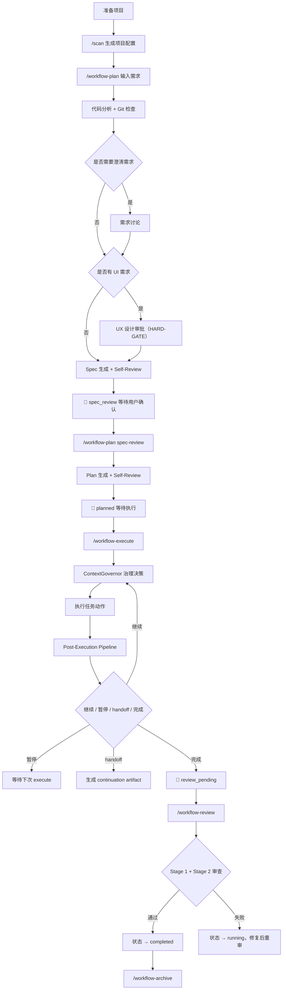
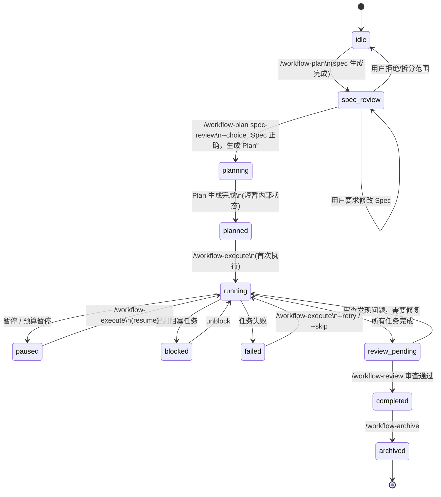
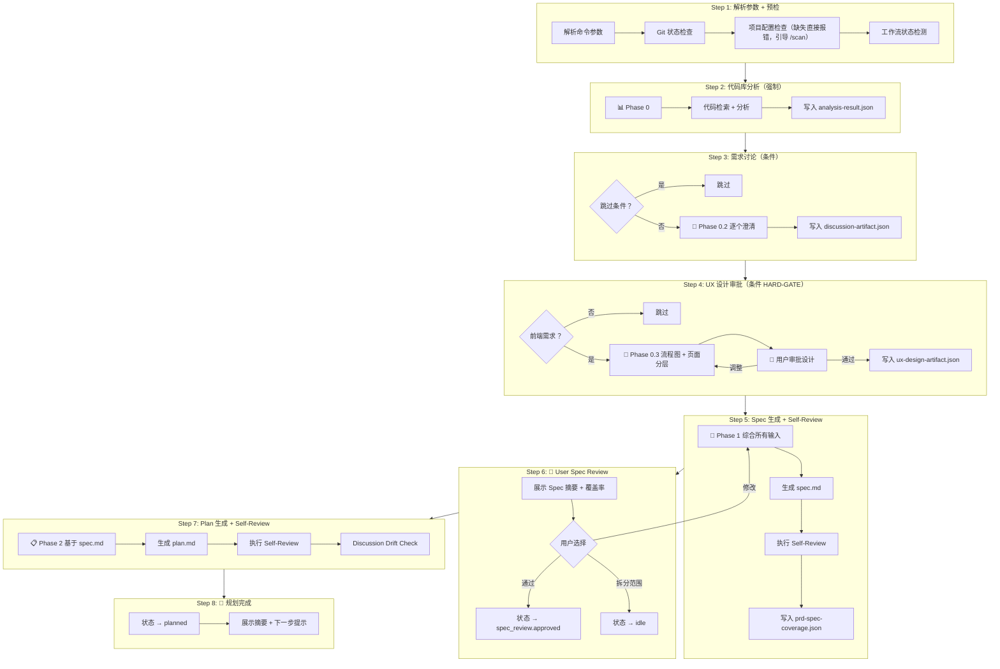
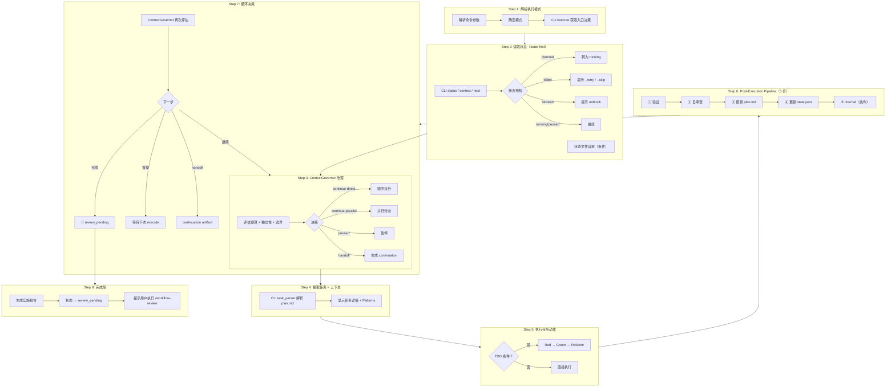
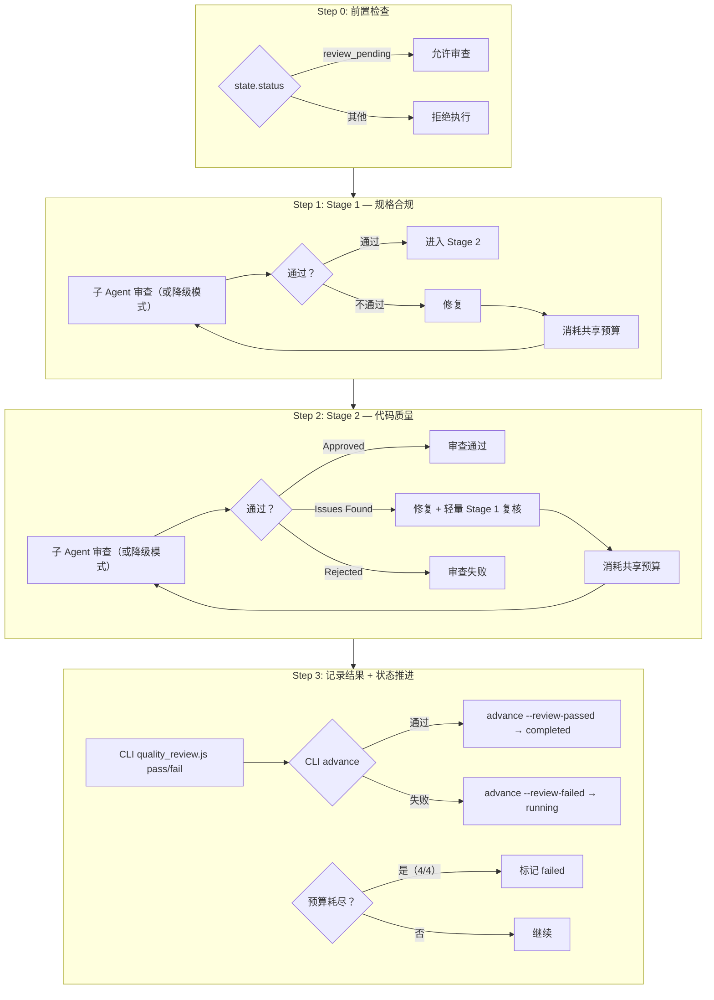
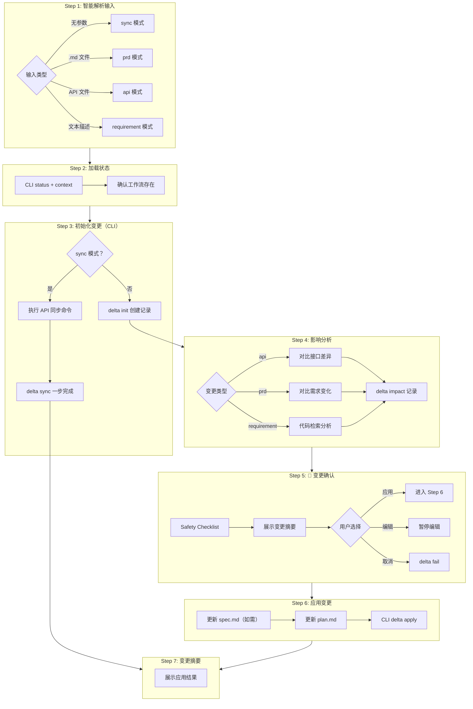
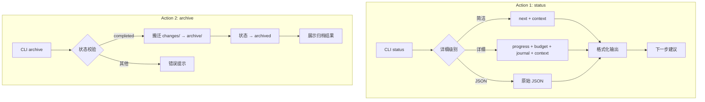
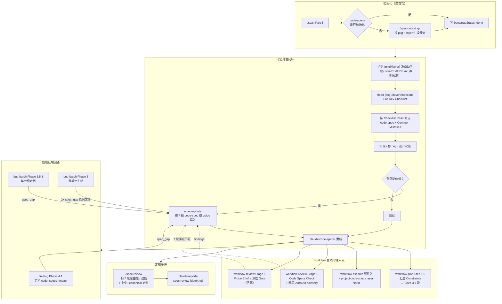
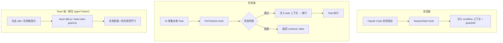

# Claude Code 工作流体系指南

> 以 `workflow` command 入口为核心的 AI 编码工作流说明文档

**文档版本**：v15.4.0  
**最后更新**：2026-04-25  
**适用仓库**：`@justinfan/agent-workflow`

---

## 目录

- [1. 文档定位](#1-文档定位)
- [2. 安装与同步](#2-安装与同步)
- [3. Workflow](#3-workflow)
- [4. Code Specs](#4-code-specs)
- [5. 其他 Skills](#5-其他-skills)
- [6. Hooks 流程控制](#6-hooks-流程控制)
- [7. 推荐使用方式](#7-推荐使用方式)
- [8. 常见问题](#8-常见问题)
- [附录：命令速查](#附录命令速查)

---

## 1. 文档定位

这份文档说明当前仓库中的 `workflow` 主线能力，以及它与其他专项 skill 的配合方式。

当前版本的核心目标不是堆叠更多中间文档，而是把需求稳定压缩成两层可消费规划工件：

- `spec.md`：统一承载范围、设计、约束、验收标准与实施切片
- `plan.md`：可直接执行的原子步骤、文件清单和验证命令

之后再进入执行层，由验证铁律和 `ContextGovernor` 控制执行质量与上下文预算；执行完成后通过独立的 `/workflow-review` 进行全量完成审查（Spec 合规 + 代码质量两阶段）。

如果只记一个入口，请记住下面这一组命令：

```bash
/workflow-plan "需求描述"
/workflow-plan spec-review --choice "Spec 正确，生成 Plan"
/workflow-execute
/workflow-review
/workflow-status
/workflow-delta
/workflow-archive
```

其中：

- `workflow-plan` 负责从需求进入规划，生成 `spec.md` 后停在 `spec_review`；`spec-review` 通过后生成 `plan.md` 进入 `planned`
- `workflow-execute` 负责按 plan 推进执行和验证，所有 task 完成后状态设为 `review_pending`
- `workflow-review` 负责全量完成审查（execute 完成后独立执行），审查通过后标记 `completed`
- `workflow-status` 负责查看当前进度、阻塞点和下一步建议
- `workflow-delta` 负责处理需求变更、PRD 更新和 API 变更
- `workflow-archive` 负责在完成后归档工作流

一句话概括：`workflow` 负责主线，其他 skill 负责专项增强。

---

## 2. 安装与同步

### 2.1 推荐安装方式

Claude Code 用户从 **v6.0.0** 起走官方 Plugin 机制分发，其他 8 个工具（Cursor / Codex / Gemini CLI 等）继续走 installer。

#### 方式 A —— Claude Code Plugin（Claude Code 用户首选）

在 Claude Code 会话里安装：

```
/plugin marketplace add fan776783/claude-workflow
/plugin install agent-workflow@agent-workflow-marketplace
```

更新到最新版本：

```
/plugin update agent-workflow@agent-workflow-marketplace
```

#### 方式 B —— 通过 npx sync（次选，也覆盖其他工具）

如果要同时给 Cursor / Codex / Gemini CLI 等安装，或需要在一条命令里顺带清理 v5.x 残留，用 sync：

```bash
npx --yes --registry <private-registry-url> @justinfan/agent-workflow@latest sync -y
```

sync 默认同步所有已检测到的工具；可以用 `-a` 指定目标，例如 `sync -a claude-code,cursor`。若 `claude` CLI 不在 PATH，sync 会打印方式 A 的手动指引。

#### 方式 C —— 克隆仓库后本地同步（开发调试）

```bash
git clone <仓库地址> claude-workflow
cd claude-workflow
npm install
npm run sync
```

### 2.2 同步动作会做什么

同步会完成以下事情：

1. 将模板内容写入 canonical 位置
2. 为不同 AI 编码工具建立受管挂载
3. 将 `skills` 逐个挂载到对应工具目录
4. 将 commands 挂载到 `commands/agent-workflow/` 命名空间
5. 将 `utils`、`specs`、`hooks`、`docs` 挂载到工具内的 `.agent-workflow/` 命名空间

### 2.3 常用本地 CLI 调用方式

如果你是在仓库目录中直接使用本地 CLI，可以执行：

```bash
node bin/agent-workflow.js status
node bin/agent-workflow.js doctor
node bin/agent-workflow.js sync -a claude-code,cursor
```

### 2.4 推荐初始化顺序

```bash
/scan
/workflow-plan "需求描述"
/workflow-plan spec-review --choice "Spec 正确，生成 Plan"
/workflow-execute
/workflow-review
```

其中 `/scan` 会生成 `.claude/config/project-config.json`，为 `workflow`、`bug-batch`、`figma-ui` 等 skill 提供稳定的项目上下文。

---

## 3. Workflow

本章把 workflow 主线的全部内容集中到一处：从系统分层到完整流程、状态机、各 skill 的内部流程图与详解、运行时辅助命令、产物与状态文件。

### 3.1 总览

各 workflow skill 直接作为命令入口，用户通过 `/workflow-plan`、`/workflow-execute`、`/workflow-review`、`/workflow-delta`、`/workflow-status`、`/workflow-archive` 调用对应职责。不再经过统一命令路由层。

#### 3.1.1 系统分层架构

整个 workflow 系统分为 **4 层**，每层有明确的职责边界：

```
+-----------------------------------------------------------------+
|                          用户层                                   |
|  /workflow-plan | /workflow-execute | /workflow-review            |
|  /workflow-delta | /workflow-status | /workflow-archive           |
+-----------------------------------------------------------------+
|                  Skill 层 (行动指南)                               |
|  workflow-plan | workflow-execute | workflow-review               |
|  workflow-delta | workflow-status | workflow-archive              |
|  自然语言 SKILL.md, 不含可执行代码                                 |
+-----------------------------------------------------------------+
|                 Runtime 层 (CLI 工具链)                            |
|  workflow_cli.js        统一命令入口                              |
|  execution_sequencer.js 执行治理 (ContextGovernor)                |
|  state_manager.js       状态读写                                  |
|  task_parser.js         Plan 解析                                 |
|  quality_review.js      质量关卡                                  |
|  verification.js        验证证据                                  |
|  journal.js             会话日志                                  |
|  batch_orchestrator.js  并行批次编排（config / select-batch）      |
|  merge_strategist.js    集成 worktree 创建 / 合流 / 丢弃           |
|  spec_bootstrap.js      Code-specs 骨架生成（支持 monorepo）         |
+-----------------------------------------------------------------+
|                  Hooks 层 (运行时守门)                             |
|  session-start.js       会话启动上下文注入 + guardrail             |
|  pre-execute-inject.js  Task 派发前门控 + 任务上下文注入           |
|  team-idle.js           原生 Agent Teams 任务板守门（TeammateIdle）|
|  team-task-guard.js     任务粒度守门（TaskCreated / TaskCompleted）|
+-----------------------------------------------------------------+
                            | 读写
+-----------------------------------------------------------------+
|                        数据层                                     |
|  项目目录:                        用户目录:                        |
|  .claude/specs/*.md               ~/.claude/workflows/{id}/       |
|  .claude/plans/*.md                 workflow-state.json            |
|  .claude/config/project-config.json                               |
+-----------------------------------------------------------------+
```

**职责分离**：
- **Skill 层**：自然语言行动指南，AI 的操作手册，不含可执行代码；用户直接调用 skill
- **CLI 层**：确定性状态管理，所有状态读写通过 CLI，AI 不直接操作 JSON
- **Hook 层**：运行时守门人，上下文注入 + 治理检查，不写主状态

当前 workflow 已模块化拆分为 **6 个专项 workflow skills + 共享运行时**，每个 skill 直接作为命令入口：

| 模块 | 路径 | 职责 |
|------|------|------|
| `workflow-plan` | `core/skills/workflow-plan/` | `/workflow-plan` + `spec-review` 规划阶段 |
| `workflow-execute` | `core/skills/workflow-execute/` | `/workflow-execute` 执行阶段 |
| `workflow-review` | `core/skills/workflow-review/` | `/workflow-review` 全量完成审查（execute 完成后独立执行） |
| `workflow-delta` | `core/skills/workflow-delta/` | `/workflow-delta` 增量变更 |
| `workflow-status` | `core/skills/workflow-status/` | `/workflow-status` 运行时状态查看 |
| `workflow-archive` | `core/skills/workflow-archive/` | `/workflow-archive` 工作流归档 |
| 共享运行时 | `core/specs/workflow-runtime/` | 状态机、共享工具、外部依赖语义等 |
| 共享模板 | `core/specs/workflow-templates/` | spec / plan 模板 |
| 共享 CLI | `core/utils/workflow/` | `workflow_cli.js`、`execution_sequencer.js`、`quality_review.js` 等 |

整体仍然把"一个模糊需求"变成"可执行、可追踪、可恢复"的工作流。

#### 3.1.2 声明式 Skill 架构

每个 workflow skill 采用统一的声明式架构：

| 组件 | 说明 |
|------|------|
| **HARD-GATE** | 不可违反的铁律规则（如"Spec 未经用户确认，不得生成 Plan"） |
| **Checklist** | 必须按序完成的步骤清单 |
| **ASCII 流程图** | 快速可视化执行路径 |
| **Step 详解** | 每步的输入、输出、CLI 调用和异常处理 |
| **CLI 接管** | 所有状态变更通过 CLI 完成，不直接读写 JSON |

#### 3.1.3 当前规划模型

当前版本采用三层工件模型：

| 层级 | 产物 | 作用 |
|------|------|------|
| 规范层 | `spec.md` | 统一承载需求范围、关键约束、用户行为、架构设计、验收标准与实施切片 |
| 计划层 | `plan.md` | 定义文件结构、原子任务、验证命令、Spec 章节映射与执行顺序 |
| 执行层 | 代码与验证证据 | 按计划实施，并经过验证、Spec 合规检查与两阶段审查 |

这意味着旧版的多文档链路（如 `baseline / brief / tech-design / spec / plan`）已经被收敛为更短、更硬约束的规划链路：

- 规划阶段以 `spec.md` 作为唯一权威规范输入
- `plan.md` 必须是可直接执行的实施计划，禁止占位式描述
- 执行阶段以验证证据和审查结果控制状态流转

#### 3.1.4 核心原则

- **Spec-first**：所有计划与执行都以 `spec.md` 为唯一权威上游
- **Plan must be executable**：`plan.md` 中每步都要可执行，禁止 `TODO` / `TBD` / "后续补充"
- **Verification Iron Law**：没有新鲜验证证据，不得标记任务完成
- **Governance-first continuation**：`execute` 先由 `ContextGovernor` 判断是否继续、暂停、并行边界或 handoff
- **Review after execution**：执行产出先验证和自审查；所有 task 完成后通过独立 `/workflow-review` 进行全量两阶段审查
- **CLI-driven state**：所有状态变更通过 CLI 完成，不直接读写 `workflow-state.json`
- **Recoverable workflow**：状态保存在磁盘上，允许中断恢复和增量更新

#### 3.1.5 什么时候优先使用 workflow

下面这几类场景优先使用 `workflow`：

- 新功能开发
- 复杂重构
- 多阶段交付
- 需要明确验收标准和用户确认的需求
- 需要中断恢复、handoff 或增量变更的任务
- 同阶段存在 2+ 独立问题域，且可能需要并行子 Agent 分派的任务

如果只是单个小 Bug、单个页面视觉还原或一次性代码审查，不一定要先进入 `workflow` 主线，可以直接使用对应专项 skill。

### 3.2 命令入口

每个 workflow skill 直接作为命令入口。以下按 skill 列出调用方式：

#### `workflow-plan`（规划 Skill）

```bash
/workflow-plan "需求描述"
/workflow-plan docs/prd.md
/workflow-plan --no-discuss docs/prd.md
/workflow-plan -f "覆盖已有流程"
/workflow-plan spec-review --choice "Spec 正确，生成 Plan"
```

- 启动规划流程，生成 `spec.md` 并停在 `spec_review`
- `spec-review`：记录用户审查结论，通过后生成 `plan.md` 进入 `planned`
- 详见 `core/skills/workflow-plan/SKILL.md`

#### `workflow-execute`（执行 Skill）

```bash
/workflow-execute
/workflow-execute --phase
/workflow-execute --retry
/workflow-execute --skip
```

- 按 `plan.md` 推进执行，经过 ContextGovernor 治理与验证
- 所有 task 完成后状态设为 `review_pending`，提示用户执行 `/workflow-review`
- 详见 `core/skills/workflow-execute/SKILL.md`

#### `workflow-delta`（增量变更 Skill）

```bash
/workflow-delta
/workflow-delta docs/prd-v2.md
/workflow-delta "新增导出功能，支持 CSV"
/workflow-delta packages/api/teamApi.ts
```

- 处理 PRD / API / 需求增量变更的影响分析与同步
- 详见 `core/skills/workflow-delta/SKILL.md`

#### `workflow-status`（状态查看 Skill）

```bash
/workflow-status
/workflow-status --detail
```

- 查看当前进度、阻塞点与下一步建议
- 详见 `core/skills/workflow-status/SKILL.md`

#### `workflow-archive`（归档 Skill）

```bash
/workflow-archive
/workflow-archive --summary
```

- 归档已完成工作流
- 详见 `core/skills/workflow-archive/SKILL.md`

#### `workflow-review`（全量完成审查 Skill）

```bash
/workflow-review
```

- `workflow-execute` 完成所有 task 后状态设为 `review_pending`，用户通过 `/workflow-review` 手动触发
- 执行 Stage 1（Spec 合规）+ Stage 2（代码质量）两阶段审查
- Stage 2 审查模式由 `role_injection.js` 的 `resolveStage2ReviewMode` 根据信号路由，三选一：命中 `security` / `backend_heavy` / `data` → `dual_reviewer`（Codex + 子 Agent 并行）；命中 `large_scope`（diff ≥10 文件或跨 3+ 层）或 `refactor` → `multi_angle`（Reuse / Quality / Efficiency 三路只读子 Agent 并行，任一 5 分钟未返回则降级为 `single_reviewer (multi_angle degraded)`）；其他 → `single_reviewer`。三路并行的 `multi_angle` 合并后只计 1 次 attempt，不突破 4 次共享预算
- 审查通过 → 状态推进到 `completed`；审查失败 → 状态回退到 `running`
- 详见 `core/skills/workflow-review/SKILL.md`

### 3.3 完整流程



#### 3.3.1 这条主线的关键特点

1. `workflow-plan` 先做代码分析、需求讨论、UX 设计审批，再生成 `spec.md`，默认停在 `spec_review`
2. `spec-review` 记录用户审查结论，通过后生成 `plan.md`，状态进入 `planned`
3. `spec.md` 是唯一权威规范，负责承接范围、设计、约束与验收标准
4. `plan.md` 是可执行计划，必须具备文件结构、原子步骤和验证命令
5. `workflow-execute` 先做治理判断，再做执行，不允许绕过 `ContextGovernor`
6. 执行管线包含验证、自审查、逐任务状态更新和 Journal 记录
7. 所有 task 完成后状态进入 `review_pending`，用户通过 `/workflow-review` 触发全量两阶段审查
8. 工作流状态持久化在磁盘中，允许暂停、恢复、增量变更与归档
9. 所有状态变更通过 CLI 完成，不直接读写 JSON

#### 3.3.2 数据流拓扑

工作流产物按**是否可提交 Git** 分为两个位置：

```text
项目目录（可提交 Git）                   用户目录（运行时状态，不污染项目）
.claude/                                 ~/.claude/workflows/{projectId}/
+-- config/                              +-- workflow-state.json
|   +-- project-config.json              +-- analysis-result.json
+-- specs/                               +-- discussion-artifact.json
|   +-- {name}.md          <- Spec       +-- ux-design-artifact.json
+-- plans/                               +-- prd-spec-coverage.json
|   +-- {name}.md          <- Plan       +-- changes/CHG-XXX/
+-- reports/                             |   +-- delta.json
    +-- {name}-report.md   <- 实施报告   |   +-- intent.md
                                         |   +-- review-status.json
                                         +-- archive/
                                         +-- journal/
```

各阶段产出的对应关系：

| 阶段 | 项目目录产物 | 用户目录产物 |
|------|-------------|-------------|
| `/scan` | `project-config.json` | - |
| `/workflow-plan` Step 2 | - | `analysis-result.json` |
| `/workflow-plan` Step 3 | - | `discussion-artifact.json` |
| `/workflow-plan` Step 4 | - | `ux-design-artifact.json` |
| `/workflow-plan` Step 5 | `specs/{name}.md` | `prd-spec-coverage.json` |
| `/workflow-plan spec-review` | `plans/{name}.md` | `workflow-state.json` 更新 |
| `/workflow-execute` | 源代码变更 | `workflow-state.json` 持续更新 |
| `/workflow-delta` | `specs/plans` 增量更新 | `changes/CHG-XXX/` |
| 工作流完成 | `reports/{name}-report.md` | 状态 -> `completed` |
| `/workflow-archive` | - | `changes/` -> `archive/` |

### 3.4 状态机

#### 3.4.1 工作流状态定义

| 状态 | 说明 |
|------|------|
| `idle` | 初始状态，无活动任务 |
| `spec_review` | Spec 已生成，等待用户确认范围 |
| `planning` | Spec 已批准，正在生成 Plan（短暂内部状态） |
| `planned` | Plan 已生成，等待执行 |
| `running` | 工作流执行中 |
| `paused` | 暂停等待用户操作 |
| `blocked` | 等待外部依赖 |
| `failed` | 任务失败，需要处理 |
| `review_pending` | 所有任务执行完毕，等待显式审查 |
| `completed` | 审查通过，所有任务完成 |
| `archived` | 工作流已归档 |

#### 3.4.2 完整状态流转图



#### 3.4.3 任务状态

| 状态 | 说明 |
|------|------|
| `pending` | 待执行 |
| `blocked` | 被阻塞 |
| `in_progress` | 执行中 |
| `completed` | 已完成 |
| `skipped` | 已跳过 |
| `failed` | 失败 |

#### 3.4.4 执行模式

| 模式 | 参数 | 中断点 |
|------|------|--------|
| continuous | 默认 | 质量关卡完成后暂停提示用户审查 |
| phase | `--phase` | 每个 phase 完成后 + 质量关卡完成后 |

#### 3.4.5 ContextGovernor 决策

| 决策 | 含义 |
|------|------|
| `continue-direct` | 直接继续顺序执行 |
| `continue-parallel-boundaries` | 按边界并行分派 |
| `pause-budget` | 因预算压力暂停 |
| `pause-governance` | 因治理 phase 边界暂停 |
| `pause-quality-gate` | 在质量关卡前暂停 |
| `pause-before-commit` | 在提交任务前暂停 |
| `handoff-required` | 达到硬水位，生成 continuation artifact |

#### 3.4.6 审查与质量关卡

| 关卡 | 状态字段 | 管理方式 |
|------|---------|---------| 
| 用户 Spec 审查 | `review_status.user_spec_review` | `/workflow-plan` spec-review 阶段 |
| Plan Review | `review_status.plan_review` | 执行引擎自动触发 |
| 执行质量关卡 | `quality_gates[taskId]` | `/workflow-review` 独立步骤（execute 完成后手动触发） |

#### 3.4.7 自愈机制

当 `workflow-state.json` 因会话丢失需要重建时：

- CLI `init` 命令根据 spec 文件存在性推断审批状态
  - 有 spec -> `user_spec_review` 恢复为 `approved`（reviewer: `system-recovery`）
  - 无 spec（如来自 `/quick-plan`） -> `user_spec_review` 标记为 `skipped`
- 此路径由 `system-recovery` reviewer 标记，不等同于用户主权审批
- `/quick-plan` 产出的 plan 可通过 `/workflow-execute` 自愈进入状态机，但会触发 `upgrade_required` 降级确认

#### 3.4.8 CLI 工具链速查

状态机的所有读写操作通过 `core/utils/workflow/` 下的 CLI 脚本完成：

| 脚本 | 职责 | 关键命令 |
|------|------|----------|
| `workflow_cli.js` | 统一 CLI 入口 | `plan`, `execute`, `status`, `delta`, `archive`, `advance`, `migrate-project-id` 等 |
| `execution_sequencer.js` | 执行治理（ContextGovernor） | `decide`, `apply-decision`, `retry`, `retry-reset`, `skip` |
| `state_manager.js` | 状态文件读写 | `writeState`, `readState` |
| `task_manager.js` | 任务管理与进度统计 | `cmdNext`, `cmdComplete`, `cmdStatus`, `cmdProgress` |
| `task_parser.js` | Plan 文档解析 | `parseTasksV2`, `summarizeTaskProgress` |
| `quality_review.js` | 质量关卡管理 | `pass`, `fail`, `read`, `budget` |
| `verification.js` | 验证证据管理 | `info`, `create` |
| `lifecycle_cmds.js` | 生命周期命令 | `cmdPlan`, `cmdSpecReview`, `cmdArchive`, `cmdDelta*`, `cmdUnblock` |
| `journal.js` | 会话日志 | `add`, `list`, `search`, `get` |
| `batch_orchestrator.js` | 并行批次编排 | `config`, `select-batch`, `dispatchReadonlyBatch` |
| `merge_strategist.js` | 集成 worktree 合流 | `create-integration`, `merge-integration`, `discard-integration` |
| `spec_bootstrap.js` | Code-specs 骨架生成（支持 monorepo workspace 检测） | `init`, `status`, `skip` |

### 3.5 Skill 流程图

#### 3.5.1 workflow-plan（规划阶段）



#### 3.5.2 workflow-execute（执行阶段）



#### 3.5.3 workflow-review（全量完成审查）



#### 3.5.4 workflow-delta（增量变更）



#### 3.5.5 workflow-status / workflow-archive（状态与归档）



### 3.6 `/workflow-plan` 规划流程详解

> 详细规则参见 `core/skills/workflow-plan/SKILL.md`。

`/workflow-plan` 支持三类常见输入：

- 内联需求：`/workflow-plan "实现用户认证功能"`
- PRD 文件：`/workflow-plan docs/prd.md`
- 强制覆盖：`/workflow-plan -f "需求描述"`

可选标志：

- `--no-discuss`：跳过需求讨论阶段

> `start` 是 `plan` 的向后兼容别名。

#### 3.6.1 Step 1：预检

启动前执行预检（详见 `core/specs/workflow-runtime/preflight.md`）：

1. **Git 状态检查** — 确认 git 仓库已初始化且有初始提交
2. **项目配置检查** — `project-config.json` 必须存在且 `project.id` 合法；缺失或无效时直接报错并引导用户先执行 `/scan`（空项目 `/scan --init`），不再自动生成最小配置。`/scan` 还会检测 v5.2.x 及之前的纯 12 位 hex `project.id` 并提示迁移为新格式 `{name-slug}-{12位 hash}`
3. **工作流状态检测** — 检查是否存在未归档的工作流，避免意外覆盖

#### 3.6.2 Phase 0：代码分析（强制）

目标是在设计前充分理解代码库，输出：

- 相关现有实现
- 可复用模块与工具
- 技术约束与继承模式
- 依赖关系与风险点
- Git 状态与可执行上下文

分析结果持久化到 `analysis-result.json`。

#### 3.6.3 Phase 0.2：需求讨论（条件执行）

当需求存在模糊点、缺失项或隐含假设时触发。它会：

- 逐个澄清问题，优先用选择题
- 识别互斥实现路径并给出方案选项
- 将结果保存为 `discussion-artifact.json`

#### 3.6.4 Phase 0.3：UX 设计审批（条件执行，HARD-GATE）

仅在检测到前端 / GUI 相关需求时触发。该阶段会：

- 生成用户操作流程图
- 生成页面分层设计（L0 / L1 / L2）
- 探测本地工作目录与设计落点
- 在用户批准前阻止进入 Spec 生成

#### 3.6.5 Phase 1：Spec 生成

输出 `.claude/specs/{task-name}.md`。

当前 `spec.md` 统一承载以下内容：

1. 背景与目标
2. 范围定义
3. 不可协商约束
4. 用户可见行为
5. 架构与模块设计
6. 文件结构
7. 验收标准
8. 实施切片
9. 待确认问题

生成后会执行 Self-Review，重点检查需求覆盖、占位符、架构一致性。

#### 3.6.6 Phase 1.1：User Spec Review（Hard Stop）

这是用户主权确认点。`workflow-plan` 在此**默认停住**，等待用户通过 `/workflow-plan spec-review --choice` 确认。

用户可以：

1. 确认 Spec，进入 Plan 生成
2. 要求修改 Spec
3. 拆分范围后重新规划

#### 3.6.7 Phase 2：Plan 生成

前置条件：Spec 审批通过。

输出 `.claude/plans/{task-name}.md`。

当前 `plan.md` 的硬约束：

- File Structure First
- Bite-Sized Tasks（每步 2-5 分钟）
- 完整代码和验证命令
- 禁止 `TODO` / `TBD` / 模糊指令
- 每步标注对应的 Spec 章节
- 使用 WorkflowTaskV2 兼容的任务结构

#### 3.6.8 规划完成 Hard Stop

Plan 生成完成后状态进入 `planned`，不会自动执行，等待用户审查后运行 `/workflow-execute`。

### 3.7 `/workflow-execute` 执行流程详解

#### 3.7.1 执行模式

| 模式 | 参数 | 说明 |
|------|------|------|
| continuous | 默认 | 连续执行，质量关卡后暂停 |
| phase | `--phase` | 阶段执行，phase 边界变化时暂停 |
| retry | `--retry` | 重试失败任务 |
| skip | `--skip` | 跳过当前任务 |

真正是否继续先由 `ContextGovernor` 决定。

#### 3.7.2 State-first 原则

**铁律：在确认 state.status / state.current_tasks 之前，不得读取 plan.md、源码或展开 Patterns to Mirror。**

调用 CLI 读取状态后做预检：

- `planned` → 转换为 `running`（首次执行）
- `failed` → 提示使用 `--retry` 或 `--skip`
- `blocked` → 提示使用 `unblock <dep>`

#### 3.7.3 ContextGovernor 治理

在确定当前任务后、执行前，评估是否应继续。决策顺序：

1. 硬停止条件（failed / blocked / retry hard stop / 缺少验证证据）
2. 下一任务的独立性与上下文污染风险
3. 治理语义边界（quality gate / before commit / phase boundary）
4. budget backstop（仅在 danger / hard handoff 时触发）

#### 3.7.4 任务执行

支持的动作：`create_file` / `edit_file` / `run_tests` / `quality_review` / `git_commit`

执行路径分两类：

- **直接模式**：在当前会话执行
- **Subagent 模式**：单任务可直接路由到子 Agent；若同阶段存在 2+ 独立任务，则先应用 `dispatching-parallel-agents` 规则再并行执行

#### 3.7.5 TDD 执行纪律（条件触发）

全部满足才触发 TDD：① phase 为 `implement` / `ui-*` ② 项目存在 Spec + 可执行测试命令 ③ actions 含 `create_file` / `edit_file` ④ 文件类型非豁免。

触发后执行 Red-Green-Refactor 循环。

#### 3.7.6 Post-Execution Pipeline（5 步管线）

每个 task 完成后，必须依次完成：

```
Task 完成 → ①验证 → ②自审查 → ③更新 plan.md → ④更新 state.json → ⑤Journal（条件） → 下一 Task
```

| 步骤 | 名称 | 关键规则 |
|------|------|----------|
| ① | **验证** | 运行验证命令，失败 → 标记 `failed` |
| ② | **自审查** | 建议性检查，不阻塞 |
| ③ | **更新 plan.md** | 逐 task 立即更新，禁止批量回写 |
| ④ | **更新 state.json** | 更新进度和当前任务 |
| ⑤ | **Journal（条件）** | 暂停/完成时记录 |

#### 3.7.7 Retry / Skip 模式

- `--retry`：对失败任务启动结构化调试协议（四阶段：根因调查 → 模式分析 → 假设验证 → 实施修复），连续 3 次失败 → Hard Stop
- `--skip`：将当前任务标记为跳过，并推进到下一个任务

#### 3.7.8 工作流完成与审查

当所有 task 完成后，`workflow-execute` 执行以下步骤：

1. 生成实施报告，输出到 `.claude/reports/{task-name}-report.md`
2. 将状态设为 `review_pending`，将报告路径写入 `state.report_path`
3. 输出提示：

```
🛑 执行完成。状态已设为 review_pending。
请执行 /workflow-review 进行全量完成审查。
审查通过后工作流将自动标记为 completed。
```

用户随后执行 `/workflow-review`，触发全量完成审查（Spec 合规 + 代码质量）。审查通过后状态推进到 `completed`；审查失败则回退到 `running` 继续修复。

#### 3.7.9 并行批次与集成 worktree

当同阶段存在 2+ 独立任务、且平台支持子 Agent 时，`workflow-execute` 经过 `batch_orchestrator.js` 选出可并行批次，再委托 `dispatching-parallel-agents` 落地。

批次判定关键约束：

- `batch_orchestrator config`：返回 `enabled` / `maxConcurrency` / `platform`，任一门槛不满足 → 走单任务串行
- `batch_orchestrator select-batch`：返回 `batch_viable` / `filtered` / `batch` / `groupId`；`batch_viable: false` 时不进入并行
- 含 `git_commit` / `quality_review` action 的任务被 `filtered` 排除，不得进入并行批次

两类批次：

- **只读批次**（analysis / review）：不 provision worktree，子 Agent 产物写到 `~/.claude/workflows/{projectId}/artifacts/{groupId}/{taskId}.json`；任一子 Agent 失败 → 降级为串行分析
- **写文件批次**：provision worktree + registerAgent 完成后，并行启动子 Agent；各子 Agent 完成后合流到集成 worktree（由 `merge_strategist.js` 管理），在集成 worktree 中跑 stage2 审查，通过才 `finalMergeToMain`；失败则 `discardIntegrationWorktree` 丢弃集成 worktree，任务回 `pending`

状态字段扩展（详见 `core/specs/workflow/state-machine.md`）：

- `parallel_execution`：全局配置（`enabled` / `max_concurrency` / `current_batch`）
- `parallel_groups[].status`：`running` / `completed` / `failed` / `fallback_serial` / `partial` / `rolledback`
- `task_runtime.dispatch_mode`：`inline` / `subagent` / `worktree`
- `quality_gates.{batchId}` 使用 `BatchQualityGateResult`，带 `scope: 'batch'` 和 per-task stage1 统计

### 3.8 运行中的辅助命令

#### 3.8.1 `/workflow-status`

用于查看当前状态、进度、阻塞点和下一步建议。由 `workflow-status` skill 处理。

常用形式：

```bash
/workflow-status             # 简洁模式
/workflow-status --detail    # 详细模式
/workflow-status --json      # JSON 模式
```

#### 3.8.2 `/workflow-delta`

统一入口处理增量变更，由 `workflow-delta` skill 处理。支持四种模式：

```bash
/workflow-delta                              # sync 模式：执行 API 同步 + 解除阻塞
/workflow-delta docs/prd-v2.md               # prd 模式：PRD 变更影响分析
/workflow-delta packages/api/teamApi.ts      # api 模式：API 接口变更分析
/workflow-delta "新增导出功能，支持 CSV"       # requirement 模式：需求变更分析
```

`delta` 会先做影响分析，再生成变更摘要，等待用户确认后再更新 `spec.md` / `plan.md`（sync 模式自动应用，跳过确认）。

#### 3.8.3 `/workflow-archive`

当任务全部完成并审查通过后，由 `workflow-archive` skill 处理。归档当前工作流，并保留历史状态和变更记录。

#### 3.8.4 `/workflow-review`

`workflow-execute` 完成所有 task 后状态进入 `review_pending`，用户通过 `/workflow-review` 手动触发全量完成审查。审查包含 Stage 1（Spec 合规）和 Stage 2（代码质量），通过后状态推进到 `completed`。

### 3.9 产物与状态文件

#### 3.9.1 项目内产物

```text
.claude/
├── config/project-config.json
├── specs/{task-name}.md
├── plans/{task-name}.md
└── reports/{task-name}-report.md
```

#### 3.9.2 用户级运行时状态

```text
~/.claude/workflows/{projectId}/
├── workflow-state.json
├── analysis-result.json
├── discussion-artifact.json
├── ux-design-artifact.json
├── prd-spec-coverage.json
├── changes/
│   └── CHG-001/
│       ├── delta.json
│       ├── intent.md
│       └── review-status.json
└── archive/
```

#### 3.9.3 常见状态

| 状态 | 说明 |
|------|------|
| `idle` | 初始状态，无活动任务 |
| `spec_review` | Spec 已生成，等待用户确认 |
| `planning` | 正在生成 Plan（短暂内部状态） |
| `planned` | 规划完成，等待执行 |
| `running` | 执行中 |
| `paused` | 暂停，等待继续 |
| `blocked` | 被外部依赖阻塞 |
| `failed` | 当前任务失败 |
| `review_pending` | 所有任务完成，等待 `/workflow-review` |
| `completed` | 审查通过，全部完成 |
| `archived` | 已归档 |

---

## 4. Code Specs

`.claude/code-specs/` 是项目自己的"活文档"，和 CLAUDE.md 的区别是：CLAUDE.md 说"AI 该知道的项目背景"，code-specs 说"这个项目代码该怎么写"。采用声明式模型：schema 与读取链路是 `{pkg}/{layer}` + 7 段 code-spec + before-dev + task 注入；Enforcement 保持 agent-workflow 自己的执行面——不做硬卡运行时，per-change 检查走 `/workflow-review` Stage 1 的 advisory 子步，infra / cross-layer 深度 gate 以 Probe E 升级为阻塞。

### 4.1 定位

- **code-spec**（`{pkg}/{layer}/*.md`）：具体怎么写代码。采用 7 段合约：Scope / Trigger · Signatures · Contracts · Validation & Error Matrix · Good-Base-Bad Cases · Tests Required · Wrong vs Correct
- **guide**（`guides/*.md`）：写代码前该想什么。思考清单、决策思路、指向 code-spec 的指针，不重复具体规则
- **layer index**（`{pkg}/{layer}/index.md`）：4 段入口，Overview / Guidelines Index / Pre-Development Checklist / Quality Check

判断依据：
- 「这是怎么写代码」→ code-spec
- 「这是写代码前想什么」→ guide
- 「不准写成这样」→ 写进对应 code-spec 的 Wrong vs Correct 段，靠人工审查把关

### 4.2 目录结构

Monorepo：按 `{pkg}/{layer}/` 二维布局 + 共享 `guides/`：

```
.claude/code-specs/
├── index.md
├── local.md
├── {pkg-a}/
│   ├── frontend/index.md
│   └── backend/index.md
├── {pkg-b}/
│   ├── frontend/index.md
│   └── backend/index.md
└── guides/index.md
```

单包项目仍走单例 package 布局：

```
.claude/code-specs/
├── index.md
├── local.md
├── {project-name}/
│   ├── frontend/index.md
│   └── backend/index.md
└── guides/index.md
```

### 4.3 命令链职责分工

| 命令 | 什么时候用 | 角色 |
|------|-----------|------|
| `/scan` Part 5 | 首次扫描项目时 | 引导 `/spec-bootstrap` 或写 `bootstrapStatus=skipped` |
| `/spec-bootstrap` | 项目首次启用 code-specs，或 `/scan` 提示未初始化 | 按 `project-config.json` 的 `monorepo.packages × tech.frameworks` 生成 `{pkg}/{layer}/` 骨架；monorepo 但未写 `monorepo.packages` 时，自动从 `pnpm-workspace.yaml` / `package.json workspaces` / `lerna.json` 解析 workspace 列表 |
| `/spec-update` | 完成实现 / 修完 bug / 做完设计决策，且有沉淀价值时 | 交互式按 7 段 code-spec 或 thinking guide 形态写入 |
| `/spec-review` | 定期维护（每周 / 大版本前） | 只读扫描 7 段合约完整性、过期、冲突、canonical / manifest 对账，输出报告 |

> 动手写代码前的预读不再作为独立命令。`core/CLAUDE.md` 的 "Code Specs 切换 package/layer" 声明会驱动 AI 在即将落代码到具体 `{pkg}/{layer}` 时主动用 Read 读对应 `index.md` + Pre-Development Checklist，无需用户手动触发命令。

### 4.4 7 段 code-spec 怎么选

`/spec-update` 交互式会先问沉淀哪种形态：

| 形态 | 用于 | 典型触发 |
|------|------|---------|
| **7 段 code-spec** | 新 API、跨层契约、错误矩阵、具体字段命名规则 | "新加了 template 下载 API"、"前后端字段映射表"、"错误码 E_AUTH_401 的返回格式" |
| **thinking guide** | 写代码前该想什么的检查清单 | "提交代码前检查 X"、"涉及 auth 的改动先看 Y" |

不确定时优先 code-spec；guides 保持精简。

code-spec 的 7 段：

1. **Scope / Trigger** — 什么样的变更触发本 spec + 具体 file glob
2. **Signatures** — 具体**文件路径** + **命令名 / API 名 / 数据库表名**；禁止占位符
3. **Contracts** — 字段级清单（字段名 + 类型 + 必需性），禁止"返回 JSON"之类笼统描述
4. **Validation & Error Matrix** — 输入条件 → 错误码 / 行为 / 错误消息
5. **Good / Base / Bad Cases** — 三案例（场景 + 代码片段）
6. **Tests Required** — 具体到**测试文件 + 测试名 + 断言内容**
7. **Wrong vs Correct** — 至少一对 bad → good 对比

### 4.5 在 workflow 中的接入点

- **`workflow-plan` Step 1.5（advisory）**：读取 `.claude/code-specs/` 目录汇总 Constraints；Spec 模板保留 `3.x Project Code Specs Constraints` 小节承载该内容；未初始化且用户未 skip 时输出 advisory 提示
- **`workflow-execute` task-aware 预注入（advisory）**：`plan-template.md` 新增可选字段 `Target Layer`；`task_runtime` 按任务声明的 `target_layer` 与变更文件 hint 做二次裁剪，`<project-code-specs>` 标签带 `layer="..."` 与 `hints="N"` 属性，不阻塞
- **无 workflow 场景的预读**：`core/CLAUDE.md` "Code Specs 切换 package/layer" 声明驱动 AI 在即将落代码到具体 `{pkg}/{layer}` 时主动读对应 `index.md` + Pre-Development Checklist；单行修复 / 研究型任务豁免
- **`workflow-review` Stage 1 Code Specs Check（advisory）**：按 diff 文件反查 `{pkg}/{layer}/` code-spec，列出缺失 / 偏差 / 建议，写入 `stage1.code_specs_check.findings_count`，不消耗 Stage 1 / Stage 2 的 4 次共享预算，不影响 pass/fail
- **`workflow-review` Stage 1 跨层 advisory（A/B/C/D）**：数据流 / 代码复用 / import 路径 / 同层一致性 4 维度启发式，按 diff 命中条件触发，仅做早期警示
- **`workflow-review` Stage 1 Probe E Infra 深度 Gate（阻塞）**：命中 infra / cross-layer 关键路径（`src/api/**`、`src/migrations/**`、`auth/**`、`services/**` 等），且关联 code-spec 存在但 7 段里 `Validation & Error Matrix` / `Good / Base / Bad Cases` / `Tests Required` 任一缺失时，Stage 1 fail，并把阻塞项写入 `stage1.cross_layer_depth_gap` + `blocking_issues`；关联 code-spec 不存在时降级为 advisory，不升级成阻塞
- **`fix-bug` Phase 4.1 Code Specs Impact 四档定档**（v5.3.1）：审查完成后必须显式输出 `code_specs_impact` ∈ `{spec_violation, spec_gap, contract_misread, spec_unrelated}`；`spec_violation` 指段落路径 `{pkg}/{layer}/{file}.md § {H3 子标题}`；`spec_gap` 附 Bad/Good 草案 + `/spec-update` 提示；`contract_misread` 指向 contract 的 `§ Validation & Error Matrix` 或 `§ Wrong vs Correct`；`spec_unrelated` 留空 advisory。`.claude/code-specs/` 不存在时统一判 `spec_unrelated` 避免虚假 advisory
- **`bug-batch` 单元级定档 + 跨单元归纳**（v5.3.1）：Phase 3 分析阶段为每个 `IssueRecord` 附加 `spec_hint`；Phase 5.5.1 单元级 review 通过后主会话按 fix-bug 四档规则为每个 FixUnit 附加 `code_specs_impact`；Phase 8 汇总时聚合全批次字段——同一文件被 2+ 单元标 `spec_gap` → 强建议 `/spec-update`，同一段落被 2+ 单元 `spec_violation` → 建议审视执行机制

### 4.6 Code Specs 闭环流程图

把上面的命令链和 workflow 注入点合成一张图，便于快速定位"现在该调哪个命令 / 该读哪个文件"。



**读图要点**：

- **实线**：命令触发的主路径（用户显式调用 / workflow 阶段流转）
- **虚线**：advisory / 阻塞信号反哺回 `/spec-update` 的建议回路，不是自动写入
- **`fix-bug` / `bug-batch` 只产 advisory**，`/spec-update` 是否实际落盘由用户决定；避免仪式感式的"每个 bug 都要动 spec"
- **Probe E 是目前唯一的阻塞路径**：code-spec 存在但 7 段深度不足 + 命中 infra 关键路径时 Stage 1 fail；其余接入点都是 advisory

### 4.7 端到端示例：沉淀一条 API 契约

场景：新加了一个后端 API `POST /api/auth/login`，前后端字段有命名约定（驼峰→下划线）。想把这条契约沉淀到 code-specs。

**Step 1 — 确保骨架存在**

```bash
/spec-bootstrap
# monorepo 项目会自动按 workspace 生成 {pkg}/{layer}/
```

**Step 2 — 用 `/spec-update` 写入 code-spec**

```bash
/spec-update
```

交互时回答：
- 沉淀哪种形态？→ code-spec
- 属于哪个 package / layer？→ `{api}/backend`
- 文件名？→ `auth-api.md`

逐段填写 7 段合约，重点：
- Signatures：写清楚 `POST /api/auth/login` 的路径、入参 shape、出参 shape
- Contracts：列出每个字段的名称 + 类型 + 必需性 + 命名转换规则（`userName` ↔ `user_name`）
- Validation & Error Matrix：枚举 `E_AUTH_401` / `E_AUTH_400` / `E_INTERNAL_500` 三种情况
- Tests Required：指到具体测试文件 `tests/auth/login.test.ts` + 断言名
- Wrong vs Correct：给一个字段漏做命名转换的 bad case

**Step 3 — 在 workflow 中参考**

```bash
/workflow-plan "新增手机号登录"
# Step 1.5 会把 auth-api.md 的 Contracts 段作为 advisory constraints 写入 Spec
/workflow-execute
# 执行阶段 PreToolUse hook 按 active task 的 package 注入 scoped code-specs
/workflow-review
# Stage 1 reviewer 会把实现和 auth-api.md 逐条对照
# Code Specs Check 子步会按 diff 文件反查 code-spec 给 advisory findings
# Probe E 若命中 infra 路径 + 7 段深度不足，Stage 1 直接 fail
```

**Step 4 — 定期维护**

```bash
/spec-review
# 输出报告到 .claude/reports/spec-review-{date}.md
# 检查：
#   - 哪些 code-spec 7 段不完整（missing-section / draft / abstract-content）
#   - 哪些 code-spec 超过 30 / 90 天没更新
#   - guides 指针是否指向已不存在的 code-spec（broken-pointer）
#   - canonical 模板 / manifests 是否有升级需要合并
```

---

## 5. 其他 Skills

### 5.1 `/session-review` 与 `/diff-review`

两者都用于代码审查，审查范围来源不同：

| 维度 | `/diff-review` | `/session-review` |
|------|----------------|-------------------|
| 变更集来源 | `git diff`（working tree / staged / branch） | 当前会话里本模型的 Edit / Write / NotebookEdit 记录 |
| 上游合并 / 脏文件 | 可能一起进入范围 | 显式排除，只审本轮改动 |
| Compaction / `/clear` | 不敏感 | 硬停：检测到压缩或清空立即中止，不回退到 git |
| 手工列文件 | `/diff-review <file1> <file2>` | 不支持，保持单一路径 |

共享管线：Layer C-H（Candidate Discovery → Normalization → Verification → Impact Analysis → Severity Calibration → Report Synthesis）复用 `core/skills/diff-review/specs/review-pipeline.md`，两者在 prompt 里都会对 Codex 显式限定审查范围。

### 5.2 Skills 体系总览

仓库当前提供 20 个 skill 目录，按职责分为四类（`/team` 已下沉为 Claude Code 原生命令，不再作为 skill）：

#### 5.2.1 用户直接调用的专项 Skills

| Skill | 触发方式 | 功能 |
|-------|---------|------|
| `scan` | `/scan` | 扫描项目技术栈，生成项目配置、上下文与知识库引导 |
| `fix-bug` | `/fix-bug` | 单问题结构化修复 |
| `diff-review` | `/diff-review` | Impact-aware Quick / Deep 模式代码审查（含 finding verification、影响性分析、fix/skip 复审循环） |
| `session-review` | `/session-review` | 审查当前会话内由本模型产生的改动，压缩/清空检测，不回退到 git diff |
| `bug-batch` | `/bug-batch` | 批量缺陷分析与分组修复 |
| `figma-ui` | `/figma-ui` | Figma 设计稿到代码 |
| `search-first` | `/search-first` | 先搜后写，输出 Adopt / Extend / Build 决策 |
| `deep-research` | `/deep-research` | 面向外部信息的多源引文研究 |
| `collaborating-with-codex` | 主动触发 | 通过 Codex App Server 运行时委派编码、调试与审查任务 |

#### 5.2.2 Workflow 主线 Skills（6 个）

以下 skill 直接作为命令入口；`/team` 直接走 Claude Code 原生 Agent Teams，不再有独立 skill：

| Skill | 入口 | 职责 |
|-------|--------|------|
| `workflow-plan` | `/workflow-plan` + `spec-review` | 规划阶段：代码分析、需求讨论、UX 审批、Spec / Plan 生成 |
| `workflow-execute` | `/workflow-execute` | 执行阶段：治理、验证、状态推进，完成后设为 `review_pending` |
| `workflow-review` | `/workflow-review`（独立执行） | 全量完成审查：Spec 合规 + 代码质量两阶段 |
| `workflow-delta` | `/workflow-delta` | 增量变更：需求 / PRD / API 变更的影响分析与同步 |
| `workflow-status` | `/workflow-status` | 运行时状态查看 |
| `workflow-archive` | `/workflow-archive` | 工作流归档 |

`/team` 命令不再是 skill；它直接走 Claude Code 原生 Agent Teams，入口由 `core/commands/team.md` 定义，伴随 `team-idle.js` / `team-task-guard.js` 两个 hook 做守门与 idle 收尾协调。

#### 5.2.3 规划与研究辅助 Skills（2 个）

| Skill | 触发方式 | 功能 |
|-------|---------|------|
| `plan` | `/quick-plan` | 轻量快速规划，只产出可执行 `plan.md`，不进入 workflow 状态机 |
| `dispatching-parallel-agents` | workflow/team 内部按需触发 | 对同阶段 2+ 独立任务做并行子 Agent 分派 |

#### 5.2.4 Code Specs Skills（3 个）

| Skill | 触发方式 | 功能 |
|-------|---------|------|
| `spec-bootstrap` | `/spec-bootstrap` 或 `/scan` Part 5 引导 | 按 `monorepo.packages × tech.frameworks` 生成 `.claude/code-specs/{pkg}/{layer}/` 骨架 + `guides/` + `local.md`；monorepo 未写 `monorepo.packages` 时自动扫 workspace |
| `spec-update` | `/spec-update` | 交互式按 7 段 code-spec 或 thinking guide 形态写入 |
| `spec-review` | `/spec-review` | 只读扫描 7 段合约完整性、过期、冲突、canonical / manifest 对账，输出报告 |

> 动手前的预读由 `core/CLAUDE.md` 的 "Code Specs 切换 package/layer" 声明驱动 AI 直接用 Read 完成，不再作为独立 skill。

#### 5.2.5 基础设施说明

- **共享运行时**（`core/specs/workflow-runtime/`）：状态机、共享工具、外部依赖语义、预检逻辑等运行时资源
- **共享模板**（`core/specs/workflow-templates/`）：spec / plan 模板
- **思维指南**（`core/specs/guides/`）：代码复用检查清单、跨层检查清单、AI 审查误报指南
- **Commands**（`core/commands/`）：`team`、`quick-plan`、`enhance`、`git-rollback`
- **Node.js helpers**：workflow 位于 `core/utils/workflow/`

#### 5.2.6 使用原则

- 主线问题走 `workflow`
- 显式多边界团队编排走 `/team`
- 简单到中等复杂度任务可先走 `/quick-plan`
- 单域问题走专项 skill
- 需要 Codex 协作时，相关 skill 会自动通过 `collaborating-with-codex` 委派任务
- 同阶段 2+ 独立任务由 `dispatching-parallel-agents` 负责并行分派

---

## 6. Hooks 流程控制

工作流体系通过 Claude Code 的 hooks 机制实现 **runtime guardrails**。hooks 不替代 `/workflow` command 和 skill 驱动的状态机，而是在其外围提供自动化的上下文注入与执行门控。

### 6.1 Hook 分类

当前共 **4 个 hook 脚本**，按职责分为两类（worktree 串行化 hook 已于 v5.3.0 移除）：

| 分类 | Hook 事件 | 脚本 | 默认启用 | 职责 |
|------|-----------|------|----------|------|
| **Workflow Hooks** | `SessionStart` | `session-start.js` | ✅ 随 `sync` 自动注入 | 注入会话级 workflow 上下文与 guardrail |
| | `PreToolUse` (matcher: `Task`) | `pre-execute-inject.js` | ✅ 随 `sync` 自动注入 | 在 Task 派发前检查状态并注入任务上下文 |
| **Team Hooks**（Claude Code 原生 Agent Teams）| `TeammateIdle` | `team-idle.js` | ✅ 随 `sync` 自动注入 | 任务板未清空时阻止队友 idle；清空时提示队友给 Lead 发 message 后退出 |
| | `TaskCreated` / `TaskCompleted` | `team-task-guard.js` | ✅ 随 `sync` 自动注入 | 任务粒度守门：缺 owner / deliverable 或遗留 TODO 时退码 2 拒绝 |

### 6.2 Hook 在流程中的位置



### 6.3 各 Hook 详解

#### 6.3.1 `SessionStart` — 会话上下文注入

**触发时机**：每次 Claude Code 会话启动时自动执行（非交互模式 `CLAUDE_NON_INTERACTIVE=1` 时跳过）。

**行为**：

1. 读取项目配置（`project-config.json`），获取项目 ID、名称、技术栈
2. 读取 workflow 运行时状态（`workflow-state.json`），获取当前进度
3. 根据当前状态生成 **next action** 提示（如 "使用 `/workflow-execute` 开始执行"）
4. 根据当前状态生成 **guardrail** 规则（如 "此状态只允许显式 `/workflow-execute`"）
5. 注入 team guardrail（阻止普通会话继承 team runtime）
6. 注入项目 spec index 和 thinking guides 引用

**输出形式**：将 XML 结构化文本写入 stdout，Claude Code 自动拼接到会话上下文。

**关键设计**：
- hook 只提供提示和守门，不做阶段流转
- 每种 workflow 状态都有对应的 guardrail 规则，防止 AI 在无指令情况下自行推进

#### 6.3.2 `PreToolUse(Task)` — 执行前门控 + 上下文注入

**触发时机**：AI 每次准备调用 `Task` 工具（即派发子任务）时触发。

**行为**：

1. 检查是否存在活跃的 workflow
   - 无 workflow → 放行（普通 Task 不受限制）
2. 检查 `spec_review` 门控
   - User Spec Review 未 approved → **阻断**
3. 检查 `state.status`
   - 只有 `running` / `paused` 允许继续
   - 其他状态 → **阻断**
4. 检查是否有 active task
   - 无 `current_tasks[0]` → **阻断**
5. 检查 `spec_file` / `plan_file` 是否齐全
   - 缺失 → **阻断**
6. 构建注入上下文：当前 task block、verification commands、spec context、quality gate state、thinking guides
7. 将上下文拼接到 `tool_input.description` 前缀 → **放行**

**阻断时输出**：`{ "continue": false, "reason": "..." }`

**放行时输出**：`{ "continue": true, "tool_input": { "description": "<injected-context>\n\n---\n\n<original-description>" } }`


#### 6.3.3 `TeammateIdle` — 原生 Agent Teams 任务板守门

**触发时机**：某位队友空闲（Claude Code 发出 `TeammateIdle` 事件）时触发。

**行为**：

1. 仅在 payload 带 `team_name` 时生效；否则放行
2. 任务板仍有未完成任务 → 退码 2 留住队友，输出 `[team-idle] 任务板仍有 N/M 个未完成任务` 让队友继续认领
3. 任务板已清空 → 通过 stderr 指示队友给 Lead 发一条 message 后放行 idle（Lead 收到后自行执行 `clean up team`）

#### 6.3.4 `TaskCreated` / `TaskCompleted` — 任务粒度守门

**触发时机**：队友创建或完成任务时触发（`team-task-guard.js` 通过参数区分 `created` / `completed`）。

**行为**：

1. `TaskCreated` 时校验 `task_subject` 是否给出明确交付；缺失退码 2，提示补上任务标题
2. `TaskCompleted` 时校验 `task_subject` / `task_description` 是否含 TODO / FIXME / 待验证 / 待补充 类字眼；命中则退码 2 拒绝"完成"标记
3. 校验通过 → 放行

### 6.4 启用与配置

#### 自动启用（推荐）

Workflow hooks 和 Team hooks 在全局 `sync` 时默认注入：

```bash
npm run sync          # 默认注入 workflow + team hooks
npm run sync -- -y    # 同上，跳过确认
```

#### 手动配置

在 `~/.claude/settings.json` 中添加：

```json
{
  "hooks": {
    "SessionStart": [
      {
        "hooks": [{
          "type": "command",
          "command": "node \"$HOME/.claude/.agent-workflow/hooks/session-start.js\""
        }]
      }
    ],
    "PreToolUse": [
      {
        "matcher": "Task",
        "hooks": [{
          "type": "command",
          "command": "node \"$HOME/.claude/.agent-workflow/hooks/pre-execute-inject.js\""
        }]
      }
    ],
    "TeammateIdle": [
      {
        "hooks": [{
          "type": "command",
          "command": "node \"$HOME/.claude/.agent-workflow/hooks/team-idle.js\""
        }]
      }
    ],
    "TaskCreated": [
      {
        "hooks": [{
          "type": "command",
          "command": "node \"$HOME/.claude/.agent-workflow/hooks/team-task-guard.js\" created"
        }]
      }
    ],
    "TaskCompleted": [
      {
        "hooks": [{
          "type": "command",
          "command": "node \"$HOME/.claude/.agent-workflow/hooks/team-task-guard.js\" completed"
        }]
      }
    ]
  }
}
```

> **注意**：路径必须使用 `$HOME` 或绝对路径，不能使用 `~`（`~` 在双引号内不被 Shell 展开）。

### 6.5 职责边界

Hooks **负责**：

- 注入 workflow 状态、当前 task、验证命令、关键约束信息
- 在状态非法、上下文不完整时阻断继续
- 为 `/team` 原生 Agent Teams 做任务板守门与 idle 收尾协调

Hooks **不负责**：

- 决定 planning / execute / delta / archive 的阶段流转（由 command + skill 决定）
- 替代 `/workflow-execute` 的 shared resolver
- 创建第二套状态机
- 直接把失败解释成 retry / skip / archive
- 替代 Team Lead 执行 `clean up team`（Lead-only 指令由负责人会话侧完成）

### 6.6 故障排查

```bash
# 检查 hook 是否已注册
cat ~/.claude/settings.json | jq '.hooks'
```

常见诊断日志：
- `[workflow-hook] 未发现活动 workflow，跳过上下文注入。` — 无活动工作流，hook 正常跳过
- `[workflow-hook] 已注入任务上下文 (N 字符)` — 成功注入上下文
- `[team-idle] 任务板仍有 N/M 个未完成任务` — 队友被留住，需继续认领任务
- `[team-task-guard:completed]` — 任务完成时带 TODO / 待验证 类字眼，已拒绝标记 completed

---

## 7. 推荐使用方式

### 7.1 标准主线

```bash
/scan
/workflow-plan "需求描述"
# 审查 spec.md
/workflow-plan spec-review --choice "Spec 正确，生成 Plan"
# 审查 plan.md
/workflow-execute
/workflow-review
/workflow-status
```

### 7.2 简单到中等复杂度任务

如果当前任务不需要完整的 spec / 状态机，而是希望快速形成可执行计划，可以先使用：

```bash
/quick-plan "需求描述"
```

确认计划后，再决定是直接实施，还是切换到 `/workflow-execute`（会触发自愈进入状态机）或 `/workflow-plan`（升级为完整工作流）。

### 7.3 长 PRD / 高约束需求

优先把需求放进 `/workflow-plan docs/prd.md`，让系统先做代码分析、需求讨论和 Spec 审查，再开始执行。

### 7.4 UI / 前端需求

如果需求涉及页面、导航、交互或首次体验，建议走 `/workflow-plan`，因为它会触发 UX 设计审批；落地后可结合 `/figma-ui` 完成设计稿还原。

### 7.5 变更驱动迭代

已有工作流发生需求更新、PRD 更新或 API 变更时，不建议直接手改 `plan.md`，而是优先使用 `/workflow-delta` 保持状态和工件一致。

### 7.6 原生 Agent Teams 并行

当同一需求有若干互相独立、可以真正并行推进的子任务时，使用 Claude Code 原生 Agent Teams：

```bash
/team 并行推进三个模块：auth / billing / notification
```

需要先在 settings.json 里启用 `CLAUDE_CODE_EXPERIMENTAL_AGENT_TEAMS=1`。详细契约参见 `core/commands/team.md`；队友空闲与任务板守门由 `team-idle.js` / `team-task-guard.js` 自动处理。

---

## 8. 常见问题

### 8.1 为什么现在 `workflow-plan` 默认停在 `spec_review`，而不是直接生成 Plan？

因为当前版本把 Spec 审查作为显式用户主权确认点。`/workflow-plan` 生成 `spec.md` 后停在 `spec_review`，等待用户通过 `/workflow-plan spec-review --choice` 确认后才生成 `plan.md`。这样用户可以在规划的每个阶段都有明确的审查窗口。

### 8.2 为什么 `execute` 完成后不直接标记 `completed`？

因为当前版本将全量完成审查作为独立步骤。`/workflow-execute` 完成所有 task 后状态设为 `review_pending`，用户需要显式执行 `/workflow-review` 触发 Stage 1（Spec 合规）+ Stage 2（代码质量）两阶段审查。审查通过后才标记 `completed`。这确保审查者与实现者在不同上下文中工作，避免执行阶段的残留记忆影响审查独立性。

### 8.3 为什么现在强调 `spec.md + plan.md`，而不是更多中间文档？

因为当前版本更强调缩短规划链路，把需求、设计、约束和验收集中到单一 `spec.md`，再把落地步骤集中到 `plan.md`，减少信息衰减和跨文档漂移。

### 8.4 为什么 `execute` 不只是简单地跑下一个任务？

因为执行阶段除了任务本身，还要考虑验证、审查、上下文预算、治理边界和 handoff 时机，所以需要 `ContextGovernor` 先做决策。

### 8.5 UX 设计审批什么时候会出现？

仅在检测到前端 / GUI 相关需求时触发。纯后端/CLI 项目自动跳过。

### 8.6 为什么必须先 `/scan`？

因为 `workflow` 依赖项目配置识别项目 ID、工作流目录和上下文信息；没有项目配置会影响状态持久化和后续 skill 协作。v5.3.0 起 preflight 不再自动生成最小配置——缺失或 `project.id` 无效会直接报错，要求先执行 `/scan`（空项目使用 `/scan --init`）。`/scan` 同时会检测 v5.2.x 及之前的纯 12 位 hex `project.id` 并提示迁移为新格式 `{name-slug}-{12位 hash}`（也可用 CLI `workflow_cli.js migrate-project-id --apply` 手动触发）。

### 8.7 什么时候需要 `dispatching-parallel-agents`？

当执行阶段存在同阶段 2+ 可证明独立任务，并且平台支持子 Agent 时，应优先按该 skill 的规则做并行分派，而不是在主会话里顺序硬跑。

### 8.8 workflow 为什么从单一 skill 拆分为 6 个子 skill？

为了降低单文件复杂度、实现渐进式加载，并让各阶段职责边界更清晰。拆分后每个 skill 只需加载自身阶段的规格文件，共享资源通过 `workflow-runtime` 复用。当前 6 个 skill 分别是：`workflow-plan`、`workflow-execute`、`workflow-review`、`workflow-delta`、`workflow-status`、`workflow-archive`。

### 8.9 `collaborating-with-codex` 何时被使用？

该 skill 是 Codex 协作的基础设施层，被 `fix-bug`、`diff-review --deep`、`workflow-review` 等多个 skill 内部引用，用于只读候选分析、审查与其他委派任务。

### 8.10 什么是声明式 Skill 架构？

每个 workflow skill 现在采用统一的声明式架构：HARD-GATE（不可违反的铁律）+ Checklist（按序执行的行动清单）+ CLI 接管（所有状态变更由 CLI 完成）。这消除了旧版 TypeScript 伪代码规格文件，减少 AI 在运行时的注意力漂移。

---

## 附录：命令速查

```bash
# 初始化
/scan

# 启动工作流
/workflow-plan "需求描述"
/workflow-plan docs/prd.md
/workflow-plan --no-discuss docs/prd.md

# 审查 Spec
/workflow-plan spec-review --choice "Spec 正确，生成 Plan"

# 执行
/workflow-execute
/workflow-execute --phase
/workflow-execute --retry
/workflow-execute --skip

# 全量完成审查
/workflow-review

# 状态
/workflow-status
/workflow-status --detail

# 增量变更
/workflow-delta
/workflow-delta docs/prd-v2.md
/workflow-delta "新增导出功能，支持 CSV"
/workflow-delta packages/api/teamApi.ts

# 归档
/workflow-archive

# team（Claude Code 原生 Agent Teams，需打开 CLAUDE_CODE_EXPERIMENTAL_AGENT_TEAMS=1）
/team 并行审查 PR #142 的安全 / 性能 / 测试覆盖
/team 用 4 个 Sonnet 队友并行重构这几个模块

# 轻量规划与辅助命令
/quick-plan "需求描述"
/enhance "原始提示词"
/git-rollback

# 专项 skill
/fix-bug "bug 描述"
/diff-review                 # Quick：单模型 + finding verification + impact analysis
/diff-review --deep          # Deep：Codex 候选问题 + 统一裁决 + impact-aware report
/session-review              # 仅审本会话内由本模型改过的文件
/bug-batch
/figma-ui <URL>
/search-first "功能需求"
/deep-research "研究主题"

# 知识库
/spec-bootstrap         # 初始化 .claude/code-specs/ 骨架（支持 monorepo）
/spec-update            # 交互式沉淀 7 段 code-spec 或 thinking guide
/spec-review            # 只读扫描 7 段完整性、过期、冲突、canonical 对账
```

---

## 参考资料

- `README.md`
- `core/commands/team.md`（/team 命令定义，Claude Code 原生 Agent Teams）
- `core/commands/quick-plan.md`
- `core/commands/enhance.md`
- `core/commands/git-rollback.md`
- `core/skills/workflow-plan/SKILL.md`
- `core/skills/workflow-execute/SKILL.md`
- `core/skills/workflow-review/SKILL.md`
- `core/skills/workflow-delta/SKILL.md`
- `core/skills/workflow-status/SKILL.md`
- `core/skills/workflow-archive/SKILL.md`
- `core/skills/search-first/SKILL.md`
- `core/skills/deep-research/SKILL.md`
- `core/skills/session-review/SKILL.md`
- `core/skills/spec-bootstrap/SKILL.md`
- `core/skills/spec-update/SKILL.md`
- `core/skills/spec-review/SKILL.md`
- `core/skills/workflow-review/references/stage1-code-specs-check.md`（Code Specs Check advisory 子步）
- `core/skills/workflow-review/references/cross-layer-checklist.md`（A/B/C/D advisory + Probe E 阻塞 gate）
- `core/specs/platform-parity.md`（multi-tool 分发 parity 契约）
- `core/specs/workflow/state-machine.md`（含 ParallelExecution / ParallelGroupRecord / BatchQualityGateResult）
- `core/specs/spec-templates/`（code-specs 模板源）
- `core/hooks/team-idle.js`、`core/hooks/team-task-guard.js`（原生 Agent Teams 的任务板守门与自动清理）
- `docs/workflow-hooks.md`（Workflow Hook Guardrails 详细文档）
