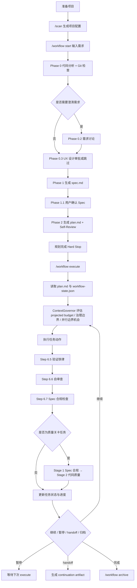

# Claude Code 工作流体系指南

> 以 `workflow` command 入口为核心的 AI 编码工作流说明文档

**文档版本**：v12.0.0  
**最后更新**：2026-04-02  
**适用仓库**：`@justinfan/agent-workflow` v4.0.0

---

## 目录

- [1. 文档定位](#1-文档定位)
- [2. 安装与同步](#2-安装与同步)
- [3. workflow command 总览](#3-workflow-command-总览)
- [4. workflow 完整流程](#4-workflow-完整流程)
- [5. `/workflow start` 规划流程详解](#5-workflow-start-规划流程详解)
- [6. `/workflow execute` 执行流程详解](#6-workflow-execute-执行流程详解)
- [7. 运行中的辅助命令](#7-运行中的辅助命令)
- [8. 工作流产物与状态文件](#8-工作流产物与状态文件)
- [9. Skills 体系总览](#9-skills-体系总览)
- [10. 推荐使用方式](#10-推荐使用方式)
- [11. 常见问题](#11-常见问题)
- [附录：命令速查](#附录命令速查)

---

## 1. 文档定位

这份文档说明当前仓库中的 `workflow` 主线能力，以及它与其他专项 skill 的配合方式。

当前版本的核心目标不是堆叠更多中间文档，而是把需求稳定压缩成两层可消费规划工件：

- `spec.md`：统一承载范围、设计、约束、验收标准与实施切片
- `plan.md`：可直接执行的原子步骤、文件清单和验证命令

之后再进入执行层，由验证铁律、Spec 合规检查、两阶段代码审查和 `ContextGovernor` 一起控制执行质量与上下文预算。

如果只记一个入口，请记住下面这一组命令：

```bash
/workflow start "需求描述"
/workflow execute
/workflow status
/workflow delta
/workflow archive
```

其中：

- `start` 负责从需求进入规划，并生成 `spec.md` / `plan.md`
- `execute` 负责按计划推进执行和验证
- `status` 负责查看当前进度、阻塞点和下一步建议
- `delta` 负责处理需求变更、PRD 更新和 API 变更
- `archive` 负责在完成后归档工作流

一句话概括：`workflow` 负责主线，其他 skill 负责专项增强。

---

## 2. 安装与同步

### 2.1 推荐安装方式

当前推荐直接克隆仓库后执行同步命令：

```bash
git clone <仓库地址> claude-workflow
cd claude-workflow
npm install
npm run sync
```

如果你已经把包发布到私有 npm 仓库，也可以直接通过 `npx` 执行：

```bash
npx --yes --registry <private-registry-url> @justinfan/agent-workflow@latest sync -y
```

常用变体：

```bash
npx --yes --registry <private-registry-url> @justinfan/agent-workflow@latest sync -a claude-code,cursor -y
npx --yes --registry <private-registry-url> @justinfan/agent-workflow@latest sync --project -y

npm run sync -- -a claude-code,cursor
npm run sync -- --project
npm run sync -- -y
```

### 2.2 同步动作会做什么

同步会完成以下事情：

1. 将模板内容写入 canonical 位置
2. 为不同 AI 编码工具建立受管挂载
3. 将 `skills` 逐个挂载到对应工具目录
4. 将 `commands`、`prompts`、`utils`、`specs` 作为目录级资源提供给工具使用

### 2.3 常用本地 CLI 调用方式

如果你是在仓库目录中直接使用本地 CLI，可以执行：

```bash
node bin/agent-workflow.js status
node bin/agent-workflow.js doctor
node bin/agent-workflow.js sync -a claude-code,cursor
```

### 2.4 推荐初始化顺序

```bash
/scan
/workflow start "需求描述"
/workflow execute
```

其中 `/scan` 会生成 `.claude/config/project-config.json`，为 `workflow`、`bug-batch`、`figma-ui` 等 skill 提供稳定的项目上下文。

---

## 3. workflow command 总览

`/workflow` 是整个体系的**统一 command 入口**，负责保持命令面稳定，并把规划、执行、审查、增量变更路由到专项 workflow skills。

当前 workflow 已模块化拆分为 **command 入口 + 4 个专项 workflow skills + 共享运行时**：

| 模块 | 路径 | 职责 |
|------|------|------|
| Command 入口 | `core/commands/workflow.md` | 稳定的 `/workflow` 命令路由层 |
| `workflow-planning` | `core/skills/workflow-planning/` | `/workflow start` 规划阶段 |
| `workflow-executing` | `core/skills/workflow-executing/` | `/workflow execute` 执行阶段 |
| `workflow-reviewing` | `core/skills/workflow-reviewing/` | 两阶段审查协议（由 execute 内部触发） |
| `workflow-delta` | `core/skills/workflow-delta/` | `/workflow delta` 增量变更 |
| 共享运行时 | `core/specs/workflow-runtime/` | 状态机、共享工具、外部依赖语义等 |
| 共享模板 | `core/specs/workflow-templates/` | spec / plan 模板 |
| 共享 CLI | `core/utils/workflow/` | workflow_cli.py |

整体仍然把"一个模糊需求"变成"可执行、可追踪、可恢复"的工作流。

### 3.1 当前规划模型

当前版本采用三层工件模型：

| 层级 | 产物 | 作用 |
|------|------|------|
| 规范层 | `spec.md` | 统一承载需求范围、关键约束、用户行为、架构设计、验收标准与实施切片 |
| 计划层 | `plan.md` | 定义文件结构、原子任务、验证命令、Spec 章节映射与执行顺序 |
| 执行层 | 代码与验证证据 | 按计划实施，并经过验证、Spec 合规检查与两阶段审查 |

这意味着旧版的多文档链路（如 `baseline / brief / tech-design / spec / plan`）已经被收敛为更短、更硬约束的规划链路：

- 规划阶段以 `spec.md` 作为唯一权威规范输入
- `plan.md` 必须是可直接执行的实施计划，禁止占位式描述
- 执行阶段以验证证据和审查结果控制状态流转

### 3.2 workflow 的核心原则

- **Spec-first**：所有计划与执行都以 `spec.md` 为唯一权威上游
- **Plan must be executable**：`plan.md` 中每步都要可执行，禁止 `TODO` / `TBD` / "后续补充"
- **Verification Iron Law**：没有新鲜验证证据，不得标记任务完成
- **Budget-first governance**：`execute` 先由 `ContextGovernor` 判断是否继续、暂停、并行边界或 handoff
- **Review after execution**：执行产出先验证，再做自审查、Spec 合规和质量关卡两阶段审查
- **Recoverable workflow**：状态保存在磁盘上，允许中断恢复和增量更新

### 3.3 workflow 的核心命令

```bash
/workflow start "需求描述"
/workflow start docs/prd.md
/workflow start --no-discuss docs/prd.md
/workflow start -f "覆盖已有流程"

/workflow execute
/workflow execute --retry
/workflow execute --skip

/workflow status
/workflow status --detail

/workflow delta
/workflow delta docs/prd-v2.md
/workflow delta "新增导出功能，支持 CSV"
/workflow delta packages/api/teamApi.ts

/workflow archive
```

### 3.4 什么时候优先使用 workflow

下面这几类场景优先使用 `workflow`：

- 新功能开发
- 复杂重构
- 多阶段交付
- 需要明确验收标准和用户确认的需求
- 需要中断恢复、handoff 或增量变更的任务
- 同阶段存在 2+ 独立问题域，且可能需要并行子 Agent 分派的任务

如果只是单个小 Bug、单个页面视觉还原或一次性代码审查，不一定要先进入 `workflow` 主线，可以直接使用对应专项 skill。

---

## 4. workflow 完整流程



### 4.1 这条主线的关键特点

1. `start` 不只是列清单，而是先做代码分析、需求讨论、UX 设计审批，再生成 `spec.md` 和 `plan.md`
2. `spec.md` 是唯一权威规范，负责承接范围、设计、约束与验收标准
3. `plan.md` 是可执行计划，必须具备文件结构、原子步骤和验证命令
4. `execute` 先做治理判断，再做执行，不允许绕过 `ContextGovernor`
5. 质量关卡任务通过两阶段审查控制风险：先看是否符合 Spec，再看代码质量
6. 工作流状态持久化在磁盘中，允许暂停、恢复、增量变更与归档

---

## 5. `/workflow start` 规划流程详解

### 5.1 Step 0：解析输入

`/workflow start` 支持三类常见输入：

- 内联需求：`/workflow start "实现用户认证功能"`
- PRD 文件：`/workflow start docs/prd.md`
- 强制覆盖：`/workflow start -f "需求描述"`

可选标志：

- `--no-discuss`：跳过需求讨论阶段

### 5.2 Step 1：项目配置检查

启动前必须先有 `.claude/config/project-config.json`。如果缺少，先执行 `/scan`。

### 5.3 Step 2：检测现有工作流

系统会检查当前项目是否已存在未归档工作流，避免意外覆盖。

### 5.4 Phase 0：代码分析（强制）

目标是在设计前充分理解代码库，输出：

- 相关现有实现
- 可复用模块与工具
- 技术约束与继承模式
- 依赖关系与风险点
- Git 状态与可执行上下文

### 5.5 Phase 0.2：需求讨论（条件执行）

当需求存在模糊点、缺失项或隐含假设时触发。它会：

- 逐个澄清问题，优先用选择题
- 识别互斥实现路径并给出方案选项
- 将结果保存为讨论工件供后续阶段消费

### 5.6 Phase 0.3：UX 设计审批（条件执行，HARD-GATE）

仅在检测到前端 / GUI 相关需求时触发。该阶段会：

- 生成用户操作流程图
- 生成页面分层设计（L0 / L1 / L2）
- 探测本地工作目录与设计落点
- 在用户批准前阻止进入 Spec 生成

### 5.7 Phase 1：Spec 生成

输出 `.claude/specs/{task-name}.md`。

当前 `spec.md` 统一承载以下内容：

1. 背景与目标
2. 范围定义
3. 不可协商约束
4. 用户可见行为
5. 架构与模块设计
6. 文件结构
7. 验收标准
8. 实施切片
9. 待确认问题

生成后会执行 Self-Review，重点检查：

- 需求覆盖是否完整
- 是否存在占位符
- 架构与约束是否一致
- 文件和验收项是否可落地

### 5.8 Phase 1.1：User Spec Review（Hard Stop）

这是用户主权确认点。用户可以：

1. 确认 Spec，进入 Plan 生成
2. 要求修改 Spec
3. 拆分范围后重新规划

### 5.9 Phase 2：Plan 生成

输出 `.claude/plans/{task-name}.md`。

当前 `plan.md` 的硬约束：

- File Structure First
- Bite-Sized Tasks（每步 2-5 分钟）
- 完整代码和验证命令
- 禁止 `TODO` / `TBD` / 模糊指令
- 每步标注对应的 Spec 章节
- 使用可解析的任务结构，便于执行态消费

### 5.10 规划完成 Hard Stop

`start` 完成后不会自动执行，而是停在规划完成节点，等待用户审查后运行 `/workflow execute`。

---

## 6. `/workflow execute` 执行流程详解

### 6.1 执行模式

`execute` 的语义模式包括：

| 模式 | 说明 | 典型暂停点 |
|------|------|------------|
| step | 单步执行 | 每个执行单元后 |
| phase | 阶段执行（默认） | 治理边界变化时 |
| continuous | 连续执行 | 质量关卡 / `git_commit` 前 |
| retry | 重试失败任务 | 当前失败任务 |
| skip | 跳过当前任务 | 当前任务 |

但这些只是语义暂停点，真正是否继续先由 `ContextGovernor` 决定。

### 6.2 Step 1：读取状态与计划

`execute` 会读取：

- `.claude/config/project-config.json`
- `~/.claude/workflows/{projectId}/workflow-state.json`
- 当前 `plan.md`
- 当前 `spec.md`

### 6.3 Step 2：ContextGovernor 做预算与边界决策

`ContextGovernor` 会先评估：

- 当前主会话上下文占用
- 下一执行单元的 projected 成本
- 是否存在同阶段 2+ 可证明独立边界
- 是否应继续顺序执行、切到并行边界、暂停或 handoff

可出现的 continuation actions 包括：

- `continue-direct`
- `continue-parallel-boundaries`
- `pause-budget`
- `pause-governance`
- `pause-quality-gate`
- `pause-before-commit`
- `handoff-required`

### 6.4 Step 3：提取当前任务

从 `plan.md` 中解析当前任务，读取：

- 任务 ID
- 阶段
- 文件范围
- 依赖关系
- 验收项
- 动作类型

### 6.5 Step 4：执行任务动作

当前支持的动作包括：

- `create_file`
- `edit_file`
- `run_tests`
- `quality_review`
- `git_commit`

执行路径分两类：

- **直接模式**：在当前会话执行
- **Subagent 模式**：单任务可直接路由到子 Agent；若同阶段存在 2+ 独立任务，则先应用 `dispatching-parallel-agents` 规则再并行执行

### 6.6 Step 6.5：验证铁律

没有新鲜验证证据，不得把任务标记为完成。

验证结果至少应包含：

- 执行过的命令
- 退出码
- 输出摘要
- 时间戳

验证失败则任务进入 `failed`，不能继续向后推进。

### 6.7 Step 6.6：自审查

对代码产出任务执行一次建议性自审查，关注：

- 完整性
- 正确性
- 一致性
- 错误处理
- 安全性

### 6.8 Step 6.7：Spec 合规检查

对 `create_file` / `edit_file` 且带验收项的任务，检查当前实现是否覆盖 Spec 要求。发现偏差会输出问题列表，不自动修复。

### 6.9 质量关卡：两阶段代码审查

当任务为质量关卡时，会执行两阶段审查：

1. **Stage 1：Spec 合规审查** — 先检查实现是否满足规范
2. **Stage 2：代码质量审查** — 再检查架构、可维护性、错误处理与安全性

Stage 2 只有在 Stage 1 通过后才会启动。

### 6.10 Retry / Skip 模式

- `--retry`：对失败任务启动结构化调试协议后重试
- `--skip`：将当前任务标记为跳过，并推进到下一个任务

### 6.11 Handoff 与恢复

当预算达到危险阈值或上下文不适合继续时，系统会建议 handoff，并生成 continuation artifact 供下次会话恢复。

---

## 7. 运行中的辅助命令

### 7.1 `/workflow status`

用于查看当前状态、进度、阻塞点和下一步建议。

常用形式：

```bash
/workflow status
/workflow status --detail
```

### 7.2 `/workflow delta`

统一入口处理增量变更，支持：

```bash
/workflow delta
/workflow delta docs/prd-v2.md
/workflow delta "新增导出功能，支持 CSV"
/workflow delta packages/api/teamApi.ts
```

自动识别逻辑大致为：

- 无参数：执行 API 同步
- `.md` 文件：按 PRD 变更处理
- API 文件路径：按 API 变更处理
- 其他文本：按需求变更处理

`delta` 会先做影响分析，再生成变更摘要，等待用户确认后再更新 `spec.md` / `plan.md`。

### 7.3 `/workflow archive`

当任务全部完成后，用于归档当前工作流，并保留历史状态和变更记录。

---

## 8. 工作流产物与状态文件

### 8.1 项目内产物

```text
.claude/
├── config/project-config.json
├── specs/{task-name}.md
└── plans/{task-name}.md
```

### 8.2 用户级运行时状态

```text
~/.claude/workflows/{projectId}/
├── workflow-state.json
├── discussion-artifact.json
├── changes/
│   └── CHG-001/
│       ├── delta.json
│       └── intent.md
└── archive/
```

### 8.3 常见状态

| 状态 | 说明 |
|------|------|
| `planned` | 规划完成，等待执行 |
| `spec_review` | 等待用户确认 Spec |
| `running` | 执行中 |
| `paused` | 暂停，等待继续 |
| `blocked` | 被外部依赖阻塞 |
| `failed` | 当前任务失败 |
| `completed` | 全部完成 |
| `archived` | 已归档 |

---

## 9. Skills 体系总览

仓库当前提供 14 个 skill 目录，按职责分为三类：

### 9.1 用户直接调用的专项 Skills（10 个）

| Skill | 触发方式 | 功能 |
|-------|---------|------|
| `scan` | `/scan` | 扫描项目技术栈，生成项目配置与上下文 |
| `analyze` | `/analyze` | Codex 技术分析 + Claude 前端分析，交叉验证 |
| `fix-bug` | `/fix-bug` | 单问题结构化修复 |
| `diff-review` | `/diff-review` | Impact-aware Quick / Deep 模式代码审查（含 finding verification、影响性分析、fix/skip 复审循环） |
| `write-tests` | `/write-tests` | 补测试、修测试 |
| `bug-batch` | `/bug-batch` | 批量缺陷分析与分组修复 |
| `figma-ui` | `/figma-ui` | Figma 设计稿到代码 |
| `visual-diff` | `/visual-diff` | 像素级和语义级视觉对比 |
| `dispatching-parallel-agents` | 自动触发 | 对同阶段 2+ 独立任务做并行子 Agent 分派 |
| `collaborating-with-codex` | 主动触发 | 通过 Codex App Server 运行时委派编码、调试与审查任务 |

### 9.2 Workflow 子 Skills（4 个）

这些 skill 不直接暴露为独立命令，而是由 `/workflow` command 入口路由调用：

| Skill | 路由自 | 职责 |
|-------|--------|------|
| `workflow-planning` | `/workflow start` | 规划阶段：代码分析、需求讨论、UX 审批、Spec / Plan 生成 |
| `workflow-executing` | `/workflow execute` | 执行阶段：治理、验证、审查、状态推进 |
| `workflow-reviewing` | 执行内部触发 | 两阶段审查协议：Spec 合规 + 代码质量 |
| `workflow-delta` | `/workflow delta` | 增量变更：需求 / PRD / API 变更的影响分析与同步 |

### 9.3 基础设施说明

- **共享运行时**（`core/specs/workflow-runtime/`）：状态机、共享工具、外部依赖语义、status/archive 等运行时资源
- **共享模板**（`core/specs/workflow-templates/`）：spec / plan 模板
- **思维指南**（`core/specs/guides/`）：代码复用检查清单、跨层检查清单、AI 审查误报指南
- **Commands**（`core/commands/`）：`workflow`（统一入口）、`enhance`（prompt 增强）、`git-rollback`（交互式回滚）

### 9.4 使用原则

- 主线问题走 `workflow`
- 单域问题走专项 skill
- 需要 Codex 协作时，相关 skill 会自动通过 `collaborating-with-codex` 委派任务
- 同阶段 2+ 独立任务由 `dispatching-parallel-agents` 负责并行分派

---

## 10. 推荐使用方式

### 10.1 标准主线

```bash
/scan
/workflow start "需求描述"
/workflow execute
/workflow status
```

### 10.2 长 PRD / 高约束需求

优先把需求放进 `/workflow start docs/prd.md`，让系统先做代码分析、需求讨论和 Spec 审查，再开始执行。

### 10.3 UI / 前端需求

如果需求涉及页面、导航、交互或首次体验，建议走 `workflow start`，因为它会触发 UX 设计审批；落地后可再结合 `/figma-ui` 或 `/visual-diff`。

### 10.4 变更驱动迭代

已有工作流发生需求更新、PRD 更新或 API 变更时，不建议直接手改 `plan.md`，而是优先使用 `/workflow delta` 保持状态和工件一致。

---

## 11. 常见问题

### 11.1 为什么现在强调 `spec.md + plan.md`，而不是更多中间文档？

因为当前版本更强调缩短规划链路，把需求、设计、约束和验收集中到单一 `spec.md`，再把落地步骤集中到 `plan.md`，减少信息衰减和跨文档漂移。

### 11.2 为什么 `execute` 不只是简单地跑下一个任务？

因为执行阶段除了任务本身，还要考虑验证、审查、上下文预算、治理边界和 handoff 时机，所以需要 `ContextGovernor` 先做决策。

### 11.3 UX 设计审批什么时候会出现？

仅在检测到前端 / GUI 相关需求时触发。纯后端、CLI 或基础设施改动通常会跳过。

### 11.4 为什么必须先 `/scan`？

因为 `workflow` 依赖项目配置识别项目 ID、工作流目录和上下文信息；没有项目配置会影响状态持久化和后续 skill 协作。

### 11.5 什么时候需要 `dispatching-parallel-agents`？

当执行阶段存在同阶段 2+ 可证明独立任务，并且平台支持子 Agent 时，应优先按该 skill 的规则做并行分派，而不是在主会话里顺序硬跑。

### 11.6 workflow 为什么从单一 skill 拆分为 4 个子 skill？

为了降低单文件复杂度、实现渐进式加载，并让各阶段职责边界更清晰。拆分后每个 skill 只需加载自身阶段的规格文件，共享资源通过 `workflow-runtime` 复用，避免重复定义。

### 11.7 `collaborating-with-codex` 何时被使用？

该 skill 是 Codex 协作的基础设施层，被 `analyze`、`fix-bug`、`diff-review --deep`、`workflow-reviewing` 等多个 skill 内部引用。当你遇到复杂问题、需要深度调试或代码审查时，相关 skill 会自动通过它委派任务到 Codex。

---

## 附录：命令速查

```bash
# 初始化
/scan

# 启动工作流
/workflow start "需求描述"
/workflow start docs/prd.md
/workflow start --no-discuss docs/prd.md

# 执行
/workflow execute
/workflow execute --retry
/workflow execute --skip

# 状态
/workflow status
/workflow status --detail

# 增量变更
/workflow delta
/workflow delta docs/prd-v2.md
/workflow delta "新增导出功能，支持 CSV"
/workflow delta packages/api/teamApi.ts

# 归档
/workflow archive

# 专项 skill
/analyze "架构问题"
/fix-bug "bug 描述"
/diff-review                 # Quick：单模型 + finding verification + impact analysis
/diff-review --deep          # Deep：Codex 候选问题 + 统一裁决 + impact-aware report
/write-tests
/bug-batch
/figma-ui <URL>
/visual-diff <URL>
```

---

## 参考资料

- `core/commands/workflow.md`（统一 command 入口）
- `core/skills/workflow-planning/SKILL.md`
- `core/skills/workflow-executing/SKILL.md`
- `core/skills/workflow-reviewing/SKILL.md`
- `core/skills/workflow-delta/SKILL.md`
- `core/specs/workflow-runtime/state-machine.md`
- `core/specs/guides/index.md`（思维指南索引）
