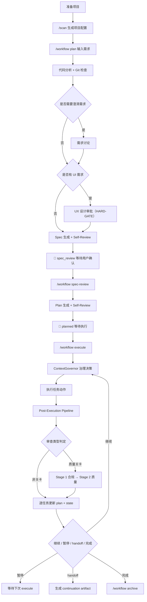
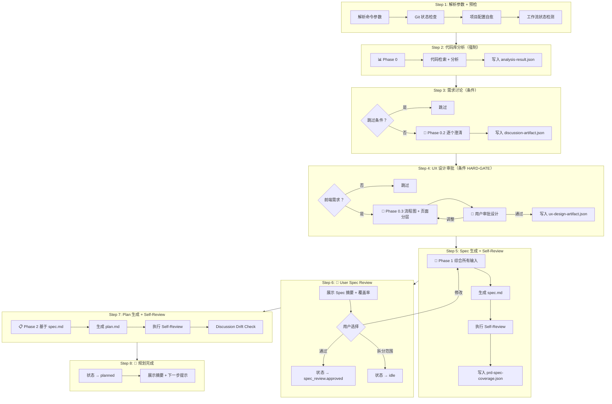
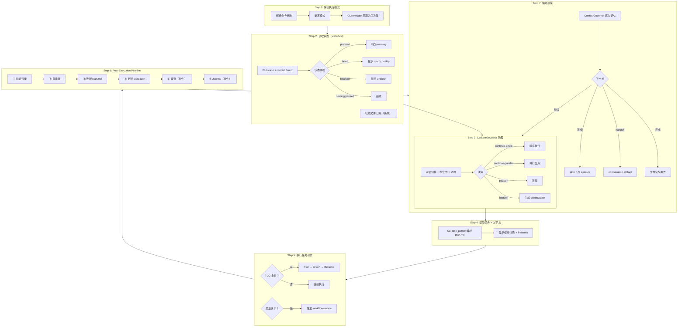
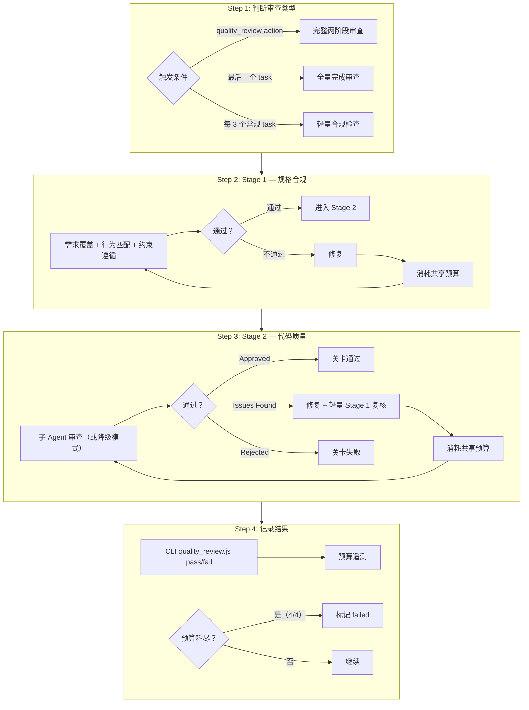
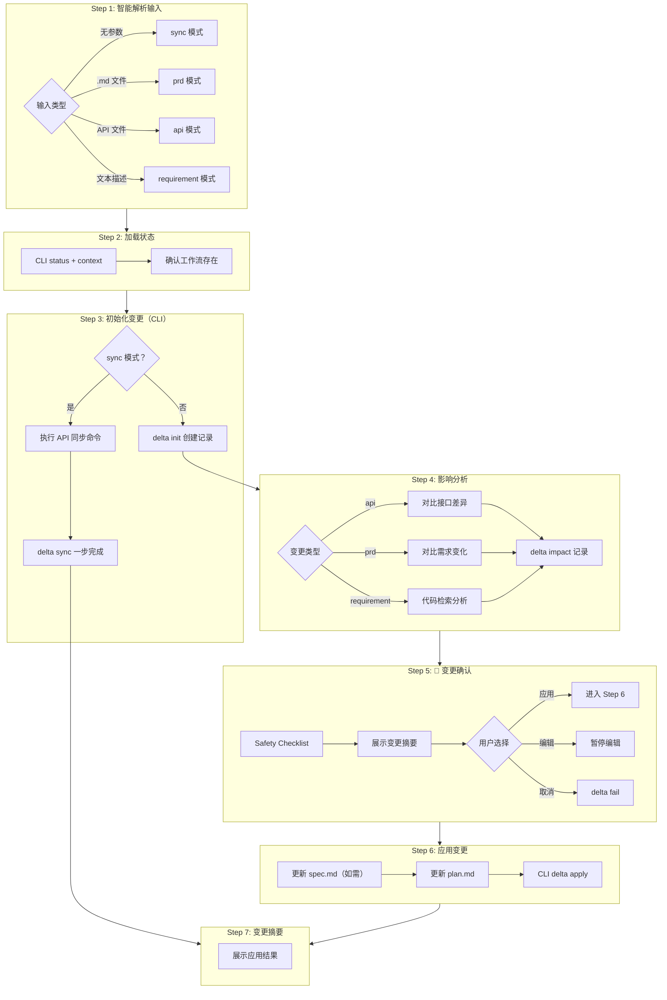
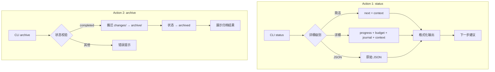
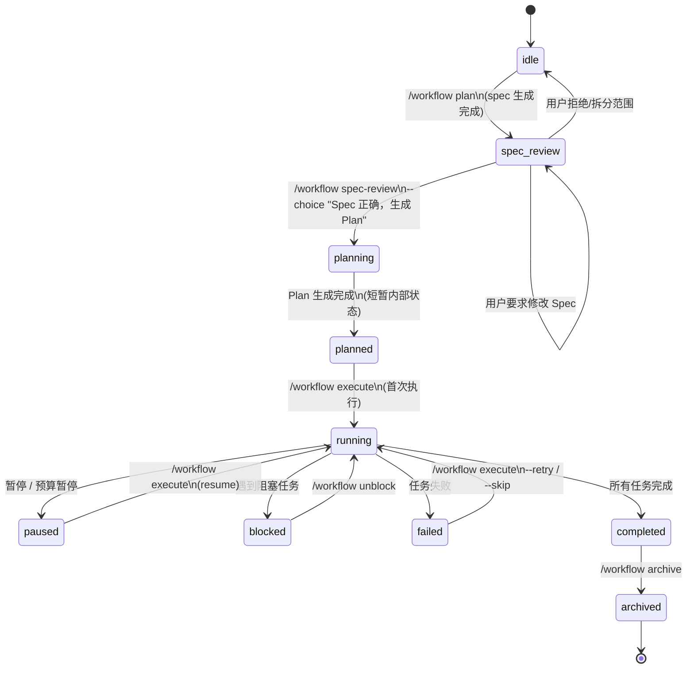
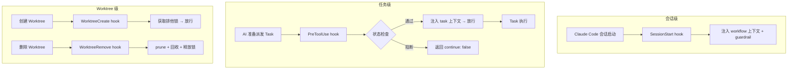

# Claude Code 工作流体系指南

> 以 `workflow` command 入口为核心的 AI 编码工作流说明文档

**文档版本**：v13.1.0  
**最后更新**：2026-04-12  
**适用仓库**：`@justinfan/agent-workflow`

---

## 目录

- [1. 文档定位](#1-文档定位)
- [2. 安装与同步](#2-安装与同步)
- [3. workflow command 总览](#3-workflow-command-总览)
- [4. workflow 完整流程](#4-workflow-完整流程)
- [5. Skill 流程图](#5-skill-流程图)
- [6. 状态机](#6-状态机)
- [7. `/workflow plan` 规划流程详解](#7-workflow-plan-规划流程详解)
- [8. `/workflow execute` 执行流程详解](#8-workflow-execute-执行流程详解)
- [9. 运行中的辅助命令](#9-运行中的辅助命令)
- [10. 工作流产物与状态文件](#10-工作流产物与状态文件)
- [11. Skills 体系总览](#11-skills-体系总览)
- [12. Hooks 流程控制](#12-hooks-流程控制)
- [13. 推荐使用方式](#13-推荐使用方式)
- [14. 常见问题](#14-常见问题)
- [附录：命令速查](#附录命令速查)

---

## 1. 文档定位

这份文档说明当前仓库中的 `workflow` 主线能力，以及它与其他专项 skill 的配合方式。

当前版本的核心目标不是堆叠更多中间文档，而是把需求稳定压缩成两层可消费规划工件：

- `spec.md`：统一承载范围、设计、约束、验收标准与实施切片
- `plan.md`：可直接执行的原子步骤、文件清单和验证命令

之后再进入执行层，由验证铁律、Spec 合规检查、两阶段代码审查和 `ContextGovernor` 一起控制执行质量与上下文预算。

如果只记一个入口，请记住下面这一组命令：

```bash
/workflow plan "需求描述"
/workflow spec-review --choice "Spec 正确，生成 Plan"
/workflow execute
/workflow status
/workflow delta
/workflow archive
```

其中：

- `plan` 负责从需求进入规划，生成 `spec.md` 后停在 `spec_review`
- `spec-review` 负责记录用户审查结论，通过后生成 `plan.md` 进入 `planned`
- `execute` 负责按计划推进执行和验证
- `status` 负责查看当前进度、阻塞点和下一步建议
- `delta` 负责处理需求变更、PRD 更新和 API 变更
- `archive` 负责在完成后归档工作流

> `start` 是 `plan` 的向后兼容别名，功能完全相同。

一句话概括：`workflow` 负责主线，其他 skill 负责专项增强。

---

## 2. 安装与同步

### 2.1 推荐安装方式

当前推荐直接克隆仓库后执行同步命令：

```bash
git clone <仓库地址> claude-workflow
cd claude-workflow
npm install
npm run sync
```

如果你已经把包发布到私有 npm 仓库，也可以直接通过 `npx` 执行：

```bash
npx --yes --registry <private-registry-url> @justinfan/agent-workflow@latest sync -y
```

常用变体：

```bash
npx --yes --registry <private-registry-url> @justinfan/agent-workflow@latest sync -a claude-code,cursor -y
npx --yes --registry <private-registry-url> @justinfan/agent-workflow@latest sync --project -y

npm run sync -- -a claude-code,cursor
npm run sync -- --project
npm run sync -- -y
```

### 2.2 同步动作会做什么

同步会完成以下事情：

1. 将模板内容写入 canonical 位置
2. 为不同 AI 编码工具建立受管挂载
3. 将 `skills` 逐个挂载到对应工具目录
4. 将 commands 挂载到 `commands/agent-workflow/` 命名空间
5. 将 `utils`、`specs`、`hooks`、`docs` 挂载到工具内的 `.agent-workflow/` 命名空间

### 2.3 常用本地 CLI 调用方式

如果你是在仓库目录中直接使用本地 CLI，可以执行：

```bash
node bin/agent-workflow.js status
node bin/agent-workflow.js doctor
node bin/agent-workflow.js sync -a claude-code,cursor
```

### 2.4 推荐初始化顺序

```bash
/scan
/workflow plan "需求描述"
/workflow spec-review --choice "Spec 正确，生成 Plan"
/workflow execute
```

其中 `/scan` 会生成 `.claude/config/project-config.json`，为 `workflow`、`bug-batch`、`figma-ui` 等 skill 提供稳定的项目上下文。

---

## 3. workflow command 总览

`/workflow` 是整个体系的**统一 command 入口**，负责保持命令面稳定，并把规划、执行、审查、增量变更路由到专项 workflow skills。

当前 workflow 已模块化拆分为 **command 入口 + 5 个专项 workflow skills + 共享运行时**：

| 模块 | 路径 | 职责 |
|------|------|------|
| Command 入口 | `core/commands/workflow.md` | 稳定的 `/workflow` 命令路由层 |
| `workflow-plan` | `core/skills/workflow-plan/` | `/workflow plan` + `/workflow spec-review` 规划阶段 |
| `workflow-execute` | `core/skills/workflow-execute/` | `/workflow execute` 执行阶段 |
| `workflow-review` | `core/skills/workflow-review/` | 两阶段审查协议（由 execute 内部触发） |
| `workflow-delta` | `core/skills/workflow-delta/` | `/workflow delta` 增量变更 |
| `workflow-ops` | `core/skills/workflow-ops/` | `/workflow status` + `/workflow archive` 运行时操作 |
| 共享运行时 | `core/specs/workflow-runtime/` | 状态机、共享工具、外部依赖语义等 |
| 共享模板 | `core/specs/workflow-templates/` | spec / plan 模板 |
| 共享 CLI | `core/utils/workflow/` | `workflow_cli.js`、`execution_sequencer.js`、`quality_review.js` 等 |

整体仍然把"一个模糊需求"变成"可执行、可追踪、可恢复"的工作流。

### 3.1 声明式 Skill 架构

每个 workflow skill 采用统一的声明式架构：

| 组件 | 说明 |
|------|------|
| **HARD-GATE** | 不可违反的铁律规则（如"Spec 未经用户确认，不得生成 Plan"） |
| **Checklist** | 必须按序完成的步骤清单 |
| **ASCII 流程图** | 快速可视化执行路径 |
| **Step 详解** | 每步的输入、输出、CLI 调用和异常处理 |
| **CLI 接管** | 所有状态变更通过 CLI 完成，不直接读写 JSON |

### 3.2 当前规划模型

当前版本采用三层工件模型：

| 层级 | 产物 | 作用 |
|------|------|------|
| 规范层 | `spec.md` | 统一承载需求范围、关键约束、用户行为、架构设计、验收标准与实施切片 |
| 计划层 | `plan.md` | 定义文件结构、原子任务、验证命令、Spec 章节映射与执行顺序 |
| 执行层 | 代码与验证证据 | 按计划实施，并经过验证、Spec 合规检查与两阶段审查 |

这意味着旧版的多文档链路（如 `baseline / brief / tech-design / spec / plan`）已经被收敛为更短、更硬约束的规划链路：

- 规划阶段以 `spec.md` 作为唯一权威规范输入
- `plan.md` 必须是可直接执行的实施计划，禁止占位式描述
- 执行阶段以验证证据和审查结果控制状态流转

### 3.3 workflow 的核心原则

- **Spec-first**：所有计划与执行都以 `spec.md` 为唯一权威上游
- **Plan must be executable**：`plan.md` 中每步都要可执行，禁止 `TODO` / `TBD` / "后续补充"
- **Verification Iron Law**：没有新鲜验证证据，不得标记任务完成
- **Governance-first continuation**：`execute` 先由 `ContextGovernor` 判断是否继续、暂停、并行边界或 handoff
- **Review after execution**：执行产出先验证，再做自审查、Spec 合规和质量关卡两阶段审查
- **CLI-driven state**：所有状态变更通过 CLI 完成，不直接读写 `workflow-state.json`
- **Recoverable workflow**：状态保存在磁盘上，允许中断恢复和增量更新

### 3.4 直接调用 Workflow Skills

每个 `/workflow` 子命令直接路由到对应的 workflow skill。以下按 skill 列出调用方式：

#### `workflow-plan`（规划 Skill）

```bash
/workflow plan "需求描述"
/workflow plan docs/prd.md
/workflow plan --no-discuss docs/prd.md
/workflow plan -f "覆盖已有流程"
/workflow spec-review --choice "Spec 正确，生成 Plan"
```

- `plan`：启动规划流程，生成 `spec.md` 并停在 `spec_review`（`start` 为别名）
- `spec-review`：记录用户审查结论，通过后生成 `plan.md` 进入 `planned`
- 详见 `core/skills/workflow-plan/SKILL.md`

#### `workflow-execute`（执行 Skill）

```bash
/workflow execute
/workflow execute --phase
/workflow execute --retry
/workflow execute --skip
```

- 按 `plan.md` 推进执行，经过 ContextGovernor 治理、验证与两阶段审查
- 详见 `core/skills/workflow-execute/SKILL.md`

#### `workflow-delta`（增量变更 Skill）

```bash
/workflow delta
/workflow delta docs/prd-v2.md
/workflow delta "新增导出功能，支持 CSV"
/workflow delta packages/api/teamApi.ts
```

- 处理 PRD / API / 需求增量变更的影响分析与同步
- 详见 `core/skills/workflow-delta/SKILL.md`

#### `workflow-ops`（运行时操作 Skill）

```bash
/workflow status
/workflow status --detail
/workflow archive
```

- `status`：查看当前进度、阻塞点与下一步建议
- `archive`：归档已完成工作流
- 详见 `core/skills/workflow-ops/SKILL.md`

#### `workflow-review`（两阶段审查 Skill）

- 由 `workflow-execute` 在质量关卡处内部触发，不直接暴露为命令
- 详见 `core/skills/workflow-review/SKILL.md`

### 3.5 什么时候优先使用 workflow

下面这几类场景优先使用 `workflow`：

- 新功能开发
- 复杂重构
- 多阶段交付
- 需要明确验收标准和用户确认的需求
- 需要中断恢复、handoff 或增量变更的任务
- 同阶段存在 2+ 独立问题域，且可能需要并行子 Agent 分派的任务

如果只是单个小 Bug、单个页面视觉还原或一次性代码审查，不一定要先进入 `workflow` 主线，可以直接使用对应专项 skill。

---

## 4. workflow 完整流程



### 4.1 这条主线的关键特点

1. `plan` 先做代码分析、需求讨论、UX 设计审批，再生成 `spec.md`，默认停在 `spec_review`
2. `spec-review` 记录用户审查结论，通过后生成 `plan.md`，状态进入 `planned`
3. `spec.md` 是唯一权威规范，负责承接范围、设计、约束与验收标准
4. `plan.md` 是可执行计划，必须具备文件结构、原子步骤和验证命令
5. `execute` 先做治理判断，再做执行，不允许绕过 `ContextGovernor`
6. 质量关卡任务通过两阶段审查控制风险：先看是否符合 Spec，再看代码质量
7. 工作流状态持久化在磁盘中，允许暂停、恢复、增量变更与归档
8. 所有状态变更通过 CLI 完成，不直接读写 JSON

---

## 5. Skill 流程图

### 5.1 workflow-plan（规划阶段）



### 5.2 workflow-execute（执行阶段）



### 5.3 workflow-review（两阶段审查）



### 5.4 workflow-delta（增量变更）



### 5.5 workflow-ops（状态与归档）



---

## 6. 状态机

### 6.1 工作流状态定义

| 状态 | 说明 |
|------|------|
| `idle` | 初始状态，无活动任务 |
| `spec_review` | Spec 已生成，等待用户确认范围 |
| `planning` | Spec 已批准，正在生成 Plan（短暂内部状态） |
| `planned` | Plan 已生成，等待执行 |
| `running` | 工作流执行中 |
| `paused` | 暂停等待用户操作 |
| `blocked` | 等待外部依赖 |
| `failed` | 任务失败，需要处理 |
| `completed` | 所有任务完成 |
| `archived` | 工作流已归档 |

### 6.2 完整状态流转图



### 6.3 任务状态

| 状态 | 说明 |
|------|------|
| `pending` | 待执行 |
| `blocked` | 被阻塞 |
| `in_progress` | 执行中 |
| `completed` | 已完成 |
| `skipped` | 已跳过 |
| `failed` | 失败 |

### 6.4 执行模式

| 模式 | 参数 | 中断点 |
|------|------|--------|
| continuous | 默认 | 质量关卡完成后暂停提示用户审查 |
| phase | `--phase` | 每个 phase 完成后 + 质量关卡完成后 |

### 6.5 ContextGovernor 决策

| 决策 | 含义 |
|------|------|
| `continue-direct` | 直接继续顺序执行 |
| `continue-parallel-boundaries` | 按边界并行分派 |
| `pause-budget` | 因预算压力暂停 |
| `pause-governance` | 因治理 phase 边界暂停 |
| `pause-quality-gate` | 在质量关卡前暂停 |
| `pause-before-commit` | 在提交任务前暂停 |
| `handoff-required` | 达到硬水位，生成 continuation artifact |

### 6.6 审查与质量关卡

| 关卡 | 状态字段 | 管理方式 |
|------|---------|---------| 
| 用户 Spec 审查 | `review_status.user_spec_review` | `workflow spec-review --choice` |
| Plan Review | `review_status.plan_review` | 执行引擎自动触发 |
| 执行质量关卡 | `quality_gates[taskId]` | `workflow-review` skill 自动触发 |

### 6.7 自愈机制

当 `workflow-state.json` 因会话丢失需要重建时：

- CLI `init` 命令根据 spec 文件存在性推断审批状态
  - 有 spec → `user_spec_review` 恢复为 `approved`（reviewer: `system-recovery`）
  - 无 spec（如来自 `/quick-plan`） → `user_spec_review` 标记为 `skipped`
- 此路径由 `system-recovery` reviewer 标记，不等同于用户主权审批
- `/quick-plan` 产出的 plan 可通过 `/workflow execute` 自愈进入状态机，但会触发 `upgrade_required` 降级确认

---

## 7. `/workflow plan` 规划流程详解

### 7.1 Step 0：解析输入

`/workflow plan` 支持三类常见输入：

- 内联需求：`/workflow plan "实现用户认证功能"`
- PRD 文件：`/workflow plan docs/prd.md`
- 强制覆盖：`/workflow plan -f "需求描述"`

可选标志：

- `--no-discuss`：跳过需求讨论阶段

> `start` 是 `plan` 的向后兼容别名。

### 7.2 Step 1：预检

启动前执行预检（详见 `core/specs/workflow-runtime/preflight.md`）：

1. **Git 状态检查** — 确认 git 仓库已初始化且有初始提交
2. **项目配置自愈** — 确保 `project-config.json` 存在，缺失时自动生成最小配置
3. **工作流状态检测** — 检查是否存在未归档的工作流，避免意外覆盖

### 7.3 Phase 0：代码分析（强制）

目标是在设计前充分理解代码库，输出：

- 相关现有实现
- 可复用模块与工具
- 技术约束与继承模式
- 依赖关系与风险点
- Git 状态与可执行上下文

分析结果持久化到 `analysis-result.json`。

### 7.4 Phase 0.2：需求讨论（条件执行）

当需求存在模糊点、缺失项或隐含假设时触发。它会：

- 逐个澄清问题，优先用选择题
- 识别互斥实现路径并给出方案选项
- 将结果保存为 `discussion-artifact.json`

### 7.5 Phase 0.3：UX 设计审批（条件执行，HARD-GATE）

仅在检测到前端 / GUI 相关需求时触发。该阶段会：

- 生成用户操作流程图
- 生成页面分层设计（L0 / L1 / L2）
- 探测本地工作目录与设计落点
- 在用户批准前阻止进入 Spec 生成

### 7.6 Phase 1：Spec 生成

输出 `.claude/specs/{task-name}.md`。

当前 `spec.md` 统一承载以下内容：

1. 背景与目标
2. 范围定义
3. 不可协商约束
4. 用户可见行为
5. 架构与模块设计
6. 文件结构
7. 验收标准
8. 实施切片
9. 待确认问题

生成后会执行 Self-Review，重点检查需求覆盖、占位符、架构一致性。

### 7.7 Phase 1.1：User Spec Review（Hard Stop）

这是用户主权确认点。`plan` 在此**默认停住**，等待用户通过 `/workflow spec-review --choice` 确认。

用户可以：

1. 确认 Spec，进入 Plan 生成
2. 要求修改 Spec
3. 拆分范围后重新规划

### 7.8 Phase 2：Plan 生成

前置条件：Spec 审批通过。

输出 `.claude/plans/{task-name}.md`。

当前 `plan.md` 的硬约束：

- File Structure First
- Bite-Sized Tasks（每步 2-5 分钟）
- 完整代码和验证命令
- 禁止 `TODO` / `TBD` / 模糊指令
- 每步标注对应的 Spec 章节
- 使用 WorkflowTaskV2 兼容的任务结构

### 7.9 规划完成 Hard Stop

Plan 生成完成后状态进入 `planned`，不会自动执行，等待用户审查后运行 `/workflow execute`。

---

## 8. `/workflow execute` 执行流程详解

### 8.1 执行模式

| 模式 | 参数 | 说明 |
|------|------|------|
| continuous | 默认 | 连续执行，质量关卡后暂停 |
| phase | `--phase` | 阶段执行，phase 边界变化时暂停 |
| retry | `--retry` | 重试失败任务 |
| skip | `--skip` | 跳过当前任务 |

真正是否继续先由 `ContextGovernor` 决定。

### 8.2 State-first 原则

**铁律：在确认 state.status / state.current_tasks 之前，不得读取 plan.md、源码或展开 Patterns to Mirror。**

调用 CLI 读取状态后做预检：

- `planned` → 转换为 `running`（首次执行）
- `failed` → 提示使用 `--retry` 或 `--skip`
- `blocked` → 提示使用 `unblock <dep>`

### 8.3 ContextGovernor 治理

在确定当前任务后、执行前，评估是否应继续。决策顺序：

1. 硬停止条件（failed / blocked / retry hard stop / 缺少验证证据）
2. 下一任务的独立性与上下文污染风险
3. 治理语义边界（quality gate / before commit / phase boundary）
4. budget backstop（仅在 danger / hard handoff 时触发）

### 8.4 任务执行

支持的动作：`create_file` / `edit_file` / `run_tests` / `quality_review` / `git_commit`

执行路径分两类：

- **直接模式**：在当前会话执行
- **Subagent 模式**：单任务可直接路由到子 Agent；若同阶段存在 2+ 独立任务，则先应用 `dispatching-parallel-agents` 规则再并行执行

### 8.5 TDD 执行纪律（条件触发）

全部满足才触发 TDD：① phase 为 `implement` / `ui-*` ② 项目存在 Spec + 可执行测试命令 ③ actions 含 `create_file` / `edit_file` ④ 文件类型非豁免。

触发后执行 Red-Green-Refactor 循环。

### 8.6 Post-Execution Pipeline（6 步管线）

每个 task 完成后，必须依次完成：

```
Task 完成 → ①验证 → ②自审查 → ③更新 plan.md → ④更新 state.json → ⑤审查（条件） → ⑥Journal（条件） → 下一 Task
```

| 步骤 | 名称 | 关键规则 |
|------|------|----------|
| ① | **验证** | 运行验证命令，失败 → 标记 `failed` |
| ② | **自审查** | 建议性检查，不阻塞 |
| ③ | **更新 plan.md** | 逐 task 立即更新，禁止批量回写 |
| ④ | **更新 state.json** | 更新进度和当前任务 |
| ⑤ | **审查（条件）** | `quality_review` → 完整两阶段；每 3 个常规 task → 轻量合规 |
| ⑥ | **Journal（条件）** | 质量关卡/暂停/完成时记录 |

### 8.7 Retry / Skip 模式

- `--retry`：对失败任务启动结构化调试协议（四阶段：根因调查 → 模式分析 → 假设验证 → 实施修复），连续 3 次失败 → Hard Stop
- `--skip`：将当前任务标记为跳过，并推进到下一个任务

### 8.8 Handoff 与恢复

当预算达到危险阈值或上下文不适合继续时，系统会建议 handoff，并生成 continuation artifact 供下次会话恢复。

---

## 9. 运行中的辅助命令

### 9.1 `/workflow status`

用于查看当前状态、进度、阻塞点和下一步建议。由 `workflow-ops` skill 处理。

常用形式：

```bash
/workflow status             # 简洁模式
/workflow status --detail    # 详细模式
/workflow status --json      # JSON 模式
```

### 9.2 `/workflow delta`

统一入口处理增量变更，由 `workflow-delta` skill 处理。支持四种模式：

```bash
/workflow delta                              # sync 模式：执行 API 同步 + 解除阻塞
/workflow delta docs/prd-v2.md               # prd 模式：PRD 变更影响分析
/workflow delta packages/api/teamApi.ts      # api 模式：API 接口变更分析
/workflow delta "新增导出功能，支持 CSV"       # requirement 模式：需求变更分析
```

`delta` 会先做影响分析，再生成变更摘要，等待用户确认后再更新 `spec.md` / `plan.md`（sync 模式自动应用，跳过确认）。

### 9.3 `/workflow archive`

当任务全部完成后，由 `workflow-ops` skill 处理。归档当前工作流，并保留历史状态和变更记录。

---

## 10. 工作流产物与状态文件

### 10.1 项目内产物

```text
.claude/
├── config/project-config.json
├── specs/{task-name}.md
├── plans/{task-name}.md
└── reports/{task-name}-report.md
```

### 10.2 用户级运行时状态

```text
~/.claude/workflows/{projectId}/
├── workflow-state.json
├── analysis-result.json
├── discussion-artifact.json
├── ux-design-artifact.json
├── prd-spec-coverage.json
├── changes/
│   └── CHG-001/
│       ├── delta.json
│       ├── intent.md
│       └── review-status.json
└── archive/
```

### 10.3 常见状态

| 状态 | 说明 |
|------|------|
| `idle` | 初始状态，无活动任务 |
| `spec_review` | Spec 已生成，等待用户确认 |
| `planning` | 正在生成 Plan（短暂内部状态） |
| `planned` | 规划完成，等待执行 |
| `running` | 执行中 |
| `paused` | 暂停，等待继续 |
| `blocked` | 被外部依赖阻塞 |
| `failed` | 当前任务失败 |
| `completed` | 全部完成 |
| `archived` | 已归档 |

---

## 11. Skills 体系总览

仓库当前提供 18 个 skill 目录，按职责分为四类：

### 11.1 用户直接调用的专项 Skills（9 个）

| Skill | 触发方式 | 功能 |
|-------|---------|------|
| `scan` | `/scan` | 扫描项目技术栈，生成项目配置与上下文 |
| `fix-bug` | `/fix-bug` | 单问题结构化修复 |
| `diff-review` | `/diff-review` | Impact-aware Quick / Deep 模式代码审查（含 finding verification、影响性分析、fix/skip 复审循环） |
| `write-tests` | `/write-tests` | 补测试、修测试 |
| `bug-batch` | `/bug-batch` | 批量缺陷分析与分组修复 |
| `figma-ui` | `/figma-ui` | Figma 设计稿到代码 |
| `search-first` | `/search-first` | 先搜后写，输出 Adopt / Extend / Build 决策 |
| `deep-research` | `/deep-research` | 面向外部信息的多源引文研究 |
| `collaborating-with-codex` | 主动触发 | 通过 Codex App Server 运行时委派编码、调试与审查任务 |

### 11.2 Workflow / Team 主线 Skills（7 个）

这些 skill 不直接都暴露为独立命令，而是由 `/workflow` 或 `/team` command 入口路由调用，或作为其内部 runtime 能力：

| Skill | 路由自 | 职责 |
|-------|--------|------|
| `workflow-plan` | `/workflow plan` + `/workflow spec-review` | 规划阶段：代码分析、需求讨论、UX 审批、Spec / Plan 生成 |
| `workflow-execute` | `/workflow execute` | 执行阶段：治理、验证、审查、状态推进 |
| `workflow-review` | 执行内部触发 | 两阶段审查协议：Spec 合规 + 代码质量 |
| `workflow-delta` | `/workflow delta` | 增量变更：需求 / PRD / API 变更的影响分析与同步 |
| `workflow-ops` | `/workflow status` + `/workflow archive` | 运行时状态查看与工作流归档 |
| `team` | `/team start` 入口层 | 显式 team mode 的入口契约、边界与路由关系 |
| `team-workflow` | `/team execute|status|archive` 及 start runtime | team phase/state contract、verify / fix loop 与运行时语义 |

### 11.3 规划与研究辅助 Skills（2 个）

| Skill | 触发方式 | 功能 |
|-------|---------|------|
| `plan` | `/quick-plan` | 轻量快速规划，只产出可执行 `plan.md`，不进入 workflow 状态机 |
| `dispatching-parallel-agents` | workflow/team 内部按需触发 | 对同阶段 2+ 独立任务做并行子 Agent 分派 |

### 11.4 基础设施说明

- **共享运行时**（`core/specs/workflow-runtime/`、`core/specs/team-runtime/`）：状态机、共享工具、外部依赖语义、预检逻辑等运行时资源
- **共享模板**（`core/specs/workflow-templates/`、`core/specs/team-templates/`）：spec / plan 模板
- **思维指南**（`core/specs/guides/`）：代码复用检查清单、跨层检查清单、AI 审查误报指南
- **Commands**（`core/commands/`）：`workflow`、`team`、`quick-plan`、`enhance`、`git-rollback`
- **Node.js helpers**：workflow 在 `core/utils/workflow/`，team 在 `core/utils/team/`

### 11.5 使用原则

- 主线问题走 `workflow`
- 显式多边界团队编排走 `/team`
- 简单到中等复杂度任务可先走 `/quick-plan`
- 单域问题走专项 skill
- 需要 Codex 协作时，相关 skill 会自动通过 `collaborating-with-codex` 委派任务
- 同阶段 2+ 独立任务由 `dispatching-parallel-agents` 负责并行分派

---

## 12. Hooks 流程控制

工作流体系通过 Claude Code 的 hooks 机制实现 **runtime guardrails** 和 **worktree 并发安全**。hooks 不替代 `/workflow` command 和 skill 驱动的状态机，而是在其外围提供自动化的上下文注入、执行门控和资源管理。

### 12.1 Hook 分类

当前共 **4 个 hook 脚本**，按职责分为两类：

| 分类 | Hook 事件 | 脚本 | 默认启用 | 职责 |
|------|-----------|------|----------|------|
| **Worktree Hooks** | `WorktreeCreate` | `worktree-serialize.js` | ✅ 随 `sync` 自动注入 | 串行化 `git worktree add`，防止并行竞争 `.git/config.lock` |
| | `WorktreeRemove` | `worktree-cleanup.js` | ✅ 随 `sync` 自动注入 | 清理孤立 worktree 引用、回收托管目录、释放串行锁 |
| **Workflow Hooks** | `SessionStart` | `session-start.js` | ✅ 随 `sync` 自动注入 | 注入会话级 workflow 上下文与 guardrail |
| | `PreToolUse` (matcher: `Task`) | `pre-execute-inject.js` | ✅ 随 `sync` 自动注入 | 在 Task 派发前检查状态并注入任务上下文 |

### 12.2 Hook 在流程中的位置



### 12.3 各 Hook 详解

#### 12.3.1 `SessionStart` — 会话上下文注入

**触发时机**：每次 Claude Code 会话启动时自动执行（非交互模式 `CLAUDE_NON_INTERACTIVE=1` 时跳过）。

**行为**：

1. 读取项目配置（`project-config.json`），获取项目 ID、名称、技术栈
2. 读取 workflow 运行时状态（`workflow-state.json`），获取当前进度
3. 根据当前状态生成 **next action** 提示（如 "使用 `/workflow execute` 开始执行"）
4. 根据当前状态生成 **guardrail** 规则（如 "此状态只允许显式 `/workflow execute`"）
5. 注入 team guardrail（阻止普通会话继承 team runtime）
6. 注入项目 spec index 和 thinking guides 引用

**输出形式**：将 XML 结构化文本写入 stdout，Claude Code 自动拼接到会话上下文。

**关键设计**：
- hook 只提供提示和守门，不做阶段流转
- 每种 workflow 状态都有对应的 guardrail 规则，防止 AI 在无指令情况下自行推进

#### 12.3.2 `PreToolUse(Task)` — 执行前门控 + 上下文注入

**触发时机**：AI 每次准备调用 `Task` 工具（即派发子任务）时触发。

**行为**：

1. 检查是否存在活跃的 workflow
   - 无 workflow → 放行（普通 Task 不受限制）
2. 检查 `spec_review` 门控
   - User Spec Review 未 approved → **阻断**
3. 检查 `state.status`
   - 只有 `running` / `paused` 允许继续
   - 其他状态 → **阻断**
4. 检查是否有 active task
   - 无 `current_tasks[0]` → **阻断**
5. 检查 `spec_file` / `plan_file` 是否齐全
   - 缺失 → **阻断**
6. 检查是否透传了禁止的 team 字段
   - 非 `/team` 路径不允许携带 `team_id` 等字段 → **阻断**
7. 构建注入上下文：当前 task block、verification commands、spec context、quality gate state、thinking guides
8. 将上下文拼接到 `tool_input.description` 前缀 → **放行**

**阻断时输出**：`{ "continue": false, "reason": "..." }`

**放行时输出**：`{ "continue": true, "tool_input": { "description": "<injected-context>\n\n---\n\n<original-description>" } }`


#### 12.3.3 `WorktreeCreate` — 串行化 worktree 创建

**触发时机**：Claude Code 创建新 worktree 前触发。

**行为**：

1. 获取 git common dir（主仓库 `.git` 目录）
2. 尝试通过 `mkdir` 原子操作获取排他锁（`<git-common-dir>/worktree-serialize.lock/`）
3. 若锁已被持有：
   - 检查是否过期（10 秒自动过期）
   - 检查持锁进程是否存活（同机器 PID 检测）
   - 可清理则清理后重试；否则指数退避等待
4. 30 秒总超时后强制放行
5. 获取锁后**不主动释放**——锁通过自动过期机制释放，确保 hook 退出后 `git worktree add` 执行期间其他请求仍被串行化

#### 12.3.4 `WorktreeRemove` — worktree 清理

**触发时机**：Claude Code 删除 worktree 时触发。

**行为**：

1. 执行 `git worktree prune`，清理孤立 worktree 引用
2. 扫描 `.claude/worktrees/` 目录，回收未被 Git 注册的孤立目录
3. 释放串行化锁目录，加速后续 worktree 创建
4. 始终返回 `{ "continue": true }`，绝不阻断

### 12.4 启用与配置

#### 自动启用（推荐）

Worktree hooks 和 Workflow hooks 在全局 `sync` 时默认注入：

```bash
npm run sync          # 默认注入 worktree + workflow hooks
npm run sync -- -y    # 同上，跳过确认
```

#### 手动配置

在 `~/.claude/settings.json` 中添加：

```json
{
  "hooks": {
    "SessionStart": [
      {
        "hooks": [{
          "type": "command",
          "command": "node \"$HOME/.claude/.agent-workflow/hooks/session-start.js\""
        }]
      }
    ],
    "PreToolUse": [
      {
        "matcher": "Task",
        "hooks": [{
          "type": "command",
          "command": "node \"$HOME/.claude/.agent-workflow/hooks/pre-execute-inject.js\""
        }]
      }
    ],
    "WorktreeCreate": [
      {
        "hooks": [{
          "type": "command",
          "command": "node \"$HOME/.claude/.agent-workflow/hooks/worktree-serialize.js\""
        }]
      }
    ],
    "WorktreeRemove": [
      {
        "hooks": [{
          "type": "command",
          "command": "node \"$HOME/.claude/.agent-workflow/hooks/worktree-cleanup.js\""
        }]
      }
    ]
  }
}
```

> **注意**：路径必须使用 `$HOME` 或绝对路径，不能使用 `~`（`~` 在双引号内不被 Shell 展开）。

### 12.5 职责边界

Hooks **负责**：

- 注入 workflow 状态、当前 task、验证命令、关键约束信息
- 在状态非法、上下文不完整时阻断继续
- 串行化 worktree 创建，回收孤立目录

Hooks **不负责**：

- 决定 planning / execute / delta / archive 的阶段流转（由 command + skill 决定）
- 替代 `/workflow execute` 的 shared resolver
- 创建第二套状态机
- 直接把失败解释成 retry / skip / archive

### 12.6 故障排查

```bash
# 检查 hook 是否已注册
cat ~/.claude/settings.json | jq '.hooks'

# 清理残留 worktree 锁
rm -rf $(git rev-parse --git-common-dir)/worktree-serialize.lock

# 检查 worktree 状态
git worktree list
git worktree prune
```

常见诊断日志：
- `[workflow-hook] 未发现活动 workflow，跳过上下文注入。` — 无活动工作流，hook 正常跳过
- `[workflow-hook] 已注入任务上下文 (N 字符)` — 成功注入上下文
- `[worktree-serialize] 获取锁超时(30000ms)，强制放行` — worktree 锁超时

---

## 13. 推荐使用方式

### 13.1 标准主线

```bash
/scan
/workflow plan "需求描述"
# 审查 spec.md
/workflow spec-review --choice "Spec 正确，生成 Plan"
# 审查 plan.md
/workflow execute
/workflow status
```

### 13.2 简单到中等复杂度任务

如果当前任务不需要完整的 spec / 状态机，而是希望快速形成可执行计划，可以先使用：

```bash
/quick-plan "需求描述"
```

确认计划后，再决定是直接实施，还是切换到 `/workflow execute`（会触发自愈进入状态机）或 `/workflow plan`（升级为完整工作流）。

### 13.3 长 PRD / 高约束需求

优先把需求放进 `/workflow plan docs/prd.md`，让系统先做代码分析、需求讨论和 Spec 审查，再开始执行。

### 13.4 UI / 前端需求

如果需求涉及页面、导航、交互或首次体验，建议走 `workflow plan`，因为它会触发 UX 设计审批；落地后可结合 `/figma-ui` 完成设计稿还原。

### 13.5 变更驱动迭代

已有工作流发生需求更新、PRD 更新或 API 变更时，不建议直接手改 `plan.md`，而是优先使用 `/workflow delta` 保持状态和工件一致。

### 13.6 显式团队编排

当同一需求需要拆成多个上下文边界，并希望使用 team runtime 统一治理时，显式使用：

```bash
/team start "需求描述"
/team execute
/team status
```

---

## 14. 常见问题

### 14.1 为什么现在 `plan` 默认停在 `spec_review`，而不是直接生成 Plan？

因为当前版本把 Spec 审查作为显式用户主权确认点。`/workflow plan` 生成 `spec.md` 后停在 `spec_review`，等待用户通过 `/workflow spec-review --choice` 确认后才生成 `plan.md`。这样用户可以在规划的每个阶段都有明确的审查窗口。

### 14.2 `start` 和 `plan` 有什么区别？

没有区别。`start` 是 `plan` 的向后兼容别名，功能完全相同。

### 14.3 为什么现在强调 `spec.md + plan.md`，而不是更多中间文档？

因为当前版本更强调缩短规划链路，把需求、设计、约束和验收集中到单一 `spec.md`，再把落地步骤集中到 `plan.md`，减少信息衰减和跨文档漂移。

### 14.4 为什么 `execute` 不只是简单地跑下一个任务？

因为执行阶段除了任务本身，还要考虑验证、审查、上下文预算、治理边界和 handoff 时机，所以需要 `ContextGovernor` 先做决策。

### 14.5 UX 设计审批什么时候会出现？

仅在检测到前端 / GUI 相关需求时触发。纯后端/CLI 项目自动跳过。

### 14.6 为什么必须先 `/scan`？

因为 `workflow` 依赖项目配置识别项目 ID、工作流目录和上下文信息；没有项目配置会影响状态持久化和后续 skill 协作。不过当前版本支持项目配置自愈，缺失时会自动生成最小配置。

### 14.7 什么时候需要 `dispatching-parallel-agents`？

当执行阶段存在同阶段 2+ 可证明独立任务，并且平台支持子 Agent 时，应优先按该 skill 的规则做并行分派，而不是在主会话里顺序硬跑。

### 14.8 workflow 为什么从单一 skill 拆分为 5 个子 skill？

为了降低单文件复杂度、实现渐进式加载，并让各阶段职责边界更清晰。拆分后每个 skill 只需加载自身阶段的规格文件，共享资源通过 `workflow-runtime` 复用。当前 5 个 skill 分别是：`workflow-plan`、`workflow-execute`、`workflow-review`、`workflow-delta`、`workflow-ops`。

### 14.9 `collaborating-with-codex` 何时被使用？

该 skill 是 Codex 协作的基础设施层，被 `fix-bug`、`diff-review --deep`、`workflow-review` 等多个 skill 内部引用，用于只读候选分析、审查与其他委派任务。

### 14.10 什么是声明式 Skill 架构？

每个 workflow skill 现在采用统一的声明式架构：HARD-GATE（不可违反的铁律）+ Checklist（按序执行的行动清单）+ CLI 接管（所有状态变更由 CLI 完成）。这消除了旧版 TypeScript 伪代码规格文件，减少 AI 在运行时的注意力漂移。

---

## 附录：命令速查

```bash
# 初始化
/scan

# 启动工作流
/workflow plan "需求描述"
/workflow plan docs/prd.md
/workflow plan --no-discuss docs/prd.md

# 审查 Spec
/workflow spec-review --choice "Spec 正确，生成 Plan"

# 执行
/workflow execute
/workflow execute --phase
/workflow execute --retry
/workflow execute --skip

# 状态
/workflow status
/workflow status --detail

# 增量变更
/workflow delta
/workflow delta docs/prd-v2.md
/workflow delta "新增导出功能，支持 CSV"
/workflow delta packages/api/teamApi.ts

# 归档
/workflow archive

# team
/team "需求描述"
/team start "需求描述"
/team execute
/team status
/team archive

# 轻量规划与辅助命令
/quick-plan "需求描述"
/enhance "原始提示词"
/git-rollback

# 专项 skill
/fix-bug "bug 描述"
/diff-review                 # Quick：单模型 + finding verification + impact analysis
/diff-review --deep          # Deep：Codex 候选问题 + 统一裁决 + impact-aware report
/write-tests
/bug-batch
/figma-ui <URL>
/search-first "功能需求"
/deep-research "研究主题"
```

---

## 参考资料

- `README.md`
- `core/commands/workflow.md`（统一 command 入口）
- `core/commands/team.md`（显式 team command 入口）
- `core/commands/quick-plan.md`
- `core/commands/enhance.md`
- `core/commands/git-rollback.md`
- `core/skills/workflow-plan/SKILL.md`
- `core/skills/workflow-execute/SKILL.md`
- `core/skills/workflow-review/SKILL.md`
- `core/skills/workflow-delta/SKILL.md`
- `core/skills/workflow-ops/SKILL.md`
- `core/skills/plan/SKILL.md`
- `core/skills/search-first/SKILL.md`
- `core/skills/deep-research/SKILL.md`
- `core/skills/team/SKILL.md`
- `core/skills/team-workflow/SKILL.md`
- `core/specs/workflow-runtime/state-machine.md`
- `core/specs/team-runtime/overview.md`
- `docs/workflow-hooks.md`（Workflow Hook Guardrails 详细文档）
- `docs/worktree-hooks.md`（Worktree 串行化 Hook 详细文档）
