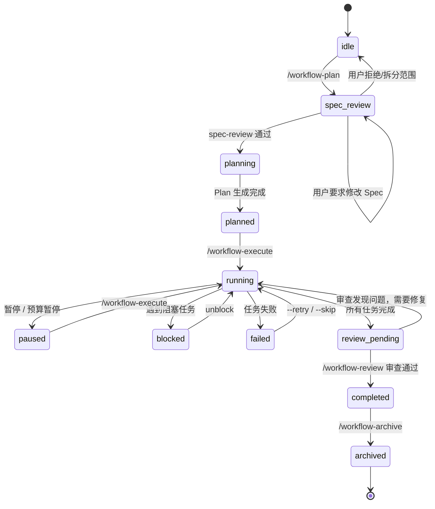
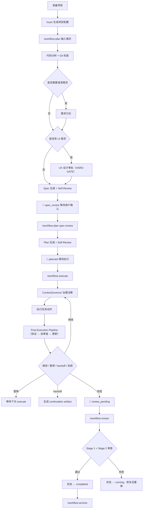

# @justinfan/agent-workflow

以模块化 workflow skills 为核心的多 AI 编码工具工作流工具集。

它提供一套可移植的 Skills 体系，用于把需求从"自然语言描述"推进到"Spec / Plan / 可执行任务"，并支持 Claude Code、Cursor、Codex、Gemini CLI、Antigravity、Droid 等多种 AI 编码工具。

---

## 核心能力

### Workflow 主线

Workflow 主线由 6 个专项 skills 直接驱动：

| 命令 | 说明 |
|------|------|
| `/workflow-plan` | 代码分析、需求讨论、UX 设计审批、Spec 生成，停在 `spec_review`；spec-review 通过后生成 Plan |
| `/workflow-execute` | 治理决策、任务执行、验证与状态推进；所有 task 完成后状态设为 `review_pending` |
| `/workflow-review` | 全量完成审查（execute 完成后独立执行），审查通过后标记 `completed` |
| `/workflow-delta` | 需求 / PRD / API 增量变更的影响分析与同步 |
| `/workflow-status` | 查看当前进度、阻塞点与下一步建议 |
| `/workflow-archive` | 归档已完成工作流 |

### Public Commands

除了 workflow 主线 skills 外，仓库还会安装手动 command 入口：

| 命令 | 类型 | 说明 |
|------|------|------|
| `/quick-plan` | command entry | 轻量快速规划，适用于简单到中等任务 |
| `/team` | command entry | 团队协作入口；仅在用户显式输入时使用，不自动触发 |
| `/enhance` | command entry | 对原始提示词做结构化增强，再等待用户确认 |
| `/git-rollback` | command entry | 交互式 Git 回滚入口，默认 dry-run 预览 |
| `/knowledge-bootstrap` | command entry | 初始化项目级 `.claude/knowledge/` 骨架（`{pkg}/{layer}/` + `guides/`） |
| `/knowledge-update` | command entry | 交互式沉淀 7 段 code-spec 或 thinking guide |
| `/knowledge-review` | command entry | 审查 7 段合约完整性、过期、冲突与 canonical 对账 |
| `/session-review` | command entry | 审查当前会话内本模型产生的改动（区别于 `/diff-review` 的 git diff 视角） |

### 项目知识库（Knowledge）

`.claude/knowledge/` 是项目自己的"活文档"，布局对齐 Trellis：

1. **code-spec**（`{pkg}/{layer}/*.md`）— 具体该怎么写代码，采用 7 段合约：Scope / Trigger · Signatures · Contracts · Validation & Error Matrix · Good-Base-Bad Cases · Tests Required · Wrong vs Correct
2. **guides**（`guides/*.md`）— 写代码前该想什么：思考清单、常见陷阱、决策思路，不重复 code-spec 的具体规则
3. **layer index**（`{pkg}/{layer}/index.md`）— 四段入口：Overview · Guidelines Index · Pre-Development Checklist · Quality Check

和 workflow 主线的协同点：

- `/scan` Part 5 首次扫描时引导初始化；已有 knowledge 时汇总 filled/draft 状态
- `/workflow-plan` Step 1.5 作为 advisory constraints 供 Spec 生成参考
- `/workflow-execute` 以 advisory 形式注入项目知识
- `/workflow-review` Stage 1 以人工对照方式检查实现与 code-spec 的一致性（声明式审查，无机读硬卡）

#### 三个命令的分工

| 命令 | 什么时候用 |
|------|-----------|
| `/knowledge-bootstrap` | 项目首次启用 knowledge 时，或 `/scan` 提示未初始化时。按 `project-config.json.monorepo.packages × tech.frameworks` 生成 `{pkg}/{layer}/` 骨架；`--reset` 清空重建 |
| `/knowledge-update` | 完成一次有沉淀价值的实现、修完一个 bug、做完一个设计决策之后。交互式按 7 段 code-spec 或 thinking guide 形态写入 |
| `/knowledge-review` | 定期维护（例如每周 / 每次大版本前）。只读扫描 7 段合约完整性、过期、冲突、canonical / manifest 对账，生成报告让人决定后续动作 |

#### 典型使用链路

以"第一次接入 + 沉淀一条 API 契约"为例：

```bash
# 1. 首次扫描项目，/scan 会提示 knowledge 未初始化
/scan

# 2. 按提示初始化骨架（或直接 /knowledge-bootstrap）
/knowledge-bootstrap
# → 生成 .claude/knowledge/{index.md, local.md, {pkg}/{layer}/index.md, guides/index.md}

# 3. 正常跑 workflow，完成实现
/workflow-plan "xxx 需求"
/workflow-execute
/workflow-review

# 4. 实现中稳定下来一条新 API，沉淀为 code-spec
/knowledge-update
# → 交互式选 {pkg}/backend/auth-api.md → 逐段填写 7 段合约
# → 含具体 file path / API name / payload 字段 / 错误矩阵 / 测试断言 / wrong vs correct

# 5. 跑一次完整性检查
/knowledge-review
# → 若 7 段仍有占位符或抽象描述，报告会列出待补齐项
```

### /team 命令

`/team` 是 Claude Code 原生 Agent Teams 的快捷入口。用一句自然语言描述任务，当前会话充当负责人，生成若干独立队友并行工作，每位队友拥有自己的 context window，彼此通过共享任务板和 mailbox 协作。

```bash
/team 并行审查 PR #142 的安全、性能、测试覆盖
/team 用 4 个 Sonnet 队友并行重构这几个模块
```

要点：
- 需要在 settings.json 或环境变量中打开 `CLAUDE_CODE_EXPERIMENTAL_AGENT_TEAMS=1`，版本 ≥ v2.1.32
- `/team` 仅在用户**显式输入**时生效；`/workflow-*`、`/quick-plan`、自然语言宽泛请求和 Broad Request Detection 都不会自动进入 team
- 收尾由 `TeammateIdle` hook 与负责人分工：任务板清空时 hook 让队友给负责人发一条 message 后正常 idle，负责人收到后按需 shutdown 剩余队友再执行 `clean up team`；若 cleanup 失败再通过 `AskUserQuestion` 弹出"重试 / 强制 / 保留"三个快捷选项
- `TaskCreated` / `TaskCompleted` hook 守门任务粒度和完成条件，缺 owner/deliverable 或遗留 TODO 时退码 2 拒绝
- 以上 hook 脚本在安装时自动写入 `~/.claude/settings.json`，脚本落在 `~/.claude/.agent-workflow/hooks/team-idle.js` 与 `team-task-guard.js`
- `dispatching-parallel-agents` 和 subagent 继续解决单会话内的并行分派问题，与 `/team` 互不替代

### 专项 Skills

| Skill | 功能 |
|-------|------|
| `scan` | 扫描项目技术栈并生成项目配置 |
| `fix-bug` | 结构化定位与修复单点问题 |
| `diff-review` | Impact-aware Quick / Deep 模式代码审查（含 finding verification、影响性分析、fix/skip 复审循环） |
| `session-review` | 审查当前会话内由本模型产生的改动；压缩/清空检测，避免扫入上游或他人改动 |
| `write-tests` | 补齐单元测试 / 集成测试 |
| `bug-batch` | 批量缺陷分析、去重与修复编排 |
| `figma-ui` | Figma 设计稿到代码 |
| `dispatching-parallel-agents` | 对同阶段 2+ 独立任务做并行子 Agent 分派 |
| `search-first` | 先搜后写，给出 Adopt / Extend / Build 决策 |
| `deep-research` | 面向外部信息的多源引文研究 |
| `knowledge-bootstrap` | 初始化 `.claude/knowledge/` 骨架（`{pkg}/{layer}/` + `guides/`） |
| `knowledge-update` | 按 7 段 code-spec 合约或 thinking guide 形态写入 |
| `knowledge-review` | 审查 7 段完整性、过期、冲突、canonical / manifest 对账，只读输出报告 |
| `collaborating-with-codex` | 通过 Codex App Server 运行时委派编码、调试与审查任务 |

---

## workflow 的当前模型

当前 `workflow` 采用"**6 个专项 workflow skills + 共享运行时**"的模块化结构。

### 系统分层架构

整个 workflow 系统分为 **4 层**，从上到下依次是：

```
+-----------------------------------------------------------------+
|                          用户层                                   |
|  /workflow-plan | /workflow-execute | /workflow-review            |
|  /workflow-delta | /workflow-status | /workflow-archive           |
+-----------------------------------------------------------------+
|                  Skill 层 (行动指南)                               |
|  workflow-plan | workflow-execute | workflow-review               |
|  workflow-delta | workflow-status | workflow-archive              |
|  自然语言 SKILL.md, 不含可执行代码                                 |
+-----------------------------------------------------------------+
|                 Runtime 层 (CLI 工具链)                            |
|  workflow_cli.js        统一命令入口                              |
|  execution_sequencer.js 执行治理 (ContextGovernor)                |
|  state_manager.js       状态读写                                  |
|  task_parser.js         Plan 解析                                 |
|  quality_review.js      质量关卡                                  |
|  verification.js        验证证据                                  |
|  batch_orchestrator.js  并行批次编排（配置 + select-batch）        |
|  merge_strategist.js    集成 worktree 创建 / 合流 / 丢弃           |
|  knowledge_bootstrap.js Knowledge 骨架生成（{pkg}/{layer}/）      |
+-----------------------------------------------------------------+
|                  Hooks 层 (运行时守门)                             |
|  session-start.js       会话启动上下文注入 + guardrail             |
|  pre-execute-inject.js  Task 派发前门控 + 任务上下文注入           |
|  worktree-serialize.js  worktree 创建串行化                       |
|  worktree-cleanup.js    worktree 清理与锁释放                     |
+-----------------------------------------------------------------+
                            | 读写
+-----------------------------------------------------------------+
|                        数据层                                     |
|  项目目录:                        用户目录:                        |
|  .claude/specs/*.md               ~/.claude/workflows/{id}/       |
|  .claude/plans/*.md                 workflow-state.json            |
|  .claude/config/project-config.json                               |
+-----------------------------------------------------------------+
```

**职责分离**：
- **Skill 层**：自然语言行动指南，AI 的操作手册，不含可执行代码；用户直接调用 skill
- **CLI 层**：确定性状态管理，所有状态读写通过 CLI，AI 不直接操作 JSON
- **Hook 层**：运行时守门人，上下文注入 + 治理检查，不写主状态

### 目录结构

```text
core/
+-- commands/team.md              # 独立 /team command 入口
+-- skills/
|   +-- workflow-plan/            # /workflow-plan + spec-review
|   +-- workflow-execute/         # /workflow-execute
|   +-- workflow-review/          # 两阶段审查（execute 内部触发）
|   +-- workflow-delta/           # /workflow-delta
|   +-- workflow-status/          # /workflow-status
|   +-- workflow-archive/         # /workflow-archive
+-- commands/
|   +-- team.md                   # /team 命令（原生 Agent Teams 入口）
+-- specs/
|   +-- workflow-runtime/         # 状态机、共享工具、外部依赖语义
|   +-- workflow-templates/       # spec / plan 模板
+-- hooks/                        # workflow / worktree / team 运行时 hook 脚本
+-- utils/
    +-- workflow/                  # workflow_cli.js、execution_sequencer.js、batch_orchestrator.js、merge_strategist.js、knowledge_* 等
```

项目侧还有一份与 workflow 并行的 knowledge 目录：

```text
.claude/knowledge/
+-- index.md                       # 根索引 + 更新记录
+-- local.md                       # 本项目模板基线 + Changelog
+-- {pkg}/
|   +-- frontend/                  # 前端 7 段 code-spec
|   +-- backend/                   # 后端 7 段 code-spec
+-- guides/                        # 跨 package / 跨 layer 共享的 thinking 清单
```

### 声明式 Skill 架构

每个 workflow skill 采用统一的声明式架构：

- **HARD-GATE**：不可违反的铁律规则
- **Checklist**：必须按序完成的行动清单
- **CLI 接管**：所有状态变更通过 CLI 完成，不直接读写 JSON

在此结构下，工作流仍保持三层工件模型：
- `spec.md`：统一承载范围、架构、约束、验收标准与实施切片
- `plan.md`：可直接执行的原子步骤、文件清单与验证命令
- 执行层：按计划产出代码，并经过验证与两阶段审查

核心设计原则：

- 单一 `spec.md` 作为规划阶段的权威规范
- `plan.md` 必须可直接执行，禁止占位式描述
- `execute` 采用 governance-first continuation，由 `ContextGovernor` 优先基于任务独立性与上下文污染风险决定继续、暂停、并行边界或 handoff
- 质量关卡任务执行两阶段审查：先做 Spec 合规，再做代码质量
- 所有状态变更通过 CLI 完成，不直接读写 `workflow-state.json`

---

## 推荐安装方式

当前推荐直接克隆仓库后执行同步命令：

```bash
git clone <repo-url> claude-workflow
cd claude-workflow
npm install
npm run sync
```

如果你已经把包发布到私有 npm 仓库，也可以直接通过 `npx` 执行：

```bash
npx --yes --registry <private-registry-url> @justinfan/agent-workflow@latest sync -y
```

常用变体：

```bash
# 全局安装（默认）：会同步模板到用户目录
# Claude Code 的 Worktree hooks 也会自动注入到 ~/.claude/settings.json
npx --yes --registry <private-registry-url> @justinfan/agent-workflow@latest sync -y

# 同步到指定 Agent
npx --yes --registry <private-registry-url> @justinfan/agent-workflow@latest sync -a claude-code,cursor -y

# 项目级安装：只同步当前仓库下的模板，不会修改 ~/.claude/settings.json
npx --yes --registry <private-registry-url> @justinfan/agent-workflow@latest sync --project -y


# 从源码仓库同步
npm run sync -- -a claude-code,cursor
npm run sync -- --project
npm run sync -- -y

# 本地开发调试：直接把受管目录链接到当前仓库 core/
npm run link -- -a claude-code

# 结束调试后恢复标准 canonical 模式
npm run sync -- -a claude-code
```

同步完成后，建议先执行：

```bash
/scan
/workflow-plan "需求描述"
/workflow-plan spec-review --choice "Spec 正确，生成 Plan"
/workflow-execute
/workflow-review
```

如果要并行推进多个独立边界，可显式用 `/team`（Claude Code 原生 Agent Teams）：

```bash
/team 并行实现三个独立模块：auth / billing / notification
```

需要先打开 `CLAUDE_CODE_EXPERIMENTAL_AGENT_TEAMS=1` 才能生效。

### 并行批次执行（workflow-execute 内部）

当同阶段存在 2+ 独立任务且平台支持子 Agent 时，`workflow-execute` 会通过 `batch_orchestrator.js` 选出可并行批次，再委托 `dispatching-parallel-agents` 落地。两类批次：

- **只读批次**（analysis / review）：不 provision worktree，子 Agent 产物写入 `~/.claude/workflows/{projectId}/artifacts/{groupId}/`
- **写文件批次**：串行 provision worktree → 并行启子 Agent → 合流到集成 worktree → stage2 审查 → 合入主分支；失败则由 `merge_strategist.js discard-integration` 丢弃集成 worktree，任务回 `pending`

含 `git_commit` / `quality_review` action 的任务不会进入并行批次。详细接口参见 `core/specs/workflow/state-machine.md` 的 `ParallelExecution` / `ParallelGroupRecord` / `BatchQualityGateResult` 定义。

### Hook 流程控制

工作流体系通过 Claude Code 的 hooks 机制实现 **runtime guardrails** 和 **worktree 并发安全**。hooks 不替代 command + skill 驱动的状态机，而是在其外围提供自动化的上下文注入、执行门控和资源管理。

当前共 **6 个 hook 脚本**，按职责分为三类：

| 分类 | Hook 事件 | 脚本 | 默认启用 | 职责 |
|------|-----------|------|----------|------|
| **Worktree Hooks** | `WorktreeCreate` | `worktree-serialize.js` | ✅ 随 `sync` 自动注入 | 串行化 worktree 创建，防止并行竞争 `.git/config.lock` |
| | `WorktreeRemove` | `worktree-cleanup.js` | ✅ 随 `sync` 自动注入 | 清理孤立 worktree 引用、回收托管目录、释放串行锁 |
| **Workflow Hooks** | `SessionStart` | `session-start.js` | ✅ 随 `sync` 自动注入 | 注入会话级 workflow 上下文、next action 与 guardrail |
| | `PreToolUse` (matcher: `Task`) | `pre-execute-inject.js` | ✅ 随 `sync` 自动注入 | Task 派发前检查 workflow 状态并注入任务上下文 |
| **Team Hooks** | `TeammateIdle` | `team-idle.js` | ✅ 随 `sync` 自动注入 | 任务板仍有未完成任务时阻止队友 idle；任务板清空时提示队友给 Lead 发 message 后退出 |
| | `TaskCreated` / `TaskCompleted` | `team-task-guard.js` | ✅ 随 `sync` 自动注入 | 任务粒度守门：缺 owner / deliverable 或遗留 TODO / FIXME 时退码 2 拒绝 |

#### 各 Hook 运行时行为

- **`SessionStart`**：会话启动时读取项目配置和 workflow 状态，注入当前进度、next action 提示、guardrail 规则和 team 隔离边界
- **`PreToolUse(Task)`**：在 Task 派发前做 5 重检查（workflow 存在 → spec_review 门控 → status 合法 → active task → 文件齐全），通过后将当前 task block、verification commands、spec context 注入到 Task description 前缀
- **`WorktreeCreate`**：通过 `mkdir` 原子锁串行化 `git worktree add`；锁 10 秒自动过期，30 秒总超时强制放行
- **`WorktreeRemove`**：执行 `git worktree prune`，回收 `.claude/worktrees/` 下孤立目录，释放串行化锁
- **`TeammateIdle`**：仅在 payload 带 `team_name` 时生效；任务板仍有未完成任务 → 退码 2 留住队友；任务板清空 → 通过 stderr 指示队友给 Lead 发 message 后放行 idle（Lead 侧收到后自行执行 `clean up team`）
- **`TaskCreated` / `TaskCompleted`**：任务粒度守门，缺 `task_subject` / 交付物或遗留 TODO / 待验证 类字眼时退码 2 拒绝

#### 启用方式

```bash
# 默认注入 worktree + workflow hooks
npm run sync -- -y
```

手动配置到 `~/.claude/settings.json`（路径必须用 `$HOME`，不能用 `~`）：

```json
{
  "hooks": {
    "SessionStart": [
      { "hooks": [{ "type": "command", "command": "node \"$HOME/.claude/.agent-workflow/hooks/session-start.js\"" }] }
    ],
    "PreToolUse": [
      { "matcher": "Task", "hooks": [{ "type": "command", "command": "node \"$HOME/.claude/.agent-workflow/hooks/pre-execute-inject.js\"" }] }
    ],
    "WorktreeCreate": [
      { "hooks": [{ "type": "command", "command": "node \"$HOME/.claude/.agent-workflow/hooks/worktree-serialize.js\"" }] }
    ],
    "WorktreeRemove": [
      { "hooks": [{ "type": "command", "command": "node \"$HOME/.claude/.agent-workflow/hooks/worktree-cleanup.js\"" }] }
    ],
    "TeammateIdle": [
      { "hooks": [{ "type": "command", "command": "node \"$HOME/.claude/.agent-workflow/hooks/team-idle.js\"" }] }
    ],
    "TaskCreated": [
      { "hooks": [{ "type": "command", "command": "node \"$HOME/.claude/.agent-workflow/hooks/team-task-guard.js\" created" }] }
    ],
    "TaskCompleted": [
      { "hooks": [{ "type": "command", "command": "node \"$HOME/.claude/.agent-workflow/hooks/team-task-guard.js\" completed" }] }
    ]
  }
}
```

#### 职责边界

hooks **负责**：注入 workflow 上下文、在状态非法 / 上下文缺失时阻断、串行化 worktree 创建  
hooks **不负责**：决定 planning / execute / delta / archive 的阶段流转、替代 `/workflow-execute` 的 shared resolver、创建第二套状态机

#### 故障排查

```bash
cat ~/.claude/settings.json | jq '.hooks'           # 检查 hook 注册
rm -rf $(git rev-parse --git-common-dir)/worktree-serialize.lock  # 清理残留锁
git worktree list && git worktree prune              # 检查 worktree 状态
```

---

## 直接调用 Workflow Skills

每个 workflow skill 可直接调用：

#### `workflow-plan`（规划 Skill）

```bash
/workflow-plan "需求描述"
/workflow-plan docs/prd.md
/workflow-plan --no-discuss docs/prd.md
/workflow-plan spec-review --choice "Spec 正确，生成 Plan"
```

- 启动规划流程，生成 `spec.md` 并停在 `spec_review`
- `spec-review`：记录用户审查结论，通过后生成 `plan.md` 进入 `planned`
- Step 1.5 读取 `.claude/knowledge/` 作为 advisory constraints；Spec 模板新增 `3.x Project Knowledge Constraints` 小节承载
- Codex Spec Review（条件，advisory）与 Codex Plan Review（条件，bounded-autofix）在 Spec / Plan 生成后可选触发

#### `workflow-execute`（执行 Skill）

```bash
/workflow-execute
/workflow-execute --retry
/workflow-execute --skip
```

- 按 `plan.md` 推进执行，经过 ContextGovernor 治理与验证
- 所有 task 完成后状态设为 `review_pending`，提示用户执行 `/workflow-review`

#### `workflow-delta`（增量变更 Skill）

```bash
/workflow-delta
/workflow-delta docs/prd-v2.md
/workflow-delta "新增导出功能，支持 CSV"
```

- 处理 PRD / API / 需求增量变更

#### `workflow-status`（状态查看 Skill）

```bash
/workflow-status
/workflow-status --detail
```

- 查看当前状态、进度与下一步建议

#### `workflow-archive`（归档 Skill）

```bash
/workflow-archive
/workflow-archive --summary
```

- 归档已完成工作流

#### `workflow-review`（全量完成审查 Skill）

```bash
/workflow-review
```

- `workflow-execute` 完成所有 task 后状态设为 `review_pending`，用户通过 `/workflow-review` 手动触发
- Stage 1 以人工对照 code-spec / guides 的方式检查实现是否符合项目约定（声明式审查，无机读硬卡）
- 执行 Stage 1（Spec 合规）+ Stage 2（代码质量）两阶段审查，共享 4 次预算
- 审查通过 → 状态推进到 `completed`；审查失败 → 状态回退到 `running`；预算耗尽 → 标记 `failed`

---

## 状态机全景

工作流有 **11 个状态**，每个状态都有对应的 Hook 护栏规则：



---

## 当前核心流程图



---

## 数据流拓扑

工作流产物按**是否可提交 Git** 分为两个位置：

```text
项目目录（可提交 Git）                   用户目录（运行时状态，不污染项目）
.claude/                                 ~/.claude/workflows/{projectId}/
+-- config/                              +-- workflow-state.json
|   +-- project-config.json              +-- analysis-result.json
+-- specs/                               +-- discussion-artifact.json
|   +-- {name}.md          <- Spec       +-- ux-design-artifact.json
+-- plans/                               +-- prd-spec-coverage.json
|   +-- {name}.md          <- Plan       +-- changes/CHG-XXX/
+-- reports/                             |   +-- delta.json
    +-- {name}-report.md   <- 实施报告   |   +-- intent.md
                                         |   +-- review-status.json
                                         +-- archive/
                                         +-- journal/
```

---

## 适用场景

优先使用 `workflow` 的场景：

- 新功能开发
- 多阶段交付
- 复杂重构
- 长 PRD 或高约束需求
- 需要显式用户确认 Spec 的任务
- 需要中断恢复、增量变更或并行子 Agent 分派的任务

如果只是单点问题，也可以直接使用专项 skill：

- 单 Bug：`/fix-bug`
- 单次审查：`/diff-review`（会先做 finding verification，再对 material findings 做 impact analysis）
- 当前会话审查：`/session-review`（只审本模型在本会话里改过的文件，避免扫入上游或他人改动）
- 单次补测：`/write-tests`
- UI 还原：`/figma-ui`
- 批量缺陷：`/bug-batch`
- 沉淀规范：`/knowledge-update` / `/knowledge-review`

优先使用 `/team` 的场景（Claude Code 原生 Agent Teams）：

- 多角度并行审查 / 研究（安全 / 性能 / 测试覆盖三路并进后综合）
- 独立模块的并行实现（各自拥有不同文件集）
- 竞争假设的 debug（队友互相反驳直到收敛）
- 跨层改动（前端 / 后端 / 测试分工同步推进）

需要先在 settings.json / 环境变量里打开 `CLAUDE_CODE_EXPERIMENTAL_AGENT_TEAMS=1` 且 Claude Code ≥ v2.1.32；`/team` 仅在用户显式输入时生效，不会被 `/workflow-*` / `/quick-plan` / 宽泛请求自动触发。

---

## 支持的 AI 编码工具

当前支持 9 个 AI 编码工具，包括：

- Claude Code
- Cursor
- Codex
- Gemini CLI
- GitHub Copilot
- OpenCode
- Qoder
- Antigravity
- Droid

---

## 更多文档

如需查看更完整说明，可参考：

- `docs/worktree-hooks.md`（WorktreeCreate / WorktreeRemove 串行化与清理）
- `docs/workflow-hooks.md`（SessionStart / PreToolUse(Task) guardrails）
- `Claude-Code-工作流体系指南.md`
- `core/commands/team.md`（独立 team command 入口）
- `core/commands/quick-plan.md`
- `core/commands/enhance.md`
- `core/commands/git-rollback.md`
- `core/commands/knowledge-bootstrap.md` / `knowledge-update.md` / `knowledge-review.md`
- `core/skills/workflow-plan/SKILL.md`
- `core/skills/workflow-execute/SKILL.md`
- `core/skills/workflow-review/SKILL.md`
- `core/skills/workflow-delta/SKILL.md`
- `core/skills/workflow-status/SKILL.md`
- `core/skills/workflow-archive/SKILL.md`
- `core/skills/plan/SKILL.md`
- `core/skills/search-first/SKILL.md`
- `core/skills/deep-research/SKILL.md`
- `core/skills/session-review/SKILL.md`
- `core/commands/team.md`（/team 命令，Claude Code 原生 Agent Teams 入口）
- `core/skills/knowledge-bootstrap/SKILL.md` / `knowledge-update/SKILL.md` / `knowledge-review/SKILL.md`
- `core/specs/workflow/state-machine.md`（含 ParallelExecution / ParallelGroupRecord / BatchQualityGateResult）
- `core/specs/knowledge-templates/`（knowledge 模板源）
- `core/hooks/team-idle.js` / `core/hooks/team-task-guard.js`（原生 Agent Teams 任务板守门与 cleanup 协调）

---

## 开发与发布

```bash
# 校验发布内容
npm run prepublishOnly

# 发布
npm run release:patch
npm run release:minor
npm run release:major
```
