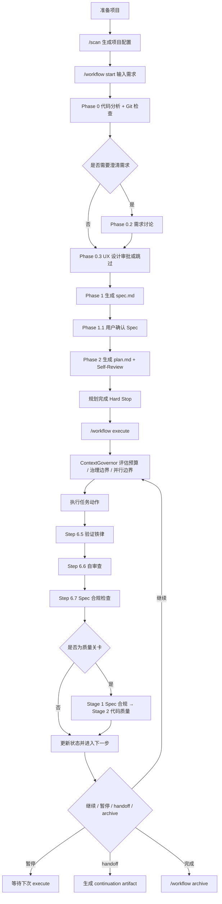

# @justinfan/agent-workflow

以 `workflow` command 入口 + 模块化 workflow skills 为核心的多 AI 编码工具工作流工具集。

它提供一套可移植的 Skills 体系，用于把需求从"自然语言描述"推进到"Spec / Plan / 可执行任务"，并支持 Claude Code、Cursor、Codex、Gemini CLI、Antigravity、Droid 等多种 AI 编码工具。

---

## 核心能力

### Workflow 主线

`/workflow` 是统一 command 入口，路由到 4 个专项 workflow skills：

| 命令 | 路由到 | 说明 |
|------|--------|------|
| `/workflow start` | `workflow-planning` | 代码分析、需求讨论、UX 设计审批、Spec / Plan 生成 |
| `/workflow execute` | `workflow-executing` | 治理决策、任务执行、验证、审查与状态推进 |
| `/workflow delta` | `workflow-delta` | 需求 / PRD / API 增量变更的影响分析与同步 |
| `/workflow status` | 共享运行时 | 查看当前进度、阻塞点与下一步建议 |
| `/workflow archive` | 共享运行时 | 归档已完成工作流 |

`workflow-reviewing`（两阶段审查协议）由 execute 内部在质量关卡处触发，不直接暴露为命令。

### Public Commands

除了 `/workflow` 主线外，仓库还会安装手动 command 入口：

| 命令 | 类型 | 说明 |
|------|------|------|
| `/quick-plan` | command entry | 轻量快速规划，适用于简单到中等任务 |
| `/team` | command entry | 团队协作入口；仅在用户显式输入时使用，不自动触发 |
| `/enhance` | command entry | 对原始提示词做结构化增强，再等待用户确认 |
| `/git-rollback` | command entry | 交互式 Git 回滚入口，默认 dry-run 预览 |

### Team 模式

`/team` 是独立的团队编排入口，覆盖 `team-plan -> team-exec -> team-verify -> team-fix` 的完整循环，并尽量复用现有 workflow 的 planning / executing / reviewing / runtime helpers。

```bash
/team start "需求描述"
/team execute
/team status
/team archive
/team cleanup --team-id auth-rollout
```

关键边界：
- `/team` 只会在用户**显式输入** `/team ...` 时启用
- `/workflow`、`/quick-plan`、自然语言模糊请求、Broad Request Detection 与 `dispatching-parallel-agents` 都**不会自动切换**到 team mode
- 普通 workflow/session hook 只读取 workflow runtime，不继承 `team-state.json`、`team_id`、`team_name`、`worker_roster`、`dispatch_batches` 或 `team_review` 等 team context
- `/team archive` 负责逻辑归档；`/team cleanup` 负责物理清理已归档的 team runtime 目录，并保留 repo 内 spec/plan 工件
- `dispatching-parallel-agents` 只作为 `team-exec` 内部可复用的规则来源（独立性检查 / 边界分组 / 冲突降级），不负责 team 生命周期
- team runtime 脚本独立位于 `core/utils/team/*.js`，便于单独迭代，不依赖 workflow Python helpers
- team runtime 使用独立状态文件：`~/.claude/workflows/{projectId}/teams/{teamId}/team-state.json`

### 专项 Skills

| Skill | 功能 |
|-------|------|
| `scan` | 扫描项目技术栈并生成项目配置 |
| `analyze` | Codex 候选技术分析 + Claude 独立分析与最终综合裁决（Codex 分析合同内聚在 skill 自身的 `references/` 下） |
| `fix-bug` | 结构化定位与修复单点问题 |
| `diff-review` | Impact-aware Quick / Deep 模式代码审查（含 finding verification、影响性分析、fix/skip 复审循环） |
| `write-tests` | 补齐单元测试 / 集成测试 |
| `bug-batch` | 批量缺陷分析、去重与修复编排 |
| `figma-ui` | Figma 设计稿到代码 |
| `dispatching-parallel-agents` | 对同阶段 2+ 独立任务做并行子 Agent 分派 |
| `search-first` | 先搜后写，给出 Adopt / Extend / Build 决策 |
| `deep-research` | 面向外部信息的多源引文研究 |
| `team` | `/team` 的显式入口 skill；只负责路由与边界，不自动触发 |
| `team-workflow` | `/team` 的重型 runtime skill；承接 start/execute/status/archive 的 phase/state contract |
| `collaborating-with-codex` | 通过 Codex App Server 运行时委派编码、调试与审查任务 |

---

## workflow 的当前模型

当前 `workflow` 采用"**command 入口 + 4 个专项 workflow skills + 共享运行时**"的模块化结构：

```text
core/
└── core/
    ├── commands/workflow.md          # 统一 command 入口（路由层）
    ├── commands/team.md              # 独立 /team command 入口
    ├── skills/
    │   ├── workflow-planning/        # /workflow start
    │   ├── workflow-executing/       # /workflow execute
    │   ├── workflow-reviewing/       # 两阶段审查（execute 内部触发）
    │   ├── workflow-delta/           # /workflow delta
    │   ├── team/                     # /team 显式入口路由
    │   ├── team-workflow/            # /team start|execute|status|archive runtime
    ├── specs/
    │   ├── workflow-runtime/         # 状态机、共享工具、外部依赖语义
    │   ├── workflow-templates/       # spec / plan 模板
    │   └── team-runtime/             # team 状态机与共享运行时文档
    └── .agent-workflow style managed projection
        ├── commands/agent-workflow/*
        └── .agent-workflow/{utils,specs,hooks,docs}
```

在此结构下，工作流仍保持三层工件模型，并且受管内部资源已收敛为 `utils/specs/hooks/docs`；`analyze` 的 Codex 分析合同也已内聚到 `core/skills/analyze/references/codex-analyzer.md`。
- `spec.md`：统一承载范围、架构、约束、验收标准与实施切片
- `plan.md`：可直接执行的原子步骤、文件清单与验证命令
- 执行层：按计划产出代码，并经过验证与两阶段审查

核心设计原则：

- 单一 `spec.md` 作为规划阶段的权威规范
- `plan.md` 必须可直接执行，禁止占位式描述
- `execute` 采用 governance-first continuation governance，由 `ContextGovernor` 优先基于任务独立性与上下文污染风险决定继续、暂停、并行边界或 handoff，并由 budget 作为兜底信号
- 质量关卡任务执行两阶段审查：先做 Spec 合规，再做代码质量

---

## 推荐安装方式

当前推荐直接克隆仓库后执行同步命令：

```bash
git clone <repo-url> claude-workflow
cd claude-workflow
npm install
npm run sync
```

如果你已经把包发布到私有 npm 仓库，也可以直接通过 `npx` 执行：

```bash
npx --yes --registry <private-registry-url> @justinfan/agent-workflow@latest sync -y
```

常用变体：

```bash
# 全局安装（默认）：会同步模板到用户目录
# Claude Code 的 Worktree hooks 也会自动注入到 ~/.claude/settings.json
npx --yes --registry <private-registry-url> @justinfan/agent-workflow@latest sync -y

# 同步到指定 Agent
npx --yes --registry <private-registry-url> @justinfan/agent-workflow@latest sync -a claude-code,cursor -y

# 项目级安装：只同步当前仓库下的模板，不会修改 ~/.claude/settings.json
npx --yes --registry <private-registry-url> @justinfan/agent-workflow@latest sync --project -y

# 可选：为 Claude Code 注册 workflow hooks（SessionStart / PreToolUse(Task) / PostToolUse）
npx --yes --registry <private-registry-url> @justinfan/agent-workflow@latest sync --workflow-hooks -y

# 从源码仓库同步
npm run sync -- -a claude-code,cursor
npm run sync -- --project
npm run sync -- --workflow-hooks -y
npm run sync -- -y

# 本地开发调试：直接把受管目录链接到当前仓库 core/
npm run link -- -a claude-code
npm run link -- --workflow-hooks -a claude-code

# 结束调试后恢复标准 canonical 模式
npm run sync -- -a claude-code
```

同步完成后，建议先执行：

```bash
/scan
/workflow start "需求描述"
/workflow execute
```

如果你要从一开始就以团队编排方式推进多边界任务，可显式改用：

```bash
/team start "需求描述"
/team execute
```

### Hook Guardrails

Claude Code 下当前有两类 hooks：

- **worktree hooks**：默认随全局 `sync` 自动注入，用于 `WorktreeCreate` / `WorktreeRemove` 的串行化和清理
- **workflow hooks**：默认**不自动注册**，需显式使用 `sync --workflow-hooks` 或 `link --workflow-hooks` 启用；用于 `SessionStart`、`PreToolUse(Task)`、`PostToolUse` 的运行时 guardrails

workflow hooks 的职责边界：
- 注入 active workflow、next action、当前 task、验证命令与质量关卡上下文
- 在状态非法、上下文缺失或质量关卡未通过时阻断继续
- 不替代 `/workflow execute` 的 shared resolver，不决定 planning / execute / delta / archive 的阶段流转

---

## workflow 主线命令

```bash
/workflow start "需求描述"
/workflow start docs/prd.md
/workflow start --no-discuss docs/prd.md

/workflow execute
/workflow execute --retry
/workflow execute --skip

/workflow status
/workflow status --detail

/workflow delta
/workflow delta docs/prd-v2.md
/workflow delta "新增导出功能，支持 CSV"

/workflow archive
```

含义如下：

- `start`：启动规划流程，生成 `spec.md` 与 `plan.md`
- `execute`：按 `plan.md` 推进执行，并经过验证与审查
- `status`：查看当前状态、进度与下一步建议
- `delta`：处理 PRD / API / 需求增量变更
- `archive`：归档已完成工作流

---

## 当前核心流程图



---

## 适用场景

优先使用 `workflow` 的场景：

- 新功能开发
- 多阶段交付
- 复杂重构
- 长 PRD 或高约束需求
- 需要显式用户确认 Spec 的任务
- 需要中断恢复、增量变更或并行子 Agent 分派的任务

如果只是单点问题，也可以直接使用专项 skill：

- 单 Bug：`/fix-bug`
- 单次审查：`/diff-review`（会先做 finding verification，再对 material findings 做 impact analysis）
- 单次分析：`/analyze`（Codex 候选分析 + Claude 综合裁决）
- 单次补测：`/write-tests`
- UI 还原：`/figma-ui`
- 批量缺陷：`/bug-batch`

优先使用 `/team` 的场景：

- 同一需求需要拆成 2+ 上下文边界
- 需要团队级状态汇总与边界领取
- 需要 verify / fix loop 只回流失败边界
- 需要显式区分 team lifecycle 与普通 workflow execute

---

## 支持的 AI 编码工具

当前支持 9 个 AI 编码工具，包括：

- Claude Code
- Cursor
- Codex
- Gemini CLI
- GitHub Copilot
- OpenCode
- Qoder
- Antigravity
- Droid

---

## 更多文档

如需查看更完整说明，可参考：

- `docs/worktree-hooks.md`（WorktreeCreate / WorktreeRemove 串行化与清理）
- `docs/workflow-hooks.md`（SessionStart / PreToolUse(Task) / PostToolUse guardrails）
- `Claude-Code-工作流体系指南.md`
- `core/commands/workflow.md`（统一 command 入口）
- `core/commands/team.md`（独立 team command 入口）
- `core/commands/quick-plan.md`
- `core/commands/enhance.md`
- `core/commands/git-rollback.md`
- `core/skills/workflow-planning/SKILL.md`
- `core/skills/workflow-executing/SKILL.md`
- `core/skills/workflow-reviewing/SKILL.md`
- `core/skills/workflow-delta/SKILL.md`
- `core/skills/plan/SKILL.md`
- `core/skills/search-first/SKILL.md`
- `core/skills/deep-research/SKILL.md`
- `core/skills/team/SKILL.md`
- `core/skills/team-workflow/SKILL.md`
- `core/specs/workflow-runtime/state-machine.md`
- `core/specs/team-runtime/overview.md`

---

## 开发与发布

```bash
# 校验发布内容
npm run prepublishOnly

# 发布
npm run release:patch
npm run release:minor
npm run release:major
```
