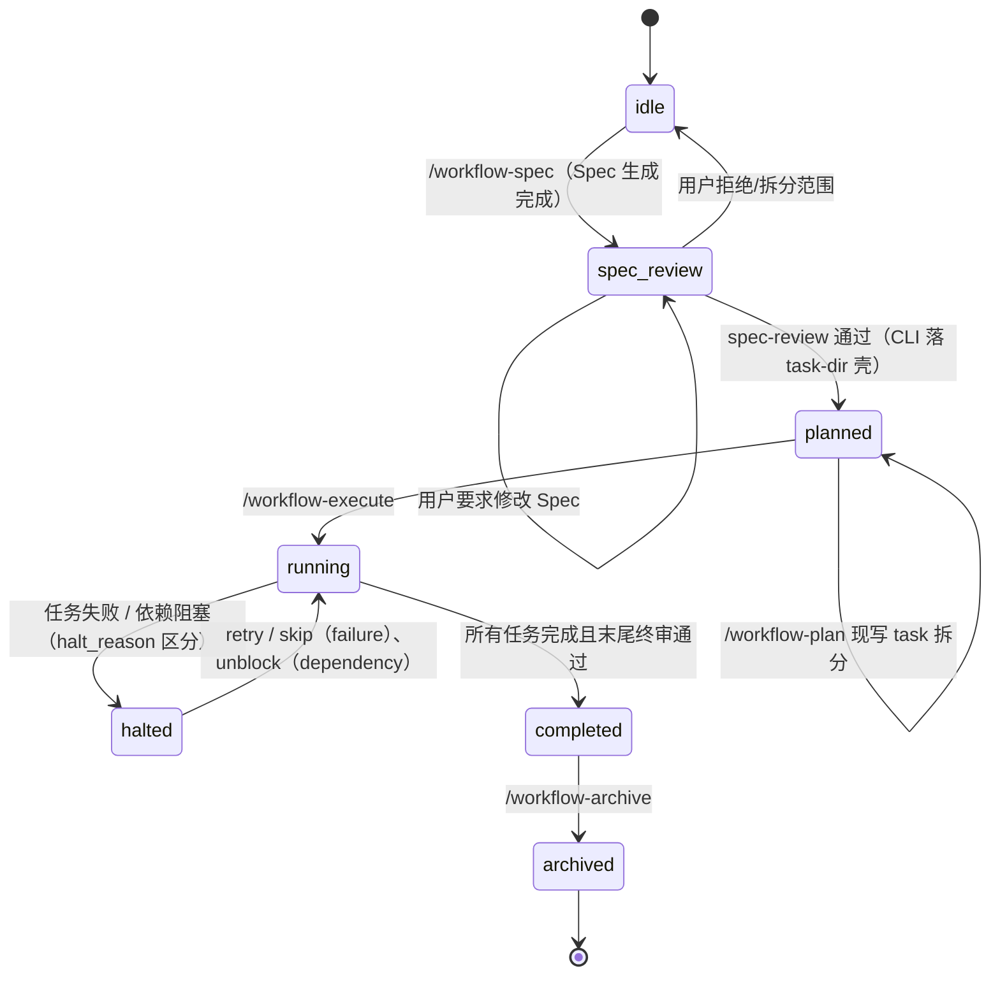

# @justinfan/agent-workflow

以模块化 workflow skills 为核心的多 AI 编码工具工作流工具集：把需求从"自然语言描述"推进到"Spec / Plan / 可执行任务"，支持 Claude Code、Qoder、Antigravity、Cursor、Codex、GitHub Copilot、OpenCode、Droid 共 8 个工具。

---

## 目录

- [1. 概览](#1-概览)
- [2. 安装与同步](#2-安装与同步)
- [3. Workflow 主线](#3-workflow-主线)
- [4. Code Specs](#4-code-specs)
- [5. Skills 一览](#5-skills-一览)
- [6. Hooks](#6-hooks)
- [7. 支持的 AI 编码工具](#7-支持的-ai-编码工具)
- [8. 开发与发布](#8-开发与发布)

---

## 1. 概览

仓库提供两条主线能力 + 一批专项 skills：

- **Workflow 主线**（6 个 skills）：`/workflow-spec` → `/workflow-plan` → `/workflow-execute`，从需求到可执行任务，支持中断恢复、增量变更（`/workflow-delta`）与归档
- **Code Specs**（3 个 skills + 项目级 `.claude/code-specs/`）：项目自己的"活文档"，承载"这个项目代码该怎么写"
- **专项 skills**：单点问题直接走对应 skill，无需进入状态机（完整清单见 [§5](#5-skills-一览)）

入口怎么选：

| 需求形态 | 入口 |
|------|------|
| 新功能 / 复杂重构 / 长 PRD / 需要显式 Spec 确认与中断恢复 | `/workflow-spec` |
| 简单到中等、一次性规划可完成 | `/quick-plan` |
| 跨 ≥2 服务 / 含 DDL / 对外接口的技术方案（三阶段研发流程） | `/design-plan`（实施后 `/plan-archive` 回写） |
| 单 Bug 修复 | `/fix-bug`（批量走 `/bug-batch`，根因定位走 `/diagnose`） |
| 代码审查 | `/diff-review`（staged / `branch` / `session` 三模式） |
| 需求模糊、先对齐再动手 | `/grill` |
| 多个互相独立的并行边界 | `/team`（Claude Code 原生 Agent Teams，需 `CLAUDE_CODE_EXPERIMENTAL_AGENT_TEAMS=1`，仅用户显式输入时生效） |

---

## 2. 安装与同步

### 2.1 安装（全局，覆盖全部 8 个工具）

```bash
npm i -g --registry <private-registry-url> @justinfan/agent-workflow
agent-workflow sync -y
```

- `npm i -g` 会**记住 registry**（供 `update` 复用），并为 installer-mount 类工具复制模板
- `sync -y` 安装 Claude Code / Antigravity 的原生 Plugin、按目录 mount 其余 6 个工具（含 Qoder）、清理旧版残留；`claude` CLI 不在 PATH 时降级为直接写 Plugin 配置

### 2.2 更新与验证

```bash
agent-workflow update     # = npm i -g @latest + 重新 sync -y；--registry <url> 换源（传一次即记住）
agent-workflow status     # 各工具安装状态
agent-workflow doctor     # 诊断配置问题
```

### 2.3 其他方式（可选）

```bash
agent-workflow sync --project -y     # 项目级安装（写当前仓库 .agents/ 而非 ~/.agents/）
```

仅需 Claude Code 时可直接用原生 Plugin（不经 npm）：

```
/plugin marketplace add fan776783/claude-workflow
/plugin install agent-workflow@agent-workflow-marketplace
```

开发调试：`git clone … && npm install && npm run sync`；链接调试 `npm run link`（claude-code 用 `claude --plugin-dir <repo>/core`）。

### 2.4 快速上手

```bash
/scan                                              # 首次：生成项目配置
/workflow-spec "需求描述"                           # 生成 spec.md，停在 spec_review 等确认
/workflow-spec spec-review --choice "Spec 正确，生成 Plan"
/workflow-plan                                     # 现写 task 拆分（task-dir）
/workflow-execute                                  # 逐 task 执行，末尾终审通过即 completed
```

---

## 3. Workflow 主线

### 3.1 命令

| 命令 | 说明 |
|------|------|
| `/workflow-spec` | 新需求入口：代码分析 → 需求讨论 → UX 审批（条件）→ 生成 `spec.md`，停在 `spec_review`；`spec-review` 通过后 CLI 落 task-dir 元数据壳，进入 `planned` |
| `/workflow-plan` | `planned` 状态下**现写最终 task 拆分**：按 implementation slice 经 `task-write` 整集写 task-dir + `context-curate` 写背包，`plan-review` lint 到 `ready:true`；可选扩写叙述 plan.md |
| `/workflow-execute` | 逐 task 执行：fresh implementer subagent + 单 reviewer subagent；所有 task 完成后 inline final reviewer 跑整 branch diff vs spec，**终审通过是进 `completed` 的唯一门** |
| `/workflow-delta` | 需求 / PRD / API 增量变更的影响分析与同步 |
| `/workflow-status` | 查看进度、阻塞点与下一步建议（只读） |
| `/workflow-archive` | 归档已完成工作流 |

> 独立的 `/workflow-review` 已下线，终审折叠进 execute Step 7；需要独立整 branch 复核走 `/diff-review branch <base>`。

### 3.2 状态机

7 个状态，所有状态变更通过 CLI 完成（AI 不直接读写 `workflow-state.json`）：



### 3.3 核心机制

- **Spec-first**：`spec.md` 是唯一权威规范，落在项目内 `docs/workflows/specs/{slug}-MMDD.md`（可入 git）；生成后必须经用户 `spec-review` 确认
- **机器 task 源 = task-dir**：`~/.claude/workflows/{pid}/tasks/{taskId}/{task.json,task.md,context.jsonl}`，由 `/workflow-plan` 现写、execute 经 `createTaskSource(state)` 读取；`plan.md` 退化为可选人类叙述（legacy plan.md-only workflow 由 `LegacyPlanMdSource` 兜底）
- **Lean execute**：controller 一次性从 task 源读全部 task 持内存，per-task 顺序派 fresh implementer subagent + 单 reviewer subagent（合并 AC + 质量两 phase）；reviewer PASS 仅内存确认，不落盘 quality gate
- **Review loop 护栏**：implementer ↔ reviewer 上限 3 次；第 2 次仍 REVISE 时 controller 调 codex `--oracle-review` 拿只读第二意见回灌第 3 次重派（codex 不可用则降级跳过）；超限 → `halted`
- **末尾终审（HARD-GATE）**：所有 task 完成后 inline final reviewer 跑整 branch diff vs spec；发现跨 task 集成问题不自动回退，issues 展示给用户决策（修复 / accept）
- **可恢复**：resume 三元组 = `current_tasks[0]` + `status` + task 源；`/clear` 后从磁盘等价重建
- **阶段交接**：spec→plan→execute 相邻阶段经 `handoff/{from}.md` 传递决策蒸馏（≤20 行 + freshness header），stale/missing 不阻断、回退读全文
- **并行边界**：plan task 一律顺序执行（有依赖 / 共享文件）；并行只走 `/dispatching-parallel-agents` 的只读 fan-out 与 writable fan-out（文件不重叠 + 无共享状态，回收后 conflict check + 全量验证 + 统一 commit），见 ADR 0003

### 3.4 产物落点

```text
项目目录（可入 git）                      用户目录（运行时状态）
docs/workflows/specs/{slug}-MMDD.md      ~/.claude/workflows/{projectId}/
.claude/config/project-config.json       ├── workflow-state.json（~3KB）
.claude/code-specs/                      ├── tasks/{taskId}/        ← 机器 task 源
                                         ├── plans/{name}.md        ← 可选人类叙述
                                         ├── handoff/{spec,plan,execute}.md
                                         ├── changes/CHG-XXX/
                                         └── archive/ journal/
```

---

## 4. Code Specs

`.claude/code-specs/` 按 `{pkg}/{layer}/` + 共享 `guides/` 分层。CLAUDE.md 说"AI 该知道的项目背景"，code-specs 说"这个项目代码该怎么写"。

| 命令 | 什么时候用 |
|------|-----------|
| `/spec-bootstrap` | 首次启用：按 `project-config.json` 的 `packages × frameworks` 生成 `{pkg}/{layer}/` 骨架 |
| `/spec-update` | 沉淀：完成实现 / 修完 bug / 设计决策后，按 7 段 code-spec 或 thinking guide 形态写入 |
| `/spec-review` | 维护：只读扫描 7 段完整性、过期、冲突、canonical 对账 |

与 workflow 的协同（全部 advisory，不硬阻塞）：`/workflow-spec` Step 1 读入作 Spec constraints；execute 按 task 的 `target_layer` 注入 scoped context；末尾终审按 diff 文件反查 code-spec；`/fix-bug` / `/bug-batch` 修复后定档 `code_specs_impact` 反哺 `/spec-update`。

7 段合约与闭环流程图详见 `docs/internal/Claude-Code-工作流体系指南.md § 4`。

---

## 5. Skills 一览

共 35 个 skill（权威清单以 `core/skills/` 为准），另有 2 个原生 command：`/team`（Agent Teams 入口）、`/git-rollback`（交互式回滚，默认 dry-run）。

| 类别 | Skill | 一句话 |
|------|-------|--------|
| **Workflow 主线** | `workflow-spec` / `workflow-plan` / `workflow-execute` / `workflow-delta` / `workflow-status` / `workflow-archive` | 见 §3 |
| **规划与对齐** | `ask-workflow` | skill 路由地图，不知道用哪个时看 |
| | `quick-plan` | 轻量规划，简单到中等任务 |
| | `grill` | 质询模糊需求到共享理解 |
| | `ux-elaboration` | 前端 UX 设计深化 → spec §4.4 Layout Anchors |
| | `prototype` | 抛弃式原型（TUI 验证 / 多版本 UI 对比） |
| **缺陷与审查** | `fix-bug` | 单 Bug 端到端修复（6 Phase + 两段 Hard Stop） |
| | `bug-batch` | 批量缺陷：全量分析找共因再成组修 |
| | `diagnose` | 根因证伪，不改代码，产出给 fix-bug 消费 |
| | `diff-review` | staged / branch / session 三模式代码审查 |
| | `tdd` | 红绿重构 vertical slice 纪律 |
| **设计与前端** | `figma-data` | Figma MCP 数据获取 + 资源分诊 → Design Package |
| | `figma-ui` | 消费 Design Package → Web 代码还原与验证 |
| | `api-smoke` | 多源接口 inventory，支持 quick 现场探测与 suite 持久脚本 |
| **研究与协作** | `research` | 代码库 / 生态 / 外部引文统一研究入口 |
| | `collaborating-with-codex` | Codex 委派编码 / 调试 / `--oracle-review` 只读第二意见 |
| | `dispatching-parallel-agents` | 同阶段 2+ 独立问题域的并行 subagent 分派 |
| | `handoff` | 把当前会话压缩成交接文档给下一 session |
| | `improve-architecture` | 架构深化机会扫描 |
| **Code Specs** | `spec-bootstrap` / `spec-update` / `spec-review` | 见 §4 |
| **项目级三阶段** | `design-plan` | 阶段一：跨服务技术方案 → `docs/designs/`（Hard Stop 评审） |
| | `plan-archive` | 阶段三：实施后 git log/diff 回写架构文档 |
| **MCP 桥接** | `bk` | 蓝鲸 CTeam / vTeam：待办 / Issue / 流转 / 评论 |
| | `alidocs` | 钉钉文档 / 表格 / AI 表格读写（mcp-gw） |
| **其他** | `scan` | 扫描项目生成 `project-config.json` |
| | `teach` | 多 session 教学 workspace（Knowledge / Skills / Wisdom + ZPD，仅用户显式触发） |
| | `write-a-skill` | meta-skill：新建 / 审查 SKILL.md |
| | `resolve-merge-conflicts` | 逐 hunk 解决 git 合并冲突，保留双方意图 |

**MCP 桥接共性**（`bk` / `alidocs` / `figma-data`）：把 MCP 调用封装成本地 CLI / mcp-gw 桥接——无状态、可控错误处理（退出码三桶归一化 `2` auth / `5` tool_not_found / `6` enum_invalid）、CI/sandbox 可跑、禁止 WebFetch 兜底（403）；共享 `core/skills/_shared/mcp-baseline.mjs`，经 checkin baseline + `<cli> diff-tools` 检测上游漂移（ADR 0001）。

---

## 6. Hooks

5 个 hook 脚本随 `sync` 自动注入，提供 runtime guardrails（注入上下文 + 守门，不替代状态机）：

| Hook 事件 | 脚本 | 职责 |
|-----------|------|------|
| `SessionStart` | `session-start.js` | 注入 workflow 上下文、next action 与 guardrail |
| `PreToolUse(Task)` | `pre-execute-inject.js` | Task 派发前 5 重门控 + 注入当前 task 的 task.md 正文 |
| `UserPromptSubmit` / `PreToolUse(ToolSearch)` | `skill-routing.js` | 命中 Figma / 钉钉 URL 时注入 skill 路由 hint |
| `TeammateIdle` | `team-idle.js` | Agent Teams 任务板未清空时留住队友 |
| `TaskCreated` / `TaskCompleted` | `team-task-guard.js` | 任务粒度守门：缺交付物 / 遗留 TODO 退码 2 拒绝 |

环境开关：`WORKFLOW_HOOKS=0` / `AGENT_WORKFLOW_DISABLE_HOOKS=1` / `CLAUDE_NON_INTERACTIVE=1` 任一命中即跳过 context 注入。Plugin 安装走 `core/hooks/hooks.json`；非 Plugin 工具由 installer 渲染 `core/hooks/agent-templates/` 模板。手动配置与故障排查见指南 § 6。

---

## 7. 支持的 AI 编码工具

当前支持 **8 个**：

| 分发方式 | 工具 |
|----------|------|
| 原生 Plugin | Claude Code、Antigravity（`agy plugin install`） |
| installer 逐 skill mount | Qoder、Cursor、Codex、GitHub Copilot、OpenCode、Droid |

> Gemini CLI 已于 2026-06-18 停服并入 Antigravity CLI（`agy`），原支持已移除。

---

## 8. 开发与发布

```bash
npm run prepublishOnly    # 校验：scripts/validate.js + 三段 node --test 套件
npm run release:patch     # 1.0.0 -> 1.0.1（自动 version bump + publish + tag + push）
npm run release:minor     # 1.0.0 -> 1.1.0
npm run release:major     # 1.0.0 -> 2.0.0
```

更多文档：

- `docs/internal/Claude-Code-工作流体系指南.md` — 完整深度参考（流程详解 / 状态机 / Hooks / FAQ）
- `core/specs/workflow-runtime/state-machine.md` — 唯一权威状态机定义
- `core/specs/platform-parity.md` — multi-tool 分发 parity 契约
- `core/skills/*/SKILL.md` — 各 skill 权威行为定义
- `.claude/code-specs/adr/` — 架构决策记录（0001 MCP drift-resilience / 0003 writable fan-out / 0004 lean execute）
