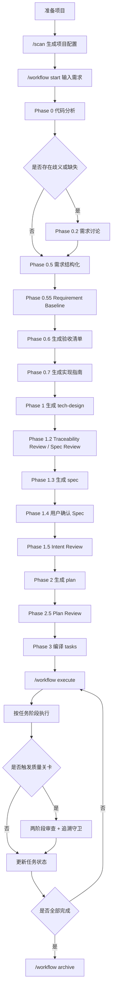

# @justinfan/agent-workflow

以 `workflow` skill 为核心的多 AI 编码工具工作流工具集。

它提供一套可移植的 Skills 体系，用于把需求从“自然语言描述”推进到“可执行任务与质量关卡”，并支持 Claude Code、Cursor、Codex、Gemini CLI 等多种 AI 编码工具。

---

## 核心能力

- `workflow`：需求分析、Requirement Baseline、Spec/Plan 生成、任务编排与执行
- `scan`：扫描项目技术栈并生成项目配置
- `analyze`：双模型技术分析
- `debug`：结构化问题定位与修复
- `diff-review`：基于 diff 的代码审查
- `write-tests`：测试编写与补齐
- `figma-ui` / `visual-diff`：UI 还原与视觉验证
- `bug-batch`：批量缺陷分析与修复编排

---

## 推荐安装方式

当前推荐直接克隆仓库后执行同步命令：

```bash
git clone <repo-url> claude-workflow
cd claude-workflow
npm install
npm run sync
```

常用变体：

```bash
# 同步到指定 Agent
npm run sync -- -a claude-code,cursor

# 项目级安装
npm run sync -- --project

# 无交互同步到所有已检测到的 Agent
npm run sync -- -y
```

同步完成后，建议先执行：

```bash
/scan
/workflow start "需求描述"
/workflow execute
```

---

## workflow 主线命令

```bash
/workflow start "需求描述"
/workflow execute
/workflow status
/workflow delta
/workflow archive
```

含义如下：

- `start`：启动规划流程
- `execute`：按任务编排推进执行
- `status`：查看当前工作流状态
- `delta`：处理 PRD / API /需求变更
- `archive`：归档已完成工作流

---

## 核心流程图



这条主线的重点是：

- 先通过 `Requirement Baseline` 固化需求真相源
- 再通过 `Spec / Plan / Tasks` 逐层收敛为可执行任务
- 执行阶段通过质量关卡和追溯守卫保证实现不偏离需求

---

## 适用场景

优先使用 `workflow` 的场景：

- 新功能开发
- 复杂重构
- 多阶段交付
- 长 PRD / 高约束需求
- 执行中可能发生增量变更的任务

如果只是单点问题，也可以直接使用专项 skill：

- 单 Bug：`/debug`
- 单次审查：`/diff-review`
- 单次分析：`/analyze`
- 单次补测：`/write-tests`
- UI 还原：`/figma-ui`

---

## 支持的 AI 编码工具

当前支持 10+ AI 编码工具，包括：

- Claude Code
- Cursor
- Codex
- Gemini CLI
- GitHub Copilot
- Kilo Code
- OpenCode
- Qoder
- Antigravity
- Droid

---

## 更多文档

如需查看更完整说明，可参考：

- `Claude-Code-工作流体系指南.md`
- `Claude-Code-入门配置指南.md`
- `templates/skills/workflow/SKILL.md`

---

## 开发与发布

```bash
# 校验发布内容
npm run prepublishOnly

# 发布
npm run release:patch
npm run release:minor
npm run release:major
```
