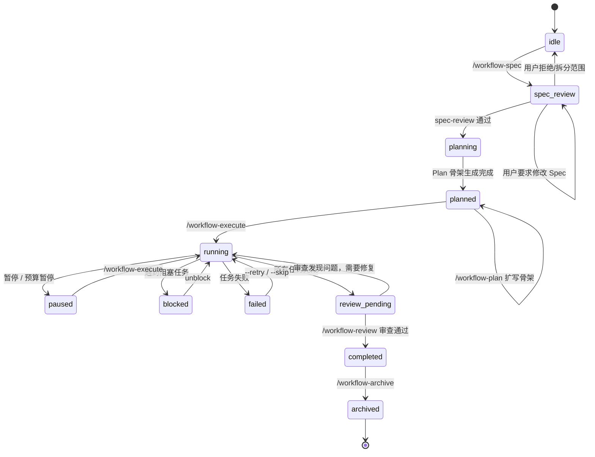
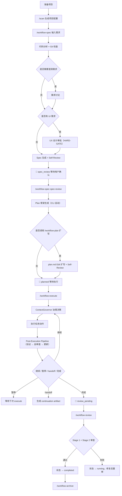

# @justinfan/agent-workflow

以模块化 workflow skills 为核心的多 AI 编码工具工作流工具集。

它提供一套可移植的 Skills 体系，用于把需求从"自然语言描述"推进到"Spec / Plan / 可执行任务"，并支持 Claude Code、Cursor、Codex、Gemini CLI、Antigravity、Droid 等多种 AI 编码工具。

---

## 目录

- [1. 概览](#1-概览)
- [2. 安装与同步](#2-安装与同步)
- [3. Workflow](#3-workflow)
- [4. Code Specs](#4-code-specs)
- [5. 其他命令与 Skills](#5-其他命令与-skills)
- [6. Hooks 流程控制](#6-hooks-流程控制)
- [7. 支持的 AI 编码工具](#7-支持的-ai-编码工具)
- [8. 更多文档与开发发布](#8-更多文档与开发发布)

---

## 1. 概览

仓库提供两条主要能力：

- **Workflow 主线**（7 个专项 skills）：从需求推进到可执行任务，支持中断恢复、增量变更与显式完成审查；其中 `/workflow-spec` 是新需求入口，`/workflow-plan` 仅在已审批 Spec 上扩写 Plan
- **Code Specs**（3 个专项 skills + 项目级 `.claude/code-specs/`）：项目自己的"活文档"，承载"这个项目代码该怎么写"的具体约束

此外还有专项 skills（`/fix-bug`、`/diagnose`、`/grill`、`/zoom-out`、`/tdd`、`/write-a-skill`、`/diff-review`、`/bug-batch`、`/figma-ui`、`/figma-data`、`/ux-elaboration`、`/system-design`、`/improve-architecture`、`/prototype`、`/handoff`、`/research`、`/quick-plan`、`/api-smoke`、`/alidocs` 等）、`/team` 原生 Agent Teams 入口，以及辅助 commands（`/git-rollback`）。

优先使用 `workflow` 的场景：

- 新功能开发
- 多阶段交付
- 复杂重构
- 长 PRD 或高约束需求
- 需要显式用户确认 Spec 的任务
- 需要中断恢复、增量变更、子 Agent 执行隔离或只读 fan-out 的任务

如果只是单点问题，也可以直接使用专项 skill：

- 需求对齐（先别写代码）：`/grill`
- 快速理解陌生模块：`/zoom-out`
- 疑难 Bug 根因证伪：`/diagnose`（先建反馈循环 → 多假设排序 → 产出根因,不改代码）
- 单 Bug 端到端修复：`/fix-bug`（内部可触发 `/diagnose`）
- 单次审查：`/diff-review`（会先做 finding verification，再对 material findings 做 impact analysis）
- 当前会话审查：`/diff-review --session`（只审本模型在本会话里改过的文件，avoid 扫入上游或他人改动；合并自旧 `/session-review`）
- 前端 UX 设计深化（§4.4）：`/ux-elaboration`
- 后端系统设计深化（§5.6）：`/system-design`
- Figma 设计稿读取 / 提取：`/figma-data`
- Figma 设计稿到代码：`/figma-ui`
- 钉钉文档 / AI 表格读写：`/alidocs`
- 接口冒烟脚本（前端视角）：`/api-smoke`
- 批量缺陷：`/bug-batch`
- TDD 纪律（红绿重构）：`/tdd`
- 抛弃式原型（TUI / 多版本 UI 对比）：`/prototype`
- 架构深化机会扫描：`/improve-architecture`
- 会话交接（压缩当前 context 给下一段）：`/handoff`
- 技术调研 / 找现成库：`/research`（合并自 `/search-first` + `/deep-research`）
- 轻量规划：`/quick-plan`（从 command 迁 skill；复杂场景仍用 `/workflow-spec`）
- 沉淀规范：`/spec-update` / `/spec-review`
- 新建 / 审查 skill：`/write-a-skill`

优先使用 `/team` 的场景（Claude Code 原生 Agent Teams）：

- 多角度并行审查 / 研究（安全 / 性能 / 测试覆盖三路并进后综合）
- 独立模块的并行实现（各自拥有不同文件集）
- 竞争假设的 debug（队友互相反驳直到收敛）
- 跨层改动（前端 / 后端 / 测试分工同步推进）

需要先在 settings.json / 环境变量里打开 `CLAUDE_CODE_EXPERIMENTAL_AGENT_TEAMS=1` 且 Claude Code ≥ v2.1.32；`/team` 仅在用户显式输入时生效，不会被 `/workflow-*` / `/quick-plan` / 宽泛请求自动触发。

---

## 2. 安装与同步

### 2.1 Claude Code 用户（v6.0.0+ 走 Plugin 机制）

Claude Code 用户从 **v6.0.0** 起走官方 Plugin 机制分发，其他 7 个工具（Cursor / Codex / Gemini CLI 等）继续走 installer。

#### 方式 A —— Claude Code Plugin（Claude Code 用户首选）

在 Claude Code 会话里安装：

```
/plugin marketplace add fan776783/claude-workflow
/plugin install agent-workflow@agent-workflow-marketplace
```

更新到最新版本：

```
/plugin update agent-workflow@agent-workflow-marketplace
```

在 Claude Code 会话外（终端）安装（需要 `claude` CLI 在 PATH）：

```bash
claude plugin marketplace add fan776783/claude-workflow
claude plugin install agent-workflow@agent-workflow-marketplace
```

更新到最新版本：

```bash
claude plugin marketplace update agent-workflow-marketplace
claude plugin update agent-workflow@agent-workflow-marketplace
```

查看当前已安装的 Plugin：

```bash
claude plugin list --json
```

#### 方式 B —— 通过 npx sync（次选，也覆盖其他工具）

如果要同时给 Cursor / Codex / Gemini CLI 等安装，或需要在一条命令里顺带清理 v5.x 残留，用 sync：

```bash
npx --yes --registry <private-registry-url> @justinfan/agent-workflow@latest sync -y
```

sync 自动同步所有已检测到的工具（不再支持 `-a` 选择子集）。若 `claude` CLI 不在 PATH，sync 会打印方式 A 的手动指引。

#### 方式 C —— 克隆仓库后本地同步（开发调试）

```bash
git clone https://github.com/fan776783/claude-workflow claude-workflow
cd claude-workflow
npm install
npm run sync
```


### 2.2 其他 7 个 AI 工具（Cursor / Codex / Gemini CLI 等）

方式 B 的 npx sync 与方式 C 的 `npm run sync` 自动同步所有已检测到的工具，包括 Cursor / Codex / Gemini CLI / GitHub Copilot / OpenCode / Antigravity / Droid。不再支持 `-a` 选择子集。常用选项：

```bash
# 项目级安装（写到当前仓库的 .agents/，而不是 ~/.agents/）
npm run sync -- --project

# 跳过确认
npm run sync -- -y

# 本地开发调试：把受管目录链接到当前仓库 core/（claude-code 不支持 link，开发者请用 --plugin-dir）
npm run link
```

同步完成后，建议先执行：

```bash
/scan
/workflow-spec "需求描述"
/workflow-spec spec-review --choice "Spec 正确，生成 Plan"
/workflow-plan                 # 可选：在已生成的 plan 骨架上做精细扩写
/workflow-execute
/workflow-review
```

如果要并行推进多个独立边界，可显式用 `/team`（Claude Code 原生 Agent Teams）：

```bash
/team 并行实现三个独立模块：auth / billing / notification
```

需要先打开 `CLAUDE_CODE_EXPERIMENTAL_AGENT_TEAMS=1` 才能生效。

---

## 3. Workflow

本章收敛 workflow 主线的全部内容：命令入口、系统模型、状态机、流程图、数据流、并行批次。

### 3.1 命令入口

Workflow 主线由 7 个专项 skills 直接驱动：

| 命令 | 说明 |
|------|------|
| `/workflow-spec` | 新需求入口：代码分析、需求讨论、UX/系统设计深化路由、Spec 生成，停在 `spec_review`；spec-review 通过后生成 Plan 骨架进入 `planned` |
| `/workflow-plan` | 在已审批 Spec 基础上对 Plan 骨架做扩写（只在 `planned` 状态下，不改变状态机） |
| `/workflow-execute` | 治理决策、任务执行、验证与状态推进；所有 task 完成后状态设为 `review_pending` |
| `/workflow-review` | 全量完成审查（execute 完成后独立执行），审查通过后标记 `completed` |
| `/workflow-delta` | 需求 / PRD / API 增量变更的影响分析与同步 |
| `/workflow-status` | 查看当前进度、阻塞点与下一步建议 |
| `/workflow-archive` | 归档已完成工作流 |

各命令的详细调用方式：

#### `workflow-spec`（Spec 入口 Skill）

```bash
/workflow-spec "需求描述"
/workflow-spec docs/prd.md
/workflow-spec --no-discuss docs/prd.md
/workflow-spec spec-review --choice "Spec 正确，生成 Plan"
```

- 启动规划流程，生成 `spec.md` 并停在 `spec_review`
- `spec-review`：记录用户审查结论，通过后由 CLI 生成 `plan.md` 骨架，状态转 `planned`
- Step 1 读取 `.claude/code-specs/` 作为 advisory constraints；Spec 模板新增 `3.x Project Code Specs Constraints` 小节承载
- Step 5 评估是否需要委托 `/ux-elaboration`（§4.4 Layout Anchors）或 `/system-design`（§5.6 API Contract / Data Flow）做设计深化
- Codex Spec Review（条件，advisory）在 Spec 生成后可选触发

#### `workflow-plan`（Plan 扩写 Skill）

```bash
/workflow-plan        # 在 planned 状态下对 plan.md 骨架做精细扩写
```

- 仅在 `status=planned` 时生效，**不创建骨架**、**不改变状态机**
- 用 Edit 增量扩写 CLI 已生成的 plan 骨架，HARD-GATE 禁止 Write 全量覆盖、禁止改首个 task ID
- Codex Plan Review（条件，bounded-autofix）在 Plan 扩写完成后可选触发

#### `workflow-execute`（执行 Skill）

```bash
/workflow-execute
/workflow-execute --retry
/workflow-execute --skip
/workflow-execute --tdd        # v6.4.2+ 显式启用 TDD 路径
```

- 按 `plan.md` 推进执行，经过 ContextGovernor 治理与验证
- 所有 task 完成后状态设为 `review_pending`，提示用户执行 `/workflow-review`
- TDD 默认不开启，仅在传入 `--tdd` 且任务形态满足条件（phase 为 `implement`/`ui-*`、存在测试命令、actions 含 `create_file`/`edit_file`、文件类型非豁免）时进入红绿重构循环
- v6.4.4+ Step 5 review loop 第 2 次仍 REVISE → controller 程序化标 `stuck_or_looping`，调 `collaborating-with-codex` `--oracle-review` 作为**第 3 次重派的 `revise_instructions` 增强输入**，不接管实现、不消耗 loop 预算；codex 不可用 → journal 写 `codex-status: codex_degraded` 跳过回灌

#### `workflow-delta`（增量变更 Skill）

```bash
/workflow-delta
/workflow-delta docs/prd-v2.md
/workflow-delta "新增导出功能，支持 CSV"
```

- 处理 PRD / API / 需求增量变更

#### `workflow-status`（状态查看 Skill）

```bash
/workflow-status
/workflow-status --detail
```

- 查看当前状态、进度与下一步建议

#### `workflow-archive`（归档 Skill）

```bash
/workflow-archive
/workflow-archive --summary
```

- 归档已完成工作流

#### `workflow-review`（全量完成审查 Skill）

```bash
/workflow-review
```

- `workflow-execute` 完成所有 task 后状态设为 `review_pending`，用户通过 `/workflow-review` 手动触发
- Stage 1 以人工对照 code-spec / guides 的方式检查实现是否符合项目约定（声明式审查，无机读硬卡）
- Stage 1 附带 Code Specs Check（按 diff 文件反查 `{pkg}/{layer}/` code-spec）和跨层 A/B/C/D advisory，均不消耗 4 次共享预算、不影响 pass/fail
- Stage 1 Probe E（阻塞）：命中 infra / cross-layer 关键路径，且关联 code-spec 存在但 7 段里 `Validation & Error Matrix` / `Good / Base / Bad Cases` / `Tests Required` 任一缺失时，Stage 1 直接 fail
- Stage 1 检查 Spec 合规、跨 task contract 一致性、需求覆盖汇总与 spec §1 成功标准；不重审每个 task 的代码质量
- Stage 2 做终态卫生检查；当 `spec.metadata.risk_signals[]` 命中 `security` / `backend_heavy` / `data` 时，可触发 `codex_enhanced` spec 级第二意见
- per-task 代码质量已由 `/workflow-execute` Step 5.2 的单 reviewer subagent 覆盖；`/workflow-review` 只补跨 task / 整需求 / 终态维度
- 审查通过 → 状态推进到 `completed`；审查失败 → 状态回退到 `running`；预算耗尽 → 标记 `failed`

### 3.2 系统分层架构

当前 `workflow` 采用"**7 个专项 workflow skills + 共享运行时**"的模块化结构，整个系统分为 **4 层**，从上到下依次是：

```
+-----------------------------------------------------------------+
|                          用户层                                   |
|  /workflow-spec | /workflow-plan | /workflow-execute              |
|  /workflow-review | /workflow-delta | /workflow-status            |
|  /workflow-archive                                                |
+-----------------------------------------------------------------+
|                  Skill 层 (行动指南)                               |
|  workflow-spec | workflow-plan | workflow-execute                 |
|  workflow-review | workflow-delta | workflow-status               |
|  workflow-archive                                                 |
|  自然语言 SKILL.md, 不含可执行代码                                 |
+-----------------------------------------------------------------+
|                 Runtime 层 (CLI 工具链)                            |
|  workflow_cli.js        统一命令入口                              |
|  execution_sequencer.js 执行治理 (ContextGovernor)                |
|  state_manager.js       状态读写                                  |
|  task_parser.js         Plan 解析                                 |
|  quality_review.js      质量关卡                                  |
|  verification.js        验证证据                                  |
|  journal.js             会话日志                                  |
|  plan_composer.js       Plan 骨架生成 / 锚点编辑 / self-review     |
|  spec_bootstrap.js      Code-specs 骨架生成（{pkg}/{layer}/）     |
+-----------------------------------------------------------------+
|                  Hooks 层 (运行时守门)                             |
|  session-start.js       会话启动上下文注入 + guardrail             |
|  pre-execute-inject.js  Task 派发前门控 + 任务上下文注入           |
+-----------------------------------------------------------------+
                            | 读写
+-----------------------------------------------------------------+
|                        数据层                                     |
|  项目目录:                        用户目录:                        |
|  .claude/specs/*.md               ~/.claude/workflows/{id}/       |
|  .claude/plans/*.md                 workflow-state.json            |
|  .claude/config/project-config.json                               |
+-----------------------------------------------------------------+
```

**职责分离**：
- **Skill 层**：自然语言行动指南，AI 的操作手册，不含可执行代码；用户直接调用 skill
- **CLI 层**：确定性状态管理，所有状态读写通过 CLI，AI 不直接操作 JSON
- **Hook 层**：运行时守门人，上下文注入 + 治理检查，不写主状态

### 3.3 目录结构

```text
core/
+-- commands/team.md              # 独立 /team command 入口
+-- skills/
|   +-- workflow-spec/            # /workflow-spec + spec-review（新需求入口）
|   +-- workflow-plan/            # /workflow-plan（planned 状态下 Plan 骨架扩写）
|   +-- workflow-execute/         # /workflow-execute
|   +-- workflow-review/          # /workflow-review 全量完成审查
|   +-- workflow-delta/           # /workflow-delta
|   +-- workflow-status/          # /workflow-status
|   +-- workflow-archive/         # /workflow-archive
+-- commands/
|   +-- team.md                   # /team 命令（原生 Agent Teams 入口）
+-- specs/
|   +-- workflow-runtime/         # 状态机、共享工具、外部依赖语义
|   +-- workflow-templates/       # spec / plan 模板
+-- hooks/                        # workflow / team 运行时 hook 脚本
+-- utils/
    +-- workflow/                  # workflow_cli.js、execution_sequencer.js、quality_review.js、plan_composer.js、spec_* 等
```

### 3.4 声明式 Skill 架构

每个 workflow skill 采用统一的声明式架构：

- **HARD-GATE**：不可违反的铁律规则
- **Checklist**：必须按序完成的行动清单
- **CLI 接管**：所有状态变更通过 CLI 完成，不直接读写 JSON

在此结构下，工作流仍保持三层工件模型：
- `spec.md`：统一承载范围、架构、约束、验收标准与实施切片
- `plan.md`：可直接执行的原子步骤、文件清单与验证命令
- 执行层：按计划产出代码，并经过验证、per-task reviewer 审查与最终完成审查

核心设计原则：

- 单一 `spec.md` 作为规划阶段的权威规范
- `plan.md` 必须可直接执行，禁止占位式描述
- `execute` 采用 governance-first continuation，由 `ContextGovernor` 优先基于任务独立性与上下文污染风险决定继续、暂停或 handoff
- 支持 subagent 的平台默认每 task 起 fresh implementer subagent，再起单 reviewer subagent 合并检查 acceptance criteria 与代码质量
- `/workflow-review` 只做整需求验收、跨 task contract 一致性和终态卫生，不重复 per-task 代码质量审查
- 所有状态变更通过 CLI 完成，不直接读写 `workflow-state.json`

### 3.5 状态机全景

工作流有 **11 个状态**，每个状态都有对应的 Hook 护栏规则：



### 3.6 当前核心流程图



### 3.7 数据流拓扑

工作流产物按**是否可提交 Git** 分为两个位置：

```text
项目目录（可提交 Git）                   用户目录（运行时状态，不污染项目）
.claude/                                 ~/.claude/workflows/{projectId}/
+-- config/                              +-- workflow-state.json
|   +-- project-config.json              +-- analysis-result.json
+-- specs/                               +-- discussion-artifact.json
|   +-- {name}.md          <- Spec       +-- ux-design-artifact.json
+-- plans/                               +-- prd-spec-coverage.json
|   +-- {name}.md          <- Plan       +-- changes/CHG-XXX/
+-- reports/                             |   +-- delta.json
    +-- {name}-report.md   <- 实施报告   |   +-- intent.md
                                         |   +-- review-status.json
                                         +-- archive/
                                         +-- journal/
```

### 3.8 执行隔离与只读 fan-out

`workflow-execute` 当前采用 **fresh-subagent-per-task**：每个 task 串行启动一个全新 implementer subagent，完成后紧跟一个单 reviewer subagent，在同一 reviewer 中依次检查 acceptance criteria 与代码质量。

并行只用于只读 fan-out：当同阶段存在 2+ 可证明独立的问题域（独立 bug 调查、多个失败测试文件、独立子系统 trace / diagnose / research / analysis）时，委托 `dispatching-parallel-agents` 并行调查，产出结论回主会话整合。

写代码动作一律顺序执行；不再支持 writable parallel execution、集成 worktree 合流或 `batch_orchestrator.js` / `merge_strategist.js` 批次编排。

---

## 4. Code Specs

`.claude/code-specs/` 是项目自己的"活文档"，按 `{pkg}/{layer}/` + 共享 `guides/` 分层。

### 4.1 定位

1. **code-spec**（`{pkg}/{layer}/*.md`）— 具体该怎么写代码，采用 7 段合约：Scope / Trigger · Signatures · Contracts · Validation & Error Matrix · Good-Base-Bad Cases · Tests Required · Wrong vs Correct
2. **guides**（`guides/*.md`）— 写代码前该想什么：思考清单、常见陷阱、决策思路，不重复 code-spec 的具体规则
3. **layer index**（`{pkg}/{layer}/index.md`）— 四段入口：Overview · Guidelines Index · Pre-Development Checklist · Quality Check

项目侧的目录结构：

```text
.claude/code-specs/
+-- index.md                       # 根索引 + 更新记录
+-- local.md                       # 本项目模板基线 + Changelog
+-- {pkg}/
|   +-- frontend/                  # 前端 7 段 code-spec
|   +-- backend/                   # 后端 7 段 code-spec
+-- guides/                        # 跨 package / 跨 layer 共享的 thinking 清单
```

### 4.2 三个命令的分工

| 命令 | 什么时候用 |
|------|-----------|
| `/spec-bootstrap` | 项目首次启用 code-specs 时，或 `/scan` 提示未初始化时。按 `project-config.json.monorepo.packages × tech.frameworks` 生成 `{pkg}/{layer}/` 骨架；`--reset` 清空重建 |
| `/spec-update` | 完成一次有沉淀价值的实现、修完一个 bug、做完一个设计决策之后。交互式按 7 段 code-spec 或 thinking guide 形态写入 |
| `/spec-review` | 定期维护（例如每周 / 每次大版本前）。只读扫描 7 段合约完整性、过期、冲突、canonical / manifest 对账，生成报告让人决定后续动作 |

动手写代码前的预读不再作为独立命令：`core/CLAUDE.md` 的 "Code Specs 切换 package/layer" 声明会驱动 AI 在即将落代码到具体 `{pkg}/{layer}` 时主动读对应 index + Pre-Development Checklist。

### 4.3 与 workflow 主线的协同点

- `/scan` Part 5 首次扫描时引导初始化；已有 code-specs 时汇总 filled/draft 状态
- `/workflow-spec` Step 1 作为 advisory constraints 供 Spec 生成参考
- `/workflow-execute` 以 advisory 形式注入项目 code-specs；`plan-template.md` 新增可选字段 `Target Layer`，按任务 `target_layer` 与变更文件 hint 做二次裁剪，`<project-code-specs>` 段会带 `layer` / `hints` 属性
- SessionStart hook 注入 overview digest / paths-only 清单；无活跃 workflow 时 AI 按 `core/CLAUDE.md` 的 "Code Specs 切换 package/layer" 规则在动手前主动读对应 `{pkg}/{layer}/index.md` 及 Pre-Development Checklist
- `/workflow-review` Stage 1 做 3 层 advisory：人工对照 code-spec + Code Specs Check（按 diff 文件反查 code-spec，记录 advisory findings 到 `stage1.code_specs_check`）+ 跨层 A/B/C/D advisory。Probe E Infra 深度 Gate（阻塞）仅在 infra / cross-layer 关键路径 + 关联 code-spec 存在但 7 段深度不足时触发，写入 `stage1.cross_layer_depth_gap` + `blocking_issues`
- `/fix-bug` Phase 4.1 强制定档 `code_specs_impact`（四档：`spec_violation` / `spec_gap` / `contract_misread` / `spec_unrelated`），判定 `spec_gap` 时附 Bad/Good 草案 + `/spec-update` 提示；`.claude/code-specs/` 不存在时统一判 `spec_unrelated` 避免虚假 advisory
- `/bug-batch` 单元级定档 + Phase 8 跨单元归纳：同一文件被 2+ FixUnit 标 `spec_gap` → 输出强信号 advisory 建议 `/spec-update`，同一段落被 2+ FixUnit 标 `spec_violation` → 建议审视执行机制

完整闭环流程图见 `docs/internal/Claude-Code-工作流体系指南.md § 4.6` 的"Code Specs 闭环流程图"。

### 4.4 典型使用链路

以"第一次接入 + 沉淀一条 API 契约"为例：

```bash
# 1. 首次扫描项目，/scan 会提示 code-specs 未初始化
/scan

# 2. 按提示初始化骨架（或直接 /spec-bootstrap）
/spec-bootstrap
# → 生成 .claude/code-specs/{index.md, local.md, {pkg}/{layer}/index.md, guides/index.md}

# 3. 正常跑 workflow，完成实现
/workflow-spec "xxx 需求"
/workflow-spec spec-review --choice "Spec 正确，生成 Plan"
/workflow-execute
/workflow-review

# 4. 实现中稳定下来一条新 API，沉淀为 code-spec
/spec-update
# → 交互式选 {pkg}/backend/auth-api.md → 逐段填写 7 段合约
# → 含具体 file path / API name / payload 字段 / 错误矩阵 / 测试断言 / wrong vs correct

# 5. 跑一次完整性检查
/spec-review
# → 若 7 段仍有占位符或抽象描述，报告会列出待补齐项
```

---

## 5. 其他命令与 Skills

### 5.1 Public Commands

除了 skill 外，仓库还会安装两个原生 command 入口（`core/commands/`）：

| 命令 | 类型 | 说明 |
|------|------|------|
| `/team` | command | Claude Code 原生 Agent Teams 入口；仅在用户显式输入时使用，不自动触发 |
| `/git-rollback` | command | 交互式 Git 回滚入口，默认 dry-run 预览 |

其他所有能力（含 `/quick-plan`、`/spec-bootstrap`、`/spec-update`、`/spec-review` 及 workflow 主线）均以 skill 形态分发，详见 5.3。

### 5.2 `/team` 命令

`/team` 是 Claude Code 原生 Agent Teams 的快捷入口。用一句自然语言描述任务，当前会话充当负责人，生成若干独立队友并行工作，每位队友拥有自己的 context window，彼此通过共享任务板和 mailbox 协作。

```bash
/team 并行审查 PR #142 的安全、性能、测试覆盖
/team 用 4 个 Sonnet 队友并行重构这几个模块
```

要点：
- 需要在 settings.json 或环境变量中打开 `CLAUDE_CODE_EXPERIMENTAL_AGENT_TEAMS=1`，版本 ≥ v2.1.32
- `/team` 仅在用户**显式输入**时生效；`/workflow-*`、`/quick-plan`、自然语言宽泛请求和 Broad Request Detection 都不会自动进入 team
- 收尾由 `TeammateIdle` hook 与负责人分工：任务板清空时 hook 让队友给负责人发一条 message 后正常 idle，负责人收到后按需 shutdown 剩余队友再执行 `clean up team`；若 cleanup 失败再通过 `AskUserQuestion` 弹出"重试 / 强制 / 保留"三个快捷选项
- `TaskCreated` / `TaskCompleted` hook 守门任务粒度和完成条件，缺 owner/deliverable 或遗留 TODO 时退码 2 拒绝
- 以上 hook 脚本在安装时自动写入 `~/.claude/settings.json`，脚本落在 `~/.claude/.agent-workflow/hooks/team-idle.js` 与 `team-task-guard.js`
- `dispatching-parallel-agents` 和 subagent 继续解决单会话内的并行分派问题，与 `/team` 互不替代

### 5.3 专项 Skills

| Skill | 功能 |
|-------|------|
| `scan` | 扫描项目技术栈并生成项目配置 |
| `grill` | 对齐澄清 - 质询模糊需求到共享理解（合并自旧 `/enhance` + `quick-plan` Ambiguity Gate） |
| `zoom-out` | 抬升抽象层,画相关 module 和 caller 的地图(7 行级轻量 skill) |
| `diagnose` | 疑难 Bug 反馈循环 + 假设证伪(不改代码,给 fix-bug / workflow-execute 消费)；v6.4.4+ Phase 3 证伪迭代第 2 轮仍不收敛 → 标 `stuck_or_looping` 调 oracle 拿 alternative POV |
| `fix-bug` | 结构化定位与修复单点问题 |
| `bug-batch` | 批量缺陷分析、去重与修复编排；v6.4.4+ 每个 issue 输出 `risk_signals`，FixUnit 聚合 signals 后单元级 review 按 risk-signal 路由 |
| `tdd` | 红绿重构 vertical slice TDD 纪律；v6.4.4+ 同一 RED 经 3 次 GREEN 尝试未通过或回归 2 个绿 test 后 2 次修正未恢复 → 标 `stuck_or_looping`，**implementer 不得自起 codex**，由 controller 统一调 `--oracle-review` 回灌 |
| `prototype` | 抛弃式原型 — TUI 验证状态/数据 + 多版本 UI 并排对比 |
| `improve-architecture` | 架构深化机会扫描（删除测试 / 依赖归类 / 并行接口设计探索） |
| `handoff` | 把当前会话压缩成交接文档，给下一个 agent / session 接力 |
| `diff-review` | Impact-aware Quick / Deep 模式代码审查;支持 `--session` 覆盖当前会话改动（合并自旧 `session-review`） |
| `ux-elaboration` | 前端 UX 设计深化 — User Flow + Page Hierarchy + Layout Anchors → spec §4.4 |
| `system-design` | 后端系统设计深化 — API Contract + Data Flow + Service Boundaries → spec §5.6 |
| `figma-data` | Figma MCP 数据获取 + 资源分诊 → Design Package（不写代码） |
| `figma-ui` | 消费 Design Package → Web 代码还原与验证 |
| `research` | 统一研究入口 - 代码库 / 生态 / 外部引文（合并自 `search-first` + `deep-research`） |
| `quick-plan` | 轻量快速规划 skill |
| `api-smoke` | 前端视角从 Spec + YApi autogen 生成后端接口冒烟脚本 |
| `alidocs` | 钉钉文档 / 在线表格 / AI 表格读写（通过 mcp-gw，不走 WebFetch） |
| `dispatching-parallel-agents` | 对同阶段 2+ 独立任务做并行子 Agent 分派 |
| `spec-bootstrap` | 初始化 `.claude/code-specs/` 骨架 |
| `spec-update` | 按 7 段 code-spec 合约或 thinking guide 形态写入 |
| `spec-review` | 审查 7 段完整性、过期、冲突、canonical / manifest 对账 |
| `write-a-skill` | Meta-skill - 新建 / 审查 SKILL.md 尺寸与描述 |
| `collaborating-with-codex` | Codex App Server 运行时委派编码 / 调试 / 审查；v6.3.0 起支持 `--model` / `--effort` Code Tasks 模式、per-job log（`Monitor "tail -F"` push 观察）、`--result <id>` 终态聚合（含 touchedFiles[] / fileChanges[] / commandExecutions[]）；v6.4.3 起新增 `--oracle-review` 高风险只读 oracle 模式，配合 risk-signal 路由（详见 `core/specs/shared/codex-routing.md`）；v6.4.4 起被 `workflow-execute` / `diagnose` / `tdd` / `bug-batch` 在 `stuck_or_looping` 信号触发时 controller 统一调用，read-only POV 回灌实现者 |
| `bk` | 蓝鲸项目管理 CLI（看待办、查 issue、流转状态、评论） |

### 5.4 MCP 替代 Skills（CLI / MCP-gw 桥接）

下面三个 skill 都是为了**替代直连 MCP 服务**而存在——它们把 MCP 调用封装成本地 CLI 或 mcp-gw 网关桥接，让 AI 不必持有 MCP 长连接、可控错误处理、可在 CI / sandbox 中执行：

| Skill | 替代的 MCP | 桥接方式 | 触发场景 |
|-------|-----------|----------|---------|
| `alidocs` | 钉钉文档 / 表格 / AI 表格 MCP | `mcp-gw.dingtalk.com/server/<hash>?key=<key>` 网关 + `doc` / `sheet` / `aitable` CLI | 用户给出 alidocs 链接 / nodeId / dentryUuid / sheetId / A1:D10 等，需要读写文档或表格 |
| `figma-data` | Figma Dev MCP | Figma MCP + 本地资源分诊 → Design Package（不写代码） | 用户给出 Figma URL 但只是要读取 / 提取 / 导出资源；也被 `figma-ui` 委托执行 Phase A 数据获取 |

**通用约束**：

- **禁止 WebFetch 兜底**：`figma.com` / `alidocs.dingtalk.com` 直连 WebFetch 必返 403；命中域名时 `skill-routing.js` 的 `UserPromptSubmit` + `PreToolUse(ToolSearch)` 会主动注入路由 hint 把请求拽回对应 skill
- **凭据管理**：`bk` token 落盘到 `~/.config/bk-mcp/token`（0600）；`alidocs` 通过 mcp-gw URL 中的 `key` 鉴权；`figma-data` 依赖 Figma MCP 的本地登录态
- **错误码契约（三桶归一化）**：CLI 退出码 `0` 成功 / `1` 本地错（缺 token / 参数错 / 网络不通）/ `2` auth 错 / `5` `tool_not_found`（上游 MCP 改名/下线）/ `6` `enum_invalid`（动态枚举漂移），stderr 输出 `{kind, hint, originalMessage}` 结构化对象供调用方解析
- **由 AI 引导初始化**：缺凭据 / 缺 project_id / 缺 mcp-gw URL 时由 AI 引导用户粘贴 token，AI 自己调 `bk auth` / `alidocs config set` 落盘，不要让用户手敲 CLI

**Drift-resilience 机制（ADR-0001）**：

三个 wrapper skill 通过 `core/skills/_shared/mcp-baseline.mjs` 共享 tool snapshot / shape 解析 / 错误归一化逻辑（`_*/` 下划线前缀目录约定 = 跨 skill 私有共享模块，不会被 mount 为 skill）。每个 wrapper 携带 checkin 权威 baseline（`baseline-schema.json`） + 本地 cache 双层结构，可通过 `<cli> diff-tools` 主动检测上游 MCP 漂移；`spec-review` 第 7 类规则按 `<!-- snapshot YYYY-MM-DD -->` 注释做周巡检查（>90d warn / >180d advisory）。`bk` 新增 `--shape issue-record` 输出 9 字段稳定 IssueRecord，`figma-data` Design Package 携带 `schemaVersion: "1.0"`，`figma-ui` Phase A Gate 0 强制 assert。详见 `.claude/code-specs/adr/0001-mcp-wrapper-skill-drift-resilience.md`。

**为什么不直接连 MCP？**：

1. MCP 长连接和会话状态会被 Claude Code 切会话 / 重启打断；CLI / mcp-gw 桥接是无状态的
2. 桥接层可以做参数校验、dry-run、分页、错误归一化，比裸 MCP 调用稳

详见各 skill 的 `SKILL.md` 与 `references/`。

---

## 6. Hooks 流程控制

工作流体系通过 Claude Code 的 hooks 机制实现 **runtime guardrails**。hooks 不替代 command + skill 驱动的状态机，而是在其外围提供自动化的上下文注入和执行门控。

当前共 **5 个 hook 脚本**，按职责分为三类：

| 分类 | Hook 事件 | 脚本 | 默认启用 | 职责 |
|------|-----------|------|----------|------|
| **Workflow Hooks** | `SessionStart` | `session-start.js` | ✅ 随 `sync` 自动注入 | 注入会话级 workflow 上下文、next action 与 guardrail |
| | `PreToolUse` (matcher: `Task`) | `pre-execute-inject.js` | ✅ 随 `sync` 自动注入 | Task 派发前检查 workflow 状态并注入任务上下文 |
| **Routing Hooks** | `UserPromptSubmit` + `PreToolUse` (matcher: `ToolSearch`) | `skill-routing.js` | ✅ 随 `sync` 自动注入 | 用户输入命中 Figma / 钉钉 URL 时注入 skill routing hint；阻止 ToolSearch 误把 skill 名当工具名搜 |
| **Team Hooks** | `TeammateIdle` | `team-idle.js` | ✅ 随 `sync` 自动注入 | 任务板仍有未完成任务时阻止队友 idle；任务板清空时提示队友给 Lead 发 message 后退出 |
| | `TaskCreated` / `TaskCompleted` | `team-task-guard.js` | ✅ 随 `sync` 自动注入 | 任务粒度守门：缺 owner / deliverable 或遗留 TODO / FIXME 时退码 2 拒绝 |

### 6.1 各 Hook 运行时行为

- **`SessionStart`**：会话启动时读取项目配置和 workflow 状态，注入当前进度、next action 提示、guardrail 规则和 team 隔离边界
- **`PreToolUse(Task)`**：在 Task 派发前做 5 重检查（workflow 存在 → spec_review 门控 → status 合法 → active task → 文件齐全），通过后将当前 task block、verification commands、spec context 注入到 Task description 前缀
- **`UserPromptSubmit` / `PreToolUse(ToolSearch)`**：扫描用户文本与 ToolSearch 查询，命中 `core/hooks/skill-routing-table.json` 中的 URL 规则（Figma / 钉钉 / mcp-gw）或 skill 名误用模式时注入路由 hint
- **`TeammateIdle`**：仅在 payload 带 `team_name` 时生效；任务板仍有未完成任务 → 退码 2 留住队友；任务板清空 → 通过 stderr 指示队友给 Lead 发 message 后放行 idle（Lead 侧收到后自行执行 `clean up team`）
- **`TaskCreated` / `TaskCompleted`**：任务粒度守门，缺 `task_subject` / 交付物或遗留 TODO / 待验证 类字眼时退码 2 拒绝

#### Hook env 开关

| 变量 | 默认 | 作用 |
|------|------|------|
| `WORKFLOW_HOOKS=0` / `AGENT_WORKFLOW_DISABLE_HOOKS=1` / `CLAUDE_NON_INTERACTIVE=1` | 未设 | 跳过所有 hook 的 context 注入（治理 gate 仍运行） |
| `AGENT_WORKFLOW_FIRST_REPLY_NOTICE=1` | 未设 | SessionStart 输出末尾追加 `<first-reply-notice>` 块，要求首轮回复用中文一句话宣告 hook 已注入。默认 OFF：strict-output 场景（首轮 JSON / patch / commit message）下避免污染输出 |

### 6.2 启用方式

```bash
# 默认注入所有 hooks
npm run sync -- -y
```

Plugin 安装走 `core/hooks/hooks.json`（`${CLAUDE_PLUGIN_ROOT}` 由 Claude Code 解析），无需手动改 settings。

如果是非 Plugin 工具或需要手动配置，参考 `core/hooks/hooks.json` 写入对应工具的 hook 配置文件（路径必须用 `$HOME`，不能用 `~`），核心 5 个条目：

```json
{
  "hooks": {
    "SessionStart": [
      { "hooks": [{ "type": "command", "command": "node \"$HOME/.claude/.agent-workflow/hooks/session-start.js\"" }] }
    ],
    "PreToolUse": [
      { "matcher": "Task", "hooks": [{ "type": "command", "command": "node \"$HOME/.claude/.agent-workflow/hooks/pre-execute-inject.js\"" }] },
      { "matcher": "ToolSearch", "hooks": [{ "type": "command", "command": "node \"$HOME/.claude/.agent-workflow/hooks/skill-routing.js\"" }] }
    ],
    "UserPromptSubmit": [
      { "hooks": [{ "type": "command", "command": "node \"$HOME/.claude/.agent-workflow/hooks/skill-routing.js\"" }] }
    ],
    "TeammateIdle": [
      { "hooks": [{ "type": "command", "command": "node \"$HOME/.claude/.agent-workflow/hooks/team-idle.js\"" }] }
    ],
    "TaskCreated": [
      { "hooks": [{ "type": "command", "command": "node \"$HOME/.claude/.agent-workflow/hooks/team-task-guard.js\" created" }] }
    ],
    "TaskCompleted": [
      { "hooks": [{ "type": "command", "command": "node \"$HOME/.claude/.agent-workflow/hooks/team-task-guard.js\" completed" }] }
    ]
  }
}
```

### 6.3 职责边界

hooks **负责**：注入 workflow 上下文、在状态非法 / 上下文缺失时阻断  
hooks **不负责**：决定 planning / execute / delta / archive 的阶段流转、替代 `/workflow-execute` 的 shared resolver、创建第二套状态机

### 6.4 故障排查

```bash
cat ~/.claude/settings.json | jq '.hooks'           # 检查 hook 注册
```

---

## 7. 支持的 AI 编码工具

当前支持 8 个 AI 编码工具，包括：

- Claude Code
- Cursor
- Codex
- Gemini CLI
- GitHub Copilot
- OpenCode
- Antigravity
- Droid

---

## 8. 更多文档与开发发布

### 8.1 更多文档

如需查看更完整说明，可参考：

- `docs/internal/Claude-Code-工作流体系指南.md`
- `core/commands/team.md`（/team 命令，Claude Code 原生 Agent Teams 入口）
- `core/commands/git-rollback.md`
- `core/skills/workflow-spec/SKILL.md`（新需求入口，含代码分析 / 讨论 / UX 审批 / Spec 生成 / spec-review）
- `core/skills/workflow-plan/SKILL.md`（planned 状态下 Plan 骨架扩写）
- `core/skills/workflow-execute/SKILL.md`
- `core/skills/workflow-review/SKILL.md`
- `core/skills/workflow-delta/SKILL.md`
- `core/skills/workflow-status/SKILL.md`
- `core/skills/workflow-archive/SKILL.md`
- `core/skills/quick-plan/SKILL.md`（从 command 迁 skill）
- `core/skills/research/SKILL.md`（合并自 search-first + deep-research）
- `core/skills/grill/SKILL.md`、`core/skills/zoom-out/SKILL.md`、`core/skills/diagnose/SKILL.md`、`core/skills/tdd/SKILL.md`、`core/skills/write-a-skill/SKILL.md`（mattpocock/skills 哲学借鉴）
- `core/specs/shared/architecture-language.md`（Module / Interface / Depth / Seam / Adapter / Leverage / Locality）
- `core/specs/shared/codex-routing.md`（v6.4.3 重写为 6 个 risk-signal 决策表，配合 `--oracle-review` Invocation Contract） / `impact-analysis-template.md` / `subagent-worker-contract.md`（跨 skill 共享协议）
- `core/skills/fix-bug/references/status-readiness.md` / `manual-intervention-reasons.md`（fix-bug/bug-batch 专用）
- `core/skills/spec-bootstrap/SKILL.md` / `spec-update/SKILL.md` / `spec-review/SKILL.md`
- `core/skills/workflow-review/references/stage1-code-specs-check.md`（Code Specs Check advisory 子步）
- `core/skills/workflow-review/references/cross-layer-checklist.md`（A/B/C/D advisory + Probe E 阻塞 gate）
- `core/specs/platform-parity.md`（multi-tool 分发 parity 契约，由 `scripts/validate.js` 在 prepublish 时校验）
- `core/specs/workflow-runtime/state-machine.md`（唯一权威状态机定义）
- `core/specs/spec-templates/`（code-specs 模板源）
- `core/hooks/team-idle.js` / `core/hooks/team-task-guard.js`（原生 Agent Teams 任务板守门与 cleanup 协调）
- `core/skills/_shared/mcp-baseline.mjs`（MCP wrapper skill 跨 skill 共享模块：tool snapshot / shape 解析 / 错误归一化）
- `.claude/code-specs/adr/0001-mcp-wrapper-skill-drift-resilience.md`（MCP wrapper drift-resilience ADR）

### 8.2 开发与发布

```bash
# 校验发布内容
npm run prepublishOnly

# 发布
npm run release:patch
npm run release:minor
npm run release:major
```
