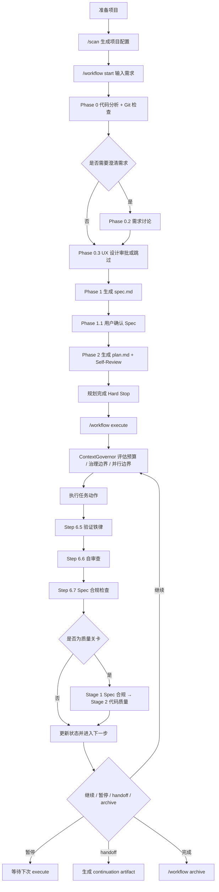

# @justinfan/agent-workflow

以 `workflow` command 入口 + 专项 workflow skills 为核心的多 AI 编码工具工作流工具集。

它提供一套可移植的 Skills 体系，用于把需求从“自然语言描述”推进到“Spec / Plan / 可执行任务”，并支持 Claude Code、Cursor、Codex、Gemini CLI、Droid 等多种 AI 编码工具。

---

## 核心能力

- `workflow`：主线 workflow command，覆盖代码分析、需求讨论、UX 设计审批、Spec 生成、Plan 生成、执行治理与归档
- `scan`：扫描项目技术栈并生成项目配置
- `debug`：结构化定位与修复单点问题
- `diff-review`：基于 diff 的代码审查
- `write-tests`：补齐单元测试 / 集成测试
- `bug-batch`：批量缺陷分析、去重与修复编排
- `figma-ui` / `visual-diff`：Figma 到代码与视觉还原验证
- `dispatching-parallel-agents`：对同阶段 2+ 独立任务做并行子 Agent 分派

---

## workflow 的当前模型

当前 `workflow` 采用“**command 入口 + 专项 workflow skills + 共享运行时**”的结构：

- `templates/commands/workflow.md`：保持 `/workflow start|execute|delta|status|archive` 的稳定公共 command 入口
- `workflow-planning`：承接 `/workflow start` 的规划阶段说明
- `workflow-executing`：承接 `/workflow execute` 的执行阶段说明
- `workflow-reviewing`：承接两阶段审查协议（由 execute 内部触发，不直接暴露成 action）
- `workflow-delta`：承接 `/workflow delta` 的增量变更说明

在此结构下，工作流仍保持三层工件模型：
- `spec.md`：统一承载范围、架构、约束、验收标准与实施切片
- `plan.md`：可直接执行的原子步骤、文件清单与验证命令
- 执行层：按计划产出代码，并经过验证与两阶段审查

相比旧版基于 `baseline / brief / tech-design / spec / plan` 的多文档链路，当前版本更强调：

- 单一 `spec.md` 作为规划阶段的权威规范
- `plan.md` 必须可直接执行，禁止占位式描述
- `execute` 采用 budget-first governance，由 `ContextGovernor` 决定继续、暂停、并行边界或 handoff
- 质量关卡任务执行两阶段审查：先做 Spec 合规，再做代码质量

---

## 推荐安装方式

当前推荐直接克隆仓库后执行同步命令：

```bash
git clone <repo-url> claude-workflow
cd claude-workflow
npm install
npm run sync
```

常用变体：

```bash
# 同步到指定 Agent
npm run sync -- -a claude-code,cursor

# 项目级安装
npm run sync -- --project

# 无交互同步到所有已检测到的 Agent
npm run sync -- -y
```

同步完成后，建议先执行：

```bash
/scan
/workflow start "需求描述"
/workflow execute
```

---

## workflow 主线命令

```bash
/workflow start "需求描述"
/workflow start docs/prd.md
/workflow start --no-discuss docs/prd.md

/workflow execute
/workflow execute --retry
/workflow execute --skip

/workflow status
/workflow status --detail

/workflow delta
/workflow delta docs/prd-v2.md
/workflow delta "新增导出功能，支持 CSV"

/workflow archive
```

含义如下：

- `start`：启动规划流程，生成 `spec.md` 与 `plan.md`
- `execute`：按 `plan.md` 推进执行，并经过验证与审查
- `status`：查看当前状态、进度与下一步建议
- `delta`：处理 PRD / API / 需求增量变更
- `archive`：归档已完成工作流

---

## 当前核心流程图



---

## 适用场景

优先使用 `workflow` 的场景：

- 新功能开发
- 多阶段交付
- 复杂重构
- 长 PRD 或高约束需求
- 需要显式用户确认 Spec 的任务
- 需要中断恢复、增量变更或并行子 Agent 分派的任务

如果只是单点问题，也可以直接使用专项 skill：

- 单 Bug：`/debug`
- 单次审查：`/diff-review`
- 单次分析：`/analyze`
- 单次补测：`/write-tests`
- UI 还原：`/figma-ui`

---

## 支持的 AI 编码工具

当前支持 10+ AI 编码工具，包括：

- Claude Code
- Cursor
- Codex
- Gemini CLI
- GitHub Copilot
- Kilo Code
- OpenCode
- Qoder
- Antigravity
- Droid

---

## 更多文档

如需查看更完整说明，可参考：

- `Claude-Code-工作流体系指南.md`
- `templates/commands/workflow.md`（统一 command 入口）
- `templates/skills/workflow-planning/SKILL.md`
- `templates/skills/workflow-executing/SKILL.md`
- `templates/skills/workflow-reviewing/SKILL.md`
- `templates/skills/workflow-delta/SKILL.md`
- `templates/specs/workflow-runtime/state-machine.md`

---

## 开发与发布

```bash
# 校验发布内容
npm run prepublishOnly

# 发布
npm run release:patch
npm run release:minor
npm run release:major
```
