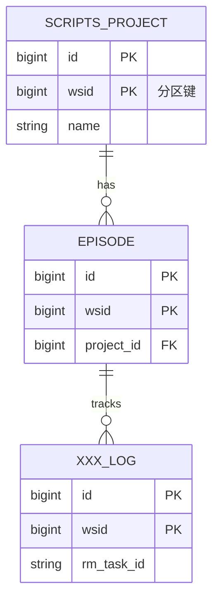
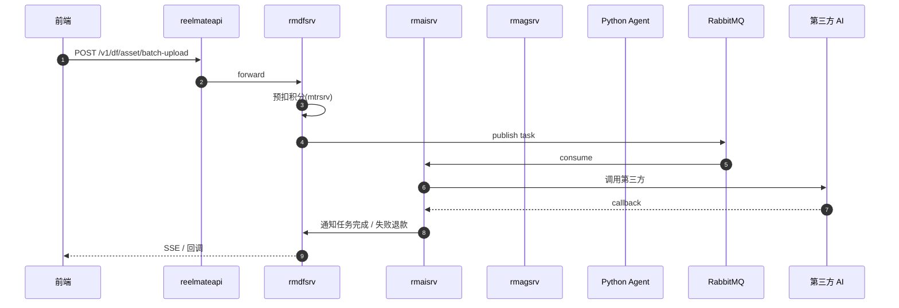
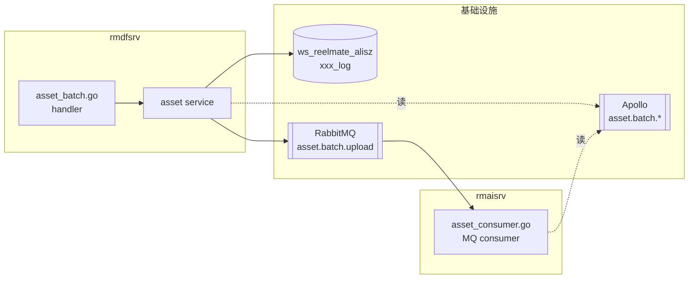

# 技术方案模板

> 由 `/design-plan` skill 使用。落盘到 `docs/designs/{slug}-{YYYYMMDD}.md`。
>
> 阶段一文档**锁定方案**;实施差异由 `/plan-archive` 在阶段三回写到本文档 § 9 章节,不修改 § 1-8 原方案内容。

---

# {需求标题}

| 字段 | 值 |
| --- | --- |
| Slug | `{slug}` |
| Date | `{YYYY-MM-DD}` |
| Version | `1.0.0`(语义版本:major=方案推翻重做 / minor=章节增补 / patch=措辞订正) |
| Status | `Draft` → `Reviewed` → `Approved` → `Implemented`,或 `Cancelled` / `Superseded by <slug>` |
| Author | `{tech lead 姓名}` |
| PRD Source | `{钉钉 / 飞书 / Notion / Confluence URL}` 或 `inline:<一句话需求>` |
| Related ADR | `{ADR-XXX 或 待定}` |
| Supersedes | `{被本方案替代的旧 slug,空白即无}` |
| Superseded By | `{替代本方案的新 slug,空白即无;由后续 design-plan 反向回填}` |

> **PRD Source 必填**。这是阶段二 `/workflow-spec` 回溯原始需求的唯一锚点 —— 设计文档是 PRD 的浓缩版,实施时若遇歧义,模型按此链接回钉钉 / 飞书取深度上下文,不需要用户在命令行二次传 URL。

## 1. 背景与目标

**PRD 原文链接**:`{钉钉 / 飞书 / Notion URL}`(必填,与上方 PRD Source 一致;无原文则填 `inline:<一句话需求>`)

**业务场景**:一句话说清楚为什么做这件事。

**量化目标**:
- 预期 QPS / TPS:
- 预期数据量 / 增长速率:
- SLA(P99 响应时间 / 可用性):
- 上线时间窗口:

**非目标**:本次**不**解决什么(避免范围蔓延)。

## 2. 接口设计

> 对齐 `docs/contracts.md` 前缀约定:`/v{ver}/{service-short-name}/{business}`。Method 语义:GET 查询 / POST 创建写入 / PUT 全量更新 / DELETE 删除。Header 必带 `X-User-Id`(wsid) / `X-Prod-Id`(pid) / `X-Space-Id`(space_id)。

| # | 路径 | Method | 服务 | 业务说明 | 鉴权 | 幂等性 | 兼容性 |
| --- | --- | --- | --- | --- | --- | --- | --- |
| 1 | `/v1/df/asset/batch-upload` | POST | rmdfsrv | 批量上传素材 | wsid | 否 | 新增 |
| 2 | ... | ... | ... | ... | ... | ... | ... |

> **兼容性**填 `新增` / `破坏性` / `灰度`。破坏性变更(改 Method 语义 / 删改字段 / 改鉴权)必须列**下游 consumer + 迁移窗口**。关键路径选择(路由风格 / 同步 vs 异步 / 鉴权方式)附一句 `备选 → 否决理由`,非不可逆决策也留取舍痕迹。

**关键接口请求 / 响应**(逐个列):

### 2.1 `<METHOD> <path>`

请求体:
```json
{
  "field_a": "...",
  "field_b": 0
}
```

响应体:
```json
{
  "code": 0,
  "msg": "ok",
  "data": { }
}
```

错误码:对齐各服务错误构造器(见 `docs/contracts.md`),fail_type / fail_msg 必填。

## 3. 数据库设计

> 大表查询必须带 wsid 分区键;`task` 表加 rm_task_id;`episode_parse_*` 加 ep_parse_id。新建表必须标注写权威服务(对齐 `docs/architecture/README.md § 数据归属`)和读服务清单。关键建模选择(存储选型 / 索引 / 分区数 / 是否独立建表)附一句 `备选 → 否决理由`。

### 3.1 新增 / 变更表清单

| 库 | 表 | 操作 | 写权威服务 | 读服务 |
| --- | --- | --- | --- | --- |
| `ws_reelmate_alisz` | `xxx_log` | NEW | rmdfsrv | rmaisrv / rmkdssrv |
| `ws_reelmate_alisz` | `task` | ALTER | rmaisrv | (跨服务读) |

### 3.2 表结构详情(逐表)

#### `<table_name>` (NEW / ALTER)

```sql
CREATE TABLE `xxx_log` (
  `id` bigint NOT NULL AUTO_INCREMENT,
  `wsid` bigint NOT NULL COMMENT '租户 ID,分区键',
  `rm_task_id` varchar(64) NOT NULL DEFAULT '' COMMENT '业务任务 ID',
  `field_a` varchar(255) NOT NULL DEFAULT '',
  `created_at` datetime NOT NULL DEFAULT CURRENT_TIMESTAMP,
  `updated_at` datetime NOT NULL DEFAULT CURRENT_TIMESTAMP ON UPDATE CURRENT_TIMESTAMP,
  PRIMARY KEY (`id`, `wsid`),
  KEY `idx_wsid_task` (`wsid`, `rm_task_id`)
) ENGINE=InnoDB DEFAULT CHARSET=utf8mb4
  PARTITION BY LINEAR HASH (wsid) PARTITIONS 64;
```

**分区键自检表**(每张表填):

| 表名 | 分区键 | 是否大表 | 查询是否必带 wsid | 备注 |
| --- | --- | --- | --- | --- |
| `xxx_log` | LINEAR HASH(wsid, 64) | 是 | 是 | 涉及任务关联,加 (wsid, rm_task_id) 二级索引 |

### 3.4 ER 图(新增/变更表关系)



> 只画**新增 + 直接关联的现有表**。无新表 / 单表无外键关系时本节填 `本次无 ER 关系变化`。

### 3.3 数据迁移 / 回填

- 是否需要 backfill:
- backfill SQL:
- 估算时长 / 是否影响线上:
- 回滚 SQL:

## 4. 系统交互设计



**关键节点说明**:
- HITL 节点:
- 重试节点 + 上限:
- 超时阈值:
- 异步回调路径(对齐 `docs/contracts.md`):

### 4.1 组件视图(C4 component-level)



> 与 § 4 时序图互补:时序图描述**调用顺序**,组件图描述**静态依赖与数据流**。新人看完两张图能在 5 分钟内画出脑图。

## 5. 微服务变更清单(分工预览)

> 阶段二人员分工依据。每行**不**写实现细节,仅列改动范围 + 估时。具体编码由各研发本地用 `/workflow-spec` 引用本文档展开。

| 仓库 | 模块路径 | 改动一句话 | 估时 | 负责人 |
| --- | --- | --- | --- | --- |
| `rmdfsrv` | `modules/api/biz/asset_batch.go` | 新增批量上传 handler + service 层 | 2d | TBD |
| `rmdfsrv` | `migrations/xxx_log.sql` | 新建日志表 + 索引 | 0.5d | TBD |
| `rmaisrv` | `modules/biz/task/asset_consumer.go` | MQ 消费者新增分支 | 1d | TBD |
| `rmaisrv` | `conf/settings.yml` | Apollo 加新 topic | 0.25d | TBD |
| ... | ... | ... | ... | ... |

**总工时估算**:`{N} 人日`,关键路径:`{瓶颈仓库}` → `{瓶颈仓库}`。(估时前扫 `docs/designs/_estimation-log.md` 同类需求"估时 vs 实际"系数校准,不凭空拍)

**阶段二调用提示**(各研发只做自己负责的行,用 inline 字符串 + `范围:` 限定):

```bash
# 例:负责 rmdfsrv asset handler 那行的研发
cd rmdfsrv
/workflow-spec "../docs/designs/{slug}-{YYYYMMDD}.md 范围:§ 5 表第 1 行 rmdfsrv asset_batch.go 批量上传 handler"

# 例:负责 rmaisrv MQ 消费者的研发
cd rmaisrv
/workflow-spec "../docs/designs/{slug}-{YYYYMMDD}.md 范围:§ 5 rmaisrv asset_consumer.go MQ 消费者"
```

`范围:` 关键字照抄本表对应行(章节号 / 仓库 / 模块路径任一即可),工具按关键字定位,不会跑偏到其他模块。

## 6. 配置 / Apollo / MQ / Agent 影响

> 密钥 / AI Key / DB 密码 / 回调 URL **不进代码**,全走 Apollo。

### 6.1 Apollo

| 命名空间 | Key | 用途 | 默认值 | 环境差异 |
| --- | --- | --- | --- | --- |
| `application` | `asset.batch.max_size` | 批量大小上限 | `100` | 无 |
| `secrets` | `xxx.api_key` | 第三方 API Key | (Apollo) | 是 |

### 6.2 MQ

| Topic | 生产服务 | 消费服务 | 重试策略 |
| --- | --- | --- | --- |
| `asset.batch.upload` | rmdfsrv | rmaisrv | 3 次,指数退避 |

### 6.3 Agent 影响

- 是否新增 Agent 任务类型:
- 是否走 rmagsrv 转发:
- 是否动 mtrsrv 积分入口:
- Agent 溯源是否落 `media_agent` PG:

## 7. 风险与回滚

| # | 风险 | 等级 | 缓解 / 回滚方案 |
| --- | --- | --- | --- |
| 1 | DDL 锁表 | 高 | 灰度凌晨执行 + DBA 审核 + 在线 DDL 工具 |
| 2 | MQ 积压 | 中 | 限流 + 降级开关(Apollo) |
| 3 | 第三方 API 不稳 | 中 | 熔断 + 失败退款流水 |

**灰度策略**:`wsid % 100 < N` 控制白名单,Apollo 动态调整。

**回滚方案**:
- 接口:Apollo 关闭新接口入口
- DB:回滚 SQL(见 § 3.3)
- 流量:切回旧路径

**验收口径**(上线判定标准,承接阶段二 E2E):
- 关键链路 E2E 场景:`bash docker.sh {需求编号} {服务列表}` 覆盖的跨服务场景清单
- 上线后观测指标 + 判定:`<指标达标 = 成功 / 触发回滚阈值>`

## 8. 关联 ADR

> 若本次有 hard-to-reverse 决策(服务拆分 / DB 选型 / 写权威翻转 / 协议变更 / 跨域改造),起草 ADR 草稿。沿用 `docs/architecture/adr/template.md` 五段(Context / Decision / Consequences / Alternatives / References)。是否独立成文,由 `/plan-archive` 阶段判定。

### ADR 草稿(若有)

**Context**:
**Decision**:
**Consequences**:
**Alternatives Considered**:

或:`本次无 hard-to-reverse 决策,无需新建 ADR。`

---

## 9. 实施回写(由 /plan-archive 填,设计阶段保留空白)

> 本节由阶段三 `/plan-archive` 在所有模块研发上线后,根据实际代码改动回写。设计阶段**保留占位**,不要在阶段一填充。

### 9.1 实际状态
- 状态:`Implemented` / `Partial` / `Cancelled`
- 上线日期:
- Commit 范围:`<since>..<head>`

### 9.2 与设计差异
- 接口差异:
- 数据库差异:
- 时序差异:
- 微服务变更清单差异:

### 9.3 关联 PR / Commit
- rmdfsrv: PR #xxx (commit `abcdef`)
- rmaisrv: PR #xxx (commit `123456`)

### 9.4 项目级文档回写
- `docs/architecture/README.md`:`<已更新章节 / 无变化>`
- `docs/architecture/glossary.md`:
- `docs/contracts.md`:
- `docs/engineering/rules.md`:
- `docs/runbooks/README.md`:
- `docs/assets/万兴剧厂概要设计.md`:
- 新建 ADR:`docs/architecture/adr/{NNN}-{slug}.md`(若有)

<!-- archived from /plan-archive @ {commit-range} -->

---

## 10. 修订历史(append-only)

> 每次修订追加一行。**不删除旧行,不修改既有行**。git history 是真源,本表承载"为什么这次升版"的语义注解。

| 日期 | Version | Status | 修改人 | 摘要 |
| --- | --- | --- | --- | --- |
| `{YYYY-MM-DD}` | `1.0.0` | `Draft` | `{author}` | 初稿 |
| `{YYYY-MM-DD}` | `1.1.0` | `Reviewed` | `{author}` | 评审反馈:接口路径调整 / 加 ER 图 |
| `{YYYY-MM-DD}` | `1.1.1` | `Approved` | `{author}` | 措辞订正,方案锁定 |
| `{YYYY-MM-DD}` | `1.2.0` | `Implemented` | `/plan-archive` | 阶段三回写 § 9 实施差异 |

**版本规则**:
- `major`(x.0.0):方案推翻重做(接口语义变 / 写权威翻转 / 时序重设计)。需要重新评审
- `minor`(1.x.0):章节增补 / 新增表或接口 / 新增风险项。允许在评审反馈中升
- `patch`(1.0.x):措辞订正 / typo / 链接修复。无需重审
