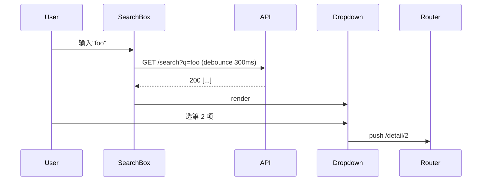

<CONTEXT>
Read `core/specs/shared/glossary.md`（产出 normative spec 内容须用 canonical 术语）。
</CONTEXT>

# ux-elaboration

> 前端设计深化——在已有 Spec §4.1-4.3 基础上生成 §4.4 UX & UI Design。

<HARD-GATE>
1. 必须有已扩写的 Spec（含 §4.1-4.3）作为输入
2. 主会话 vision 只输出 LayoutAnchor 写入 §4.4.3，不解 designContext / 不写其他项目文件
3. 布局提取只做区域级别识别，不做像素级还原（像素级还原是 `/figma-ui` 的活）
4. ASCII wireframe 表达"形状 + 比例"，不替代设计稿——pending 时不编造
</HARD-GATE>

## Checklist

1. ☐ 定位 Spec 文件 + 验证前置章节
2. ☐ § 4.4.1 User Flow（Mermaid flowchart + sequenceDiagram 按需）
3. ☐ § 4.4.2 Page Hierarchy（页面层级表，含「关键交互」列）
4. ☐ 设计稿策展（人工，一次性贴入设计源构建 DesignSourceMap）
5. ☐ § 4.4.3 Page Layout Summary（布局表 + ASCII wireframe + 截图引用，skip existing）
6. ☐ Self-Review（UX 一致性检查）

---

## Step 1: 定位 Spec + 验证前置

**入口参数**（直接调用时，`workflow-spec` 委托不传）：

| 参数 | 含义 |
|---|---|
| `--design <dir>` | 截图目录，自动列文件作为候选 |

> `workflow-spec` Step 6 委托 ux-elaboration 时**不传**设计源参数——PRD 中的图片/URL 不一定是布局参考，需要人在 Step 4 显式策展。

**输入来源**（按优先级）：
1. 活跃 workflow → 读取 `workflow-state.json` 中的 `spec_file`
2. 用户指定路径 → `/ux-elaboration path/to/spec.md`
3. 无参数 → 搜索 `~/.claude/workflows/{projectId}/specs/` 下最新 spec

**验证**：
- §4.1 Primary Flow 非空（推导 User Flow 的依据）
- §5.1 Module Responsibilities 非空（确认 module 划分）
- §4.4 章节为空或仅含模板占位（已 priming 过的迭代场景应走 `/figma-ui`）

**验证失败时（错误信息分流）**：
- §4.1 / §5.1 缺失或为空 → 告知"先完成 Spec 核心章节再回来"
- §4.4 已有非占位内容 → 告知"已 priming 过，设计迭代请走 `/figma-ui`；若确认要重做，先手动清空 §4.4"

## Step 2: § 4.4.1 User Flow

主会话生成 Mermaid 用户操作 flowchart，≥ 3 个场景：

| 场景 | 必须覆盖 |
|------|---------|
| 首次使用 | 新用户引导路径、空状态处理 |
| 核心操作 | 入口到完成核心功能 |
| 异常/边界 | 操作失败、数据为空、权限不足 |

Edit 写入 spec.md § 4.4.1。

### 时序密集场景追加 sequenceDiagram（可选）

flowchart 表达跳转，不表达时序。满足以下任一条件的页面/流程，§4.4.1 末尾追加 Mermaid `sequenceDiagram` 子节：

- 单次用户操作触发 ≥ 3 次前后端往返（如搜索 + 防抖 + 联想 + 详情预取）
- ≥ 2 个组件协作（如下拉选择联动表单字段、Drawer 内表单提交后通知列表刷新）
- 涉及竞态/取消语义（如快速切 tab 时上一个请求需要丢弃）

示例：



不满足条件的页面**不要**勉强画——flowchart 就够。

## Step 3: § 4.4.2 Page Hierarchy

填写页面层级表，L0 module 不超过 4 个。

输出格式：

```markdown
| 层级 | 模块 | 页面 | 变更类型 | 关键交互 | 说明 |
|------|------|------|---------|---------|------|
| L0 | Dashboard | DashboardPage | new | 搜索(防抖+联想)、卡片多选 | 数据概览 |
| L1 | Dashboard | DetailPanel | new | Drawer 抽屉、表单 inline 校验 | 详情面板 |
| L0 | Settings | SettingsPage | new | — | 纯展示 |
```

**「关键交互」列规则**：

- 只列**该页面非主路径必须处理**的交互（loading/error/empty 不入——是 frontend convention 通则）
- 一句话点到为止（如 `搜索(防抖+联想)`、`拖拽排序`、`键盘快捷键`、`Drawer + 表单提交触发列表刷新`）
- 无非主路径交互的纯展示页填 `—`
- 不写参数（"防抖 300ms"、"hover 200ms"）——参数留给实现/code-spec

作用：plan 拆 task 时当 hint，提醒非主路径不要漏；细节归 figma-ui 阶段对照设计稿确定。

Edit 写入 spec.md § 4.4.2。

## Step 4: 设计稿策展（人工）

ux-elaboration 是一次性 priming，设计源**由用户在本 Step 显式提供**——不自动扫 PRD/对话上下文（PRD 中的图片不一定是布局参考，需人筛选）。

> 单 frame Figma URL 通过 `figma-data screenshot` 命令只取 PNG，**不解 designContext**（designContext 是 `/figma-ui` 的活）。顶层文件 URL + 自动 frame 匹配路径不支持——真实 frame 名（如 "Dashboard v3 final"、"[WIP] Screen 2"）与 Page Hierarchy 页面名 fuzzy match 命中率低，失败回退成本大于直接贴单 frame URL。三种输入（单 frame URL / 附件 / 路径）最终统一走主会话 vision over PNG。

**不调 AskUserQuestion**（同 `/workflow-spec` Step 6、`/quick-plan` 风格）。展示 Page Hierarchy 后等用户一次性贴入设计源，AI 归一化。

### 自动收集（无询问）

1. 入口参数 `--design <dir>` → 直接进 DesignSourceMap
2. 项目根 `.claude/design/` 或 `docs/design/` 下的图片文件 → **列为候选**（不自动纳入），展示给用户选

### 主会话提示模板

```
🎨 需要 priming 的页面（已 skip existing）：
- <PageA> (new)
- <PageB> (modify)
- <PageC> (new)

请一次性提供设计源，任选组合：
- 单 frame Figma URL（每行一个，带 node-id 参数，可加页面名前缀如「列表页: <url>」）
- 截图附件（直接贴在回复里）
- 截图路径或目录
- 候选：.claude/design/ 下识别到 <N> 个文件，需用请说"用候选"
- 跳过："全部跳过" / "跳过 <PageX>"
```

### 用户回复归一化（一回合完成 DesignSourceMap）

| 用户输入 | 处理 |
|---|---|
| 单 frame Figma URL | 按用户标注（如「列表页: <url>」）优先，否则按 URL 顺序与 Page Hierarchy 顺序匹配。URL 必须含 `node-id` 参数，缺失则提示用户重贴 |
| 图片附件 | 按 4 层优先级匹配：<br>(1) 用户标签「列表页: [img]」→ 直接落位<br>(2) 文件名 fuzzy match（如 `dashboard.png` → DashboardPage）<br>(3) 附件顺序 ↔ Page Hierarchy 顺序（位置回退，标 ⚠️ 强制用户确认）<br>数量不匹配（多/少）显式提示，不静默截断 |
| 路径 / 目录 | `Read` 验证存在；目录则 `ls` 列文件按文件名 fuzzy match 页面名，失败走位置回退（标 ⚠️） |
| `跳过 X` / `全部跳过` | DesignSourceMap 对应页面标 `infer` |

AI 归一化后**始终展示匹配结果给用户复核**，回"OK"继续，或"PageA 换成 img2"这种重映射。

### 缺失补齐（一次自由文本）

部分页面未匹配到设计源时打印：

```
✅ 已匹配：
  - PageA → <frame/file>
  - PageB → <frame/file>
❓ 未匹配：PageC

补充 PageC 的设计源，或回"跳过 PageC"。
```

用户回复后再走一次归一化。仍未匹配 → 标 `infer`，不再追问。

### DesignSourceMap（内存对象）

```typescript
type DesignSource =
  | { type: 'figma_screenshot'; fileKey: string; nodeId: string; url: string }
  | { type: 'screenshot'; imagePath: string }   // 含附件经 Read 拿到的内容
  | { type: 'infer' };
```

> `figma_screenshot` 类型标示"只取单 frame 截图，不解 designContext"——上下文成本降 10-100×，designContext 留给 `/figma-ui`。

## Step 5: § 4.4.3 布局锚点提取（主会话 vision）

**关键原则**：本 skill 只需要区域级布局信息（< 2KB JSON / 页），主会话 vision 直接读截图即可。**不走子 Agent、不解 designContext**——designContext 是 `/figma-ui` 的活，对本 skill 是 10-100× 上下文浪费。

**Skip 条件**：Page Hierarchy 中 `existing` 页面跳过，只对 `new` 和 `modify` 跑提取。`existing` 在 §4.4.3 表格写一行 `existing — see code (<path>)`，不展开区域。

### 按来源走 vision

| sourceType | 主会话动作 |
|---|---|
| `figma_screenshot` | 调 `node <figma-cli> screenshot --url <url>` 拿单 frame PNG → `Read` → vision 识别 |
| `screenshot` | `Read` 路径或消费消息附件 → vision 识别 |
| `infer` | 凭 §4.1 Primary Flow 和 §5.1 推断，标 `confidence: low` |

### LayoutAnchor 输出（主会话内联，无子 Agent）

```json
{
  "pageId": "DashboardPage",
  "sourceType": "figma_screenshot",
  "confidence": "high",
  "regions": [
    { "name": "Header", "layout": "flex-row", "height": "64px" },
    { "name": "Sidebar", "layout": "flex-column", "width": "280px" },
    { "name": "Content", "layout": "grid-3col", "gap": "24px" }
  ],
  "dimensions": { "maxWidth": "1440px", "padding": "24px" },
  "responsive": { "breakpoint": "1024px", "behavior": "collapse-sidebar" },
  "keyComponents": ["StatCard", "ChartPanel", "DataTable"]
}
```

`confidence` 由主会话 AI 自评：
- `high`：vision 识别清晰、区域边界明确
- `low`：截图模糊 / 区域不确定 / `infer` 路径
- **vision 完全跑飞**（识别不到结构 / 给的是渲染图非 UI）→ 不写 LayoutAnchor，§4.4.3 该行写 `pending — 需人工补充`，§9 Open Questions 加一条

### 写入 §4.4.3

机器读的表（figma-ui 消费）+ 人读的 ASCII wireframe + 截图引用（reviewer 对照）三件套。

**布局表**：

```markdown
| 页面 | 变更 | 主要区域 | 布局模式 | 关键组件 | 来源 | 置信 |
|------|------|---------|---------|---------|------|------|
| DashboardPage | new | Header + Sidebar(280px) + Content(grid-3col) | Flex | StatCard, ChartPanel | Figma 截图 | high |
| DetailPanel | modify | Header + 三栏 | Grid | DataTable | 截图 | low ⚠️ |
| EmptyState | new | — | — | — | pending | — |
| LegacyPage | existing | see code (apps/x/Legacy.vue) | — | — | — | — |
```

**ASCII wireframe**：表后逐行追加，仅 `new` / `modify` 行必须，`existing` / `pending` 跳过。主会话 vision 已读过截图，输出 box-drawing 草图近零成本。规则：

- 用 `┌─┐ │ └─┘ ├─┤ ┬ ┴` 字符；标 width/height 仅在 sidebar / header 等约束区
- 区域名与布局表第 3 列一致，便于人眼对照
- 不画细节（按钮文案、图标），只表达**形状 + 比例**

示例：

````markdown
**DashboardPage**

```
┌─────────────────────────────────────────┐
│ Header                            [User]│  64px
├──────┬──────────────────────────────────┤
│      │ ┌─────┐ ┌─────┐ ┌─────┐          │
│ Side │ │Stat │ │Stat │ │Stat │          │
│ 280  │ └─────┘ └─────┘ └─────┘          │
│      │ ┌──────────────────────────────┐ │
│      │ │ Chart                        │ │
│      │ └──────────────────────────────┘ │
└──────┴──────────────────────────────────┘
```

来源：``
````

**截图引用**：DesignSourceMap 中 `figma_screenshot` / `screenshot` 类型在 wireframe 下一行追加 ``。`infer` / `pending` 省略。

`pending` 行不阻塞 plan 生成，但 `/figma-ui` 执行时必须先处理（打开页面前重新询问设计源）。

### 降级

- `figma-data` CLI 不可用（`doctor` 失败）→ 提示用户改贴截图；**不静默 fallback 到 infer**
- 主会话 vision 失败 → 标 pending（同上），**不编造**布局

## Step 6: Self-Review（UX 一致性）

设计深化完成后立即执行。输出分两段:

### 6.1 一致性 Checklist（✅ 表示通过）

- **workflow 完整性** — User Flow 每个步骤在 § 4.1-4.3 有对应描述
- **场景覆盖** — flowchart scenarios ≥ 3（首次使用、核心操作、异常/边界）
- **层级约束** — L0 module ≤ 4 个
- **布局对齐** — § 4.4.3 Page Layout 与 § 4.4.2 Page Hierarchy 页面一一对应
- **wireframe 覆盖** — § 4.4.3 每个 `new`/`modify` 行附 ASCII wireframe；`existing`/`pending` 跳过
- **截图引用** — DesignSourceMap 有 `figma_screenshot`/`screenshot` 源的行附 ``
- **关键交互填写** — § 4.4.2 每行有"关键交互"列内容或显式 `—`
- **与架构一致** — § 4.4 涉及的页面在 § 6 File Structure 有对应文件

### 6.2 Resolved Inconsistencies（可选，有冲突时输出）

单独列出已自动修复的冲突项，前缀 "已修复:"，**不混入 6.1 的 ✅ checklist**。

例:
> 已修复: 截图 2 字段顺序与 PRD 红字 `位置调整至项目名称下面` 冲突，§4.4.3 字段顺序按 PRD 红字落地（项目名称 → 所属成员组 → 画面比例 → 剧目类型），不按截图原始顺序。

无冲突时此段省略。

---

## 与其他 skill 的关系

| skill | 关系 |
|-------|------|
| `workflow-spec` | 上游调用方；Step 5 确认需要前端深化后委托本 skill |
| `figma-ui` | 下游消费方；执行阶段按 § 4.4.3 布局锚点做像素级还原 |
