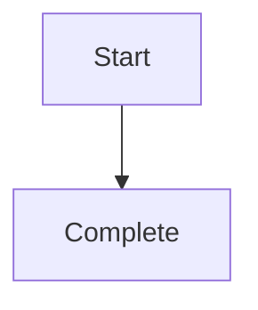

# Spec: {{task_name}}

> 统一规范文档：需求范围 + 设计决策 + 验收标准

## 1. Context

{{context_summary}}

### 1.1 Problem Statement

### 1.2 Assumptions

---

## 2. Scope

### 2.1 In Scope

{{scope_summary}}

### 2.2 Out of Scope

{{out_of_scope_summary}}

### 2.3 Blocked

{{blocked_summary}}

---

## 3. Constraints

> 不可协商的硬约束，来自原始需求或技术限制。

{{critical_constraints}}

### 3.x Project Code Specs Constraints

> 从 `.claude/code-specs/` 提取的与本任务相关的项目级约束（如有）。
> 若 code-specs 目录不存在或无相关内容，删除本小节。

{{code_specs_constraints}}

---

## 4. User-facing Behavior

### 4.1 Primary Flow

{{user_facing_behavior}}

### 4.2 Error and Edge Flows

### 4.3 Observable Outcomes

### 4.4 UX & UI Design（前端任务适用）

<!-- 后端/CLI 项目删除本节 -->

#### 4.4.1 User Flow（Mermaid）

**场景覆盖**（≥ 3 个）：

| 场景 | 描述 | 覆盖节点 |
|------|------|---------|
| 首次使用 | 新用户引导路径 | |
| 核心操作 | 入口到完成核心功能 | |
| 异常/边界 | 操作失败、数据为空、权限不足 | |

#### 4.4.2 Page Hierarchy

| 层级 | 页面名 | 功能module | 导航方式 |
|------|--------|---------|---------|
| L0 | | | |
| L1 | | | |

> L0 module不超过 4 个。

#### 4.4.3 Page Layout Summary

<!-- 由 Step 4.D 设计深化阶段填写。来源：Figma 设计稿 / 截图 / 交互图推断 -->

| 页面 | delta 类型 | 主要区域 | 布局模式 | 关键组件 | 来源 |
|------|---------|---------|---------|---------|------|
| | | | | | |

**布局约束**：

- （响应式断点、最大宽度等）

---

## 5. Architecture and Module Design

{{architecture_summary}}

### 5.1 Module Responsibilities

<!-- 名字来自 glossary。 -->

### 5.2 Data Models

### 5.3 Technology Choices

- 框架 / 库 / 存储选型及理由：

### 5.4 Risks and Trade-offs

<!-- 「无」/「直接做」不算,凑数 → 整段删。 -->

### 5.5 Depth and Seams（条件段）

> **触发规则**：仅当 § 5.1 Module Responsibilities 列出 **≥ 3 个 module**时填写；否则**整段删除**（含 `### 5.5` 标题）。
>
> **本段存在 = 承诺认真填**——不要留 `<高/中/低>` 这种套话，否则对 review 无价值。
>
> 参考 mattpocock/skills 的 `improve-codebase-architecture/LANGUAGE.md` / `DEEPENING.md`；workflow-review Stage 1 的 Depth Heuristics（H1/H2）会优先信任本段声明。

#### 5.5.1 Module Depth Justification

每个 module 按 `core/skills/workflow-review/references/depth-heuristics.md` H1 的 deletion test 判断,每 module 1 行。真实 module 才填,凑数 → 删行。

| Module | 接口方法数 | Deletion test 结论 |
|--------|-----------|--------------------|

允许的 Deletion test 结论值:`分散到 N 个 caller` / `蒸发` / `搬到另一处`。`蒸发`是危险信号——module 是 pass-through,写了就要解释为什么保留。

#### 5.5.2 Seam Strategy（仅当本 spec 引入新抽象接口 / port 时填；否则删除本小节）

每个真实 seam 一行。只有 1 个 adapter 且无计划加第二个 → 不要写本表,改在 § 5.1 内联实现(避免 single-adapter abstraction)。

| Seam（接口名） | Adapter 数量 | 理由 |
|---------------|--------------|------|

<!-- 示例(填写时删除): `OrderRepo | 2 (prod + test fake) | 真实 seam` / `PricingPort | 1 | 暂为 indirection——spec 承诺的第二个 adapter 见 § X` -->

---

## 6. File Structure

{{file_structure}}

---

## 7. Acceptance Criteria

{{acceptance_criteria}}

### 7.1 Test Strategy

<!-- 三层金字塔不必凑齐,不写的层级不列。 -->

---

## 8. Implementation Slices

{{implementation_slices}}

---

## 9. Open Questions & Dependencies

### 9.1 需求澄清记录

<!-- 讨论阶段的澄清结果。每项格式：维度 / 问题 / 答案 / 影响级别 -->

| 维度 | 问题 | 答案 | 影响 |
|------|------|------|------|
| | | | |

### 9.2 方案选择

<!-- 仅当存在互斥实现路径时填写 -->

**选定方案**：

**被排除方案**：

| 方案 | 排除原因 |
|------|---------|
| | |

### 9.3 未解决依赖

<!-- 外部依赖未就绪时填写。对应需求在 § 2 Scope 中标记为 blocked -->

| 依赖 | 类型 | 状态 | 影响 |
|------|------|------|------|
| | | | |

### 9.4 Open Questions

<!-- 不要把已解决的写回来凑数。 -->

