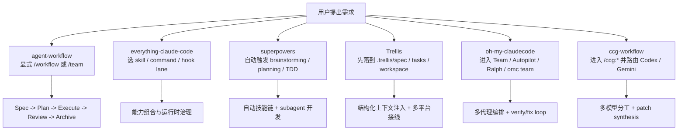
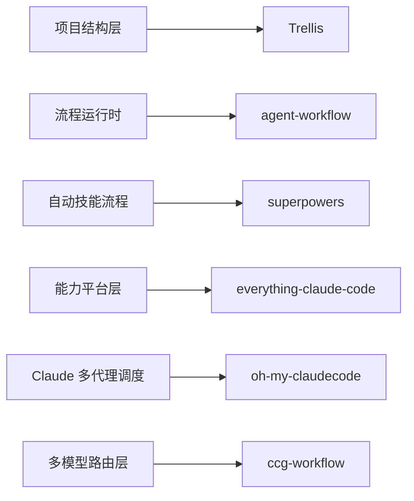

# 6 个 AI 编码工作流项目对比（精简版）

> 对比对象：
> - `@justinfan/agent-workflow`
> - `everything-claude-code`
> - `superpowers`
> - `Trellis`
> - `oh-my-claudecode`
> - `ccg-workflow`

## 1. 一页结论

这 6 个项目都在做「AI 编码增强」，但抽象层完全不同：

- **`@justinfan/agent-workflow`**：偏 **流程运行时**，核心是 `/workflow`、显式 `/team` 与 `/quick-plan`，强调 `spec -> plan -> execute -> review -> archive` 的统一生命周期，并用 shared runtime 维持可恢复执行。
- **`everything-claude-code`**：偏 **超大能力平台**，核心是海量 `agents / skills / hooks / rules / commands / MCP` 的组合分发。
- **`superpowers`**：偏 **自动触发式开发流程**，核心是“技能自动介入”，把 brainstorming、plan、TDD、subagent 开发串成默认行为。
- **`Trellis`**：偏 **仓库内结构层**，核心是 `.trellis/spec`、`.trellis/tasks`、`.trellis/workspace`，把规范、任务、记忆沉淀到项目目录里。
- **`oh-my-claudecode`**：偏 **Claude Code 多代理编排层**，核心是 Team / Autopilot / Ralph / Ultrawork / tmux CLI workers。
- **`ccg-workflow`**：偏 **Claude + Codex + Gemini 多模型路由器**，核心是固定的前后端模型分工与 `/ccg:*` 命令体系。

一句话概括：

| 项目 | 最像什么 |
|---|---|
| `agent-workflow` | 工作流操作系统 |
| `everything-claude-code` | AI 编码增强应用商店 |
| `superpowers` | 自动驾驶式技能工作流 |
| `Trellis` | AI 协作项目骨架 |
| `oh-my-claudecode` | Claude 多代理调度层 |
| `ccg-workflow` | 多模型协作路由器 |

---

## 2. 总对比表

| 维度 | `agent-workflow` | `everything-claude-code` | `superpowers` | `Trellis` | `oh-my-claudecode` | `ccg-workflow` |
|---|---|---|---|---|---|---|
| 核心定位 | 流程型 workflow 产品 | 多 harness 能力平台 | 自动触发式开发 workflow | 多平台 AI 项目结构框架 | Claude 多代理编排层 | Claude 编排 Codex/Gemini 的多模型系统 |
| 核心抽象 | `/workflow` + 显式 `/team` + `/quick-plan` + shared runtime | `agents + skills + hooks + rules + commands` | composable skills 自动触发 | `.trellis/spec/tasks/workspace` | Team / Autopilot / Ralph / `omc team` | `/ccg:*` + Codex/Gemini prompts |
| 入口模式 | 少命令、强协议，主线与辅助命令分层 | 大量命令/技能并存 | 尽量自动触发，少记命令 | `trellis init` 后把结构注入仓库 | CLI + in-session skills 双入口 | `/ccg:*` 显式命令驱动 |
| 安装模型 | canonical + managed-links；skills 逐个挂载，commands 进 `commands/agent-workflow/`，内部资源进 `.agent-workflow/` | plugin + manual + selective install | 插件市场/手工安装，按平台不同 | `trellis init` 生成项目骨架 | marketplace + npm CLI/runtime 双路径 | `npx ccg-workflow` 安装命令/skills/prompts |
| 状态/记忆 | 用户目录 workflow/team runtime state + 项目内 `.claude/specs`/`.claude/plans` 工件 | SQLite state store + sessions/instincts | 更偏流程纪律，轻状态外显 | `.trellis/workspace/` 项目内记忆 | `.omc/state/` + project memory + notepad | `.claude/.ccg` + plan/context/spec 工件 |
| 并行协作 | 显式 `/team` + boundary runtime + `dispatching-parallel-agents` 规则复用 | orchestration/worktree/loop 多 lane | subagent-driven-development | git worktrees + task structure | in-session Team + tmux CLI workers | team 系列 + 外部模型并行 |
| 多模型能力 | 可协作 Codex，但产品中心仍是 workflow/runtime，而非模型路由 | 有 multi-* lane，但非唯一核心 | 不是主打多模型，主打技能流程 | 不是主打模型路由 | 可接 Codex/Gemini，但重心仍是 Claude 编排 | 产品中心就是 Codex/Gemini/Claude 分工 |
| 多工具策略 | 统一投影到 9 个工具 | 多工具原生表面一起打包 | 多平台插件/安装说明 | 单一 `.trellis` 结构适配 13 平台 | 以 Claude Code 为中心，外接 Codex/Gemini CLI | 以 Claude Code 为中心安装 `/ccg:*` |
| 最适合 | 复杂需求、流程治理、团队交付 | 想一次拿到最多能力面 | 想让 agent 自动按“对的流程”做事 | 团队希望把规范/任务/记忆写进仓库 | 想强化 Claude 的多代理执行力 | 想固定前后端多模型协作模式 |

---

## 3. 关键差异流程图

### 3.1 从“需求进入系统”的角度看

### 3.2 从“产品抽象层”看

---

## 4. 最值得关注的 6 个差异点

### 4.1 工作流是否“显式”

- **最显式**：`agent-workflow`、`ccg-workflow`
- **半显式半自动**：`oh-my-claudecode`
- **最自动**：`superpowers`
- **最结构化但不强行接管流程**：`Trellis`
- **能力面最分散**：`everything-claude-code`

### 4.2 抽象中心在哪里

- **流程生命周期**：`agent-workflow`
- **能力资产规模**：`everything-claude-code`
- **技能纪律与行为塑形**：`superpowers`
- **仓库内规范/任务/记忆结构**：`Trellis`
- **多代理执行编排**：`oh-my-claudecode`
- **多模型职责分工**：`ccg-workflow`

### 4.3 项目状态放在哪里

- **用户目录 runtime state**：`agent-workflow`、`everything-claude-code`、`oh-my-claudecode`、`ccg-workflow`
- **项目目录内状态/记忆**：`Trellis`
- **更偏流程行为、较少强调独立状态系统**：`superpowers`

### 4.4 并行策略谁最强

- **团队/边界治理最强**：`agent-workflow`
- **多 lane 最丰富**：`everything-claude-code`
- **默认 subagent 开发最顺滑**：`superpowers`
- **基于任务与 worktree 的团队协作最清晰**：`Trellis`
- **Claude 原生 Team + tmux worker 双轨**：`oh-my-claudecode`
- **外部模型并行分析/执行最强**：`ccg-workflow`

### 4.5 对 Claude Code 的依赖程度

- **Claude 原生最强绑定**：`superpowers`、`oh-my-claudecode`
- **Claude 为主，但强调跨平台**：`agent-workflow`、`everything-claude-code`、`ccg-workflow`
- **平台无关结构层最明显**：`Trellis`

### 4.6 哪个最容易形成产品差异化

- **最容易靠流程语义形成差异化**：`agent-workflow`
- **最容易靠内容规模形成差异化**：`everything-claude-code`
- **最容易靠默认体验形成差异化**：`superpowers`
- **最容易靠团队协作骨架形成差异化**：`Trellis`
- **最容易靠编排体验形成差异化**：`oh-my-claudecode`
- **最容易靠模型组合形成差异化**：`ccg-workflow`

---

## 5. 场景选择建议

| 场景 | 更适合的项目 |
|---|---|
| 我想把需求推进成稳定的 Spec / Plan / Execute 生命周期 | `agent-workflow` |
| 我想先快速拿到可执行计划，再决定要不要进完整状态机 | `agent-workflow` |
| 我想一口气拿到最多 commands / skills / hooks / rules | `everything-claude-code` |
| 我希望 agent 自动按正确流程来，不想记太多命令 | `superpowers` |
| 我想把团队规范、任务、项目记忆沉淀进仓库本身 | `Trellis` |
| 我想把 Claude Code 变成更强的多代理执行器 | `oh-my-claudecode` |
| 我想固定“前端 Gemini / 后端 Codex / Claude 编排”的协作模式 | `ccg-workflow` |

---

## 6. 对当前项目的结论

如果把这 6 个项目放在一起看，**当前项目 `@justinfan/agent-workflow` 的真正差异化不在“功能最多”或“命令最多”**，而在：

1. **把 workflow 当成产品本身**，而不是一堆能力的集合
2. **把 `/team` 做成显式、可治理、可恢复的 runtime**，不是简单的并行分派
3. **同时保留 `/quick-plan` 这类轻量入口**，让简单到中等复杂度任务不必一上来就进入完整状态机
4. **用 canonical + managed-links** 统一多工具分发，并把 commands / 内部资源投影到稳定命名空间
5. **把状态机、contract、doc/runtime 一致性** 当成核心工程约束

所以它更像：

> 一个面向多 AI 编码工具的、强调交付治理、显式团队编排与可恢复运行时的 workflow runtime。

而不是：

> 单纯的技能合集、插件大礼包，或多模型路由器。

---

## 7. 关键判断依据（精简）

- **`agent-workflow`**：`README.md`、`Claude-Code-工作流体系指南.md`、`core/commands/workflow.md`、`core/commands/team.md`、`core/commands/quick-plan.md`、`lib/agents.js`、`lib/installer.js`
- **`everything-claude-code`**：`README.md`、`CLAUDE.md`、`package.json`、`scripts/ecc.js`、`scripts/install-plan.js`、`scripts/install-apply.js`
- **`superpowers`**：`README.md`、`CLAUDE.md`
- **`Trellis`**：`README.md`、`packages/cli/package.json`
- **`oh-my-claudecode`**：`README.md`、`CLAUDE.md`、`package.json`
- **`ccg-workflow`**：`README.md`、`CLAUDE.md`、`package.json`
