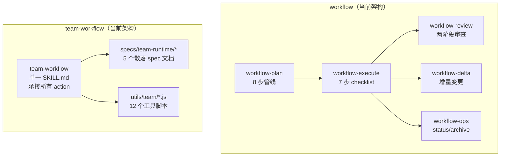
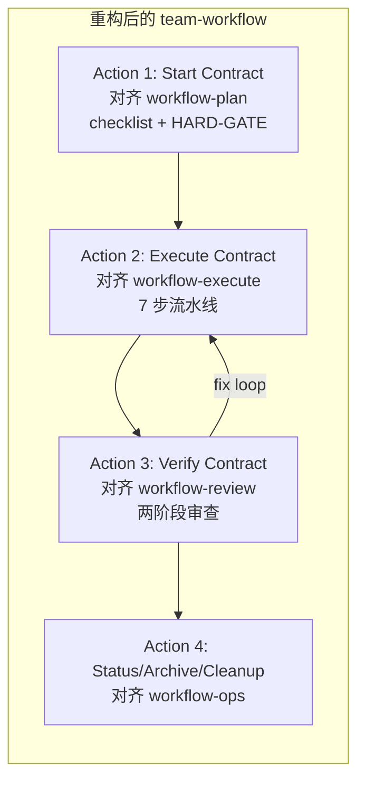

# team-workflow 执行流程与 workflow 对齐方案

## 背景

当前 `team-workflow` 和 `workflow` 是两套**独立演进**的执行体系：

- **workflow** 已完成声明驱动 + CLI 状态机架构重构，拥有成熟的 skill 分层（`workflow-plan` → `workflow-execute` → `workflow-review` → `workflow-delta` → `workflow-ops`），CLI 为状态唯一写入者，SKILL.md 以 checklist + 自然语言行动指南为主。

- **team-workflow** 仍保留大量散落的 runtime spec 文档（`core/specs/team-runtime/*`），没有 skill 分层，缺少声明式 checklist 和 CLI 统一操作面，依赖 AI 直接调用 `lifecycle.js` 等底层函数。

这导致两个系统在**治理模型、状态管理、质量关卡、执行纪律**上存在显著差异。

---

## 现状差异分析

### 执行流程对比



### 逐维度对比

| 维度 | workflow | team-workflow | 差距 |
|------|----------|---------------|------|
| **Skill 分层** | 5 个独立 skill，各自 SKILL.md | 1 个 team-workflow SKILL.md 承接全部 | ❌ 职责过于集中 |
| **CLI 统一** | `workflow_cli.js` 统一入口，所有状态变更走 CLI | `team-cli.js` 入口 → `lifecycle.js` 直调 | ⚠️ CLI 形式存在，但内部不够结构化 |
| **状态机** | 10 状态 + 声明式转换表 | 7 phase + 隐式 `inferTeamPhase()` | ⚠️ phase 推断逻辑散落在代码中 |
| **HARD-GATE** | 每个 skill 有显式 `<HARD-GATE>` 声明 | team-workflow 无 HARD-GATE | ❌ 治理规则缺失 |
| **Checklist** | 每个 skill 有编号步骤 checklist | 仅有 contract 段落描述 | ❌ 执行纪律不对齐 |
| **质量关卡** | 两阶段审查（Stage 1 合规 + Stage 2 质量） | `team-verify` → `team-fix` 但无详细审查协议 | ❌ 审查深度不足 |
| **执行治理** | ContextGovernor + budget backstop | 无对应机制 | ❌ 缺失治理信号 |
| **Post-Execution Pipeline** | 6 步管线（验证→自审→plan→state→审查→journal） | 无结构化后置管线 | ❌ 完成后流程缺失 |
| **Self-Review** | spec/plan/code 各有 self-review | team 无 self-review | ❌ 质量自检缺失 |
| **产物模板** | spec-template.md + plan-template.md | 无结构化模板 | ⚠️ 产物格式不统一 |

### 状态机语义对应

> [!NOTE]
> 两套状态机不是一一映射关系，而是**语义层面的对应**。team 的 phase 粒度更粗，部分 workflow 内部状态在 team 中不存在独立表达。

| team phase | 语义等价的 workflow 阶段 | 差异说明 |
|-----------|------------------------|----------|
| `team-plan` | `planning` | team 的简化规划，无 `idle`/`spec_review` 独立阶段 |
| `team-exec` | `running` | 执行阶段语义一致 |
| `team-verify` | (无直接等价) | workflow 的审查内嵌在 `running` phase 的 `quality_review` task action 中，team 独立为 phase 级别 |
| `team-fix` | `failed` + `--retry` | 修复子循环，workflow 通过 retry 模式处理 |
| `completed` | `completed` | 语义一致 |
| `failed` | `failed` | 语义一致 |
| `archived` | `archived` | 语义一致 |
| (无对应) | `idle` | team 没有空闲态，start 前 runtime 不存在 |
| (无对应) | `spec_review` | team-plan 内部完成，不独立暴露 |
| (无对应) | `paused` / `blocked` | team 无暂停/阻塞独立状态 |

---

## 设计原则

1. **复用优先**：team 的执行应最大化复用 workflow 已有的治理机制（Post-Execution Pipeline、Quality Review），而不是重建一套
2. **声明驱动**：team-workflow 应与 workflow 保持相同的 SKILL.md 架构风格 — checklist + HARD-GATE + 自然语言行动指南
3. **CLI 统一**：team 的所有状态变更通过 `team-cli.js` 完成，内部调用关系与 `workflow_cli.js` 保持对称
4. **独立 runtime 不变**：team-state.json / team-task-board.json 的隔离路径不变，不与 workflow-state.json 合并
5. **skill 分层不强制**：team 场景使用频率低于 workflow，不需要拆成 5 个 skill；但应将 team-workflow SKILL.md **按 action 分区**强化治理
6. **治理轻量化**：ContextGovernor 只做 phase 边界判断，不复用完整 budget backstop（team 的 boundary 执行由 sub-agent 完成，sub-agent 有自己的 context budget）
7. **分阶段实施**：CLI 增强分两阶段交付，第一阶段只实现最核心的 3 个命令

---

## 提案方案

> [!IMPORTANT]
> 不拆分 team-workflow 为多个 skill，而是在单一 SKILL.md 内按 workflow 的模式重写每个 action contract，使其执行纪律对齐。

### 方案概览



---

## 具体变更

### 一、team-workflow SKILL.md 重写

#### [MODIFY] [SKILL.md](file:///d:/code/claude-workflow/core/skills/team-workflow/SKILL.md)

将当前 135 行的概述式文档重写为 **workflow 风格的完整行动指南**（预估 ~400 行）：

**1. 添加 HARD-GATE 区块**

```markdown
<HARD-GATE>
五条不可违反的规则：
1. Start 输出的 spec/plan/board 必须全部落盘且可解析，才允许宣告 start 完成
2. Execute 阶段必须至少存在一个可写 implementer，否则不得推进到 team-exec
3. verify 失败时只允许回流失败边界到 team-fix，不得重跑整个团队
4. 每个 boundary 完成后必须立即更新 board + state，禁止批量回写
5. team-review 未生成且 overall_passed 未确认，不得进入 completed
</HARD-GATE>
```

**HARD-GATE 规则 4 的运行时 enforcement 设计**：

当前规则 1/2/3/5 在代码中已有对应检查（`lifecycle.js` 产物校验、`hasWritableWorker()`、`inferTeamPhase()` 的回流约束、`overall_passed` 检查）。规则 4（禁止批量回写）缺少运行时强制机制，需额外设计：

- 在 `advance` 命令中增加**时间戳一致性检测**：advance boundary B(n) 时，检查 B(n-1) 的 `board.updated_at` 和 `state.updated_at` 是否在 B(n-1) 完成时间之后
- 若检测到前一个 boundary 已完成但 board/state 未更新，`advance` 返回 `{ ok: false, reason: 'stale_checkpoint', stale_boundary: 'B(n-1)' }`
- 此检测为**建议性警告**而非硬阻断（首次实施阶段），后续可根据使用情况升级为硬阻断

**2. Action 1: Start — 对齐 workflow-plan**

添加按序 checklist：

```markdown
## Action 1: Start Contract

### Checklist（必须按序完成）

1. ☐ 解析参数 + 预检
2. ☐ 代码库分析（复用 workflow-plan Step 2 思路）
3. ☐ 生成 team spec.md（简化版，无 UX/讨论阶段）
4. ☐ 生成 team plan.md + team-task-board.json
5. ☐ 初始化 team-state.json + boundary_claims
6. ☐ 🛑 Start 完成（Hard Stop，不自动进入 execute）
```

每个 step 添加具体的 CLI 调用和预期行为，格式与 workflow-plan 对齐。

**3. Action 2: Execute — 对齐 workflow-execute**

引入 workflow-execute 的 7 步结构：

```markdown
## Action 2: Execute Contract

### Checklist（按序执行）

1. ☐ 读取 team runtime 状态（state-first）
2. ☐ Execute Entry Gate（强制校验）
3. ☐ 推断当前 team_phase + 提取可执行边界
4. ☐ 执行边界任务（单/并行）
5. ☐ Post-Execution Pipeline（对齐 workflow-execute 6 步管线）
6. ☐ 判断下一步（继续执行 / 进入 verify / 进入 fix）
```

**关键对齐点**：

| workflow-execute 步骤 | team-execute 对齐 |
|----------------------|-------------------|
| Step 2: state-first | team state-first：先读 team-state.json（CLI `context` 命令） |
| Step 3: ContextGovernor | team 只做 phase 边界判断（`inferTeamPhase()`），不复用完整 budget backstop |
| Step 5: 执行动作 | 边界任务按 board 推进（CLI `next` → 执行 → CLI `advance`） |
| Step 6: Post-Execution Pipeline | 每个 boundary 完成后：验证 → 更新 board → 更新 state → journal |
| Step 7: 下一步决策 | 推断 phase → 继续 / verify / fix |

> [!NOTE]
> team 不需要完整 ContextGovernor 的原因：orchestrator 自身的 context 消耗主要是状态管理（较轻），boundary 执行由 sub-agent 完成，sub-agent 有独立的 context budget。phase 边界判断已由 `inferTeamPhase()` 承担。

**4. Action 3: Verify — 对齐 workflow-review**

引入审查纪律：

```markdown
## Action 3: Verify Contract

### Checklist（按序执行）

1. ☐ 汇总所有 boundary 执行结果
2. ☐ Stage 1：合规验证（team spec 覆盖检查）
3. ☐ Stage 2：集成验证（跨边界接口一致性）
4. ☐ 写入 team_review 结果
5. ☐ 判定：completed / team-fix
```

**5. Action 4: Status/Archive/Cleanup — 对齐 workflow-ops**

添加格式化输出模板和 CLI 调用规范。

---

### 二、team-cli.js 增强（分阶段实施）

#### [MODIFY] [team-cli.js](file:///d:/code/claude-workflow/core/utils/team/team-cli.js)

当前 team-cli.js 只有 94 行，功能过于薄。需增强为与 workflow_cli.js 对称的统一操作面。

#### 第一阶段（本次实施）

| 子命令 | 对齐的 workflow CLI | 实现路径 | 说明 |
|--------|---------------------|---------|------|
| `team-cli.js status` | `workflow_cli.js status` | `lifecycle.cmdTeamStatus` | 已有 ✅ |
| `team-cli.js context` | `workflow_cli.js context` | **直接组装**（只读） | 聚合 team state + board + 下一步 |
| `team-cli.js next` | `workflow_cli.js next` | **直接组装**（只读） | 返回下一个可执行的 boundary |
| `team-cli.js advance <boundaryId>` | `workflow_cli.js advance` | **走 state-manager**（有写） | 完成 boundary 并推进 |

#### 第二阶段（后续迭代）

| 子命令 | 说明 | 延后理由 |
|--------|------|----------|
| `team-cli.js progress` | boundary 进度统计 | 信息可从 `context` 输出中获得 |
| `team-cli.js journal add` | team 级 journal | team 模式当前不常用 journal |

#### 实现路径说明

新增的只读命令（`context`、`next`）**不经过 `lifecycle.js`**，直接在 CLI 层调用 `phase-controller.js` + `state-manager.js` 组装输出。这避免了 700 行的 lifecycle.js 继续膨胀，同时保持了只读操作的轻量性。

写操作命令（`advance`）通过 `state-manager.js` 的原子更新函数完成，不新增 lifecycle.js 函数。

#### 输出 JSON Schema

**`context` 输出**：
```json
{
  "team_phase": "team-exec",
  "status": "running",
  "board_summary": { "total": 5, "completed": 2, "failed": 0, "pending": 3 },
  "next_boundary": { "id": "B3", "phase": "implement", "blocked_by": [] },
  "governance_signals": { "has_writable_worker": true, "phase_transition_pending": false },
  "team_review": { "overall_passed": false, "reviewed_at": null }
}
```

**`next` 输出**：
```json
{
  "boundary_id": "B3",
  "phase": "implement",
  "blocked_by": [],
  "claim_status": "unclaimed",
  "claimable_role": "implementer",
  "dependencies_met": true
}
```

**`advance` 输出**：
```json
{
  "ok": true,
  "advanced_boundary": "B3",
  "new_phase": "team-exec",
  "board_updated": true,
  "state_updated": true,
  "checkpoint_warning": null
}
```

> `advance` 可能返回 `{ ok: false, reason: 'stale_checkpoint', stale_boundary: 'B2' }` 提示前一个 boundary 的 checkpoint 未写入。

---

### 三、team runtime spec 整合

#### specs/team-runtime/ 处理策略

| 文件 | 处置 | 理由 |
|------|------|------|
| `overview.md` | **保留** | 入口定位文档 |
| `state-machine.md` | **保留 + 增强** | 添加与 workflow 状态机的语义对应表 |
| `execute-entry.md` | **整合进 SKILL.md + 保留引用桩** | 内容整合为 Action 2 Step 2，原文件添加重定向头 |
| `status.md` | **整合进 SKILL.md + 保留引用桩** | 内容整合为 Action 4，原文件添加重定向头 |
| `archive.md` | **整合进 SKILL.md + 保留引用桩** | 内容整合为 Action 4，原文件添加重定向头 |

**引用桩格式**（整合后的原文件头部添加）：

```markdown
> ⚠️ 本文档的权威内容已整合至 [`team-workflow/SKILL.md`](../../skills/team-workflow/SKILL.md) Action N。
> 本文件仅作为引用桩保留，防止交叉引用死链。如需修改请编辑 SKILL.md。
```

保留引用桩而非直接删除的理由：`state-machine.md` 和 `overview.md` 中存在对这些文件的交叉引用，完全删除会产生死链。后续统一清理时再一次性处理。

---

### 四、状态机对齐

#### [MODIFY] [state-machine.md](file:///d:/code/claude-workflow/core/specs/team-runtime/state-machine.md)

添加与 workflow 状态机的**语义对应**章节（非一一映射）：

```markdown
## 与 workflow 状态机的语义对应

> 两套状态机不是一一映射关系，而是语义层面的对应。team 的 phase 粒度更粗，
> 部分 workflow 内部状态在 team 中不存在独立表达。

| team phase | 语义等价的 workflow 阶段 | 差异说明 |
|-----------|------------------------|----------|
| `team-plan` | `planning` | team 的简化规划，无 `idle`/`spec_review` 独立阶段 |
| `team-exec` | `running` | 执行阶段语义一致 |
| `team-verify` | (无直接等价) | workflow 的审查内嵌在 `running` phase 的 `quality_review` task 中，team 独立为 phase |
| `team-fix` | `failed` + `--retry` | 修复子循环 |
| `completed` | `completed` | 语义一致 |
| `failed` | `failed` | 语义一致 |
| `archived` | `archived` | 语义一致 |

### 治理信号复用

team-execute 阶段复用以下 workflow 治理机制（轻量化）：
- **Phase 边界判断**：`inferTeamPhase()` 承担 phase 转换决策（不引入完整 ContextGovernor）
- **Post-Execution Pipeline**：boundary 完成后的验证 → 更新 board → 更新 state → journal 流程
- **Quality Review CLI**：team-verify 可复用 `quality_review.js` 的 pass/fail 写入逻辑

> ContextGovernor 的 budget backstop 不复用到 team 层。
> 理由：orchestrator 自身 context 消耗较轻，boundary 执行由 sub-agent 完成，
> sub-agent 有独立的 context budget。
```

---

### 五、phase-controller.js 增强

#### [MODIFY] [phase-controller.js](file:///d:/code/claude-workflow/core/utils/team/phase-controller.js)

- 增加 `getPhaseTransitionReason()` — 返回 phase 转换的原因描述（对齐 workflow 的 decision action 语义）
- 增加 `canEnterPhase(targetPhase, state, board)` — 显式 gate check（对齐 execute-entry.md 的准入条件）
- 优化 `inferTeamPhase()` 的终态检查，添加显式 error 返回（当前只返回 `'failed'` 缺少诊断信息）

---

## 文件变更汇总

### 第一阶段（本次实施）

| 文件 | 操作 | 预估行数 | 优先级 |
|------|------|----------|--------|
| `core/skills/team-workflow/SKILL.md` | 重写 | 135 → ~400 | P0 |
| `core/utils/team/team-cli.js` | 增强（+3 命令） | 94 → ~180 | P0 |
| `core/utils/team/phase-controller.js` | 增强 | 180 → ~250 | P0 |
| `core/specs/team-runtime/state-machine.md` | 增强（语义对应表） | 211 → ~270 | P1 |
| `core/specs/team-runtime/execute-entry.md` | 添加引用桩头 | +3 行 | P1 |
| `core/specs/team-runtime/status.md` | 添加引用桩头 | +3 行 | P1 |
| `core/specs/team-runtime/archive.md` | 添加引用桩头 | +3 行 | P1 |

### 第二阶段（后续迭代）

| 文件 | 操作 | 说明 |
|------|------|------|
| `core/utils/team/team-cli.js` | +2 命令（progress、journal） | 待第一阶段稳定后 |
| `core/utils/team/lifecycle.js` | 拆分评估 | 33KB 单体文件的拆分边界分析 |

---

## 已确认的设计决策

| # | 决策 | 结论 | 理由 |
|---|------|------|------|
| 1 | Skill 拆分 vs 单 Skill 分区 | **不拆分**，单 SKILL.md 按 Action 分区 | team 使用频率低；12 个 utils/*.js 已提供功能分离 |
| 2 | spec 文档整合后原文件处理 | **保留引用桩**，添加重定向头 | 避免 state-machine.md 和 overview.md 的交叉引用死链 |
| 3 | CLI 增强范围 | **第一阶段 3 命令**：context、next、advance | context/next 是 checklist 最常引用的；advance 替代直接调 lifecycle |
| 4 | ContextGovernor 复用深度 | **只做 phase 边界判断**，不复用 budget backstop | orchestrator context 消耗轻；sub-agent 有独立 budget |

## 开放问题

> [!WARNING]
> **lifecycle.js 拆分**：当前 33KB / ~700 行的单体文件是最大技术债务。本方案通过让新增只读 CLI 命令绕过 lifecycle（直接调用 phase-controller + state-manager）来避免进一步膨胀。lifecycle.js 的拆分应作为第二阶段独立任务，建议拆分方向：
> - `lifecycle-start.js`（~200 行，start 相关逻辑）
> - `lifecycle-execute.js`（~300 行，execute/verify/fix 相关逻辑）
> - `lifecycle-ops.js`（~100 行，status/archive/cleanup 相关逻辑）
> - `lifecycle-shared.js`（~100 行，共享工具函数）

---

## 验证计划

### 自动化测试

```bash
# 现有 team 测试回归
node --test tests/test_team_*.js

# phase-controller 增强功能测试
node --test tests/test_phase_controller.js
```

#### phase-controller.js 新增测试场景

| 函数 | 测试场景 | 预期 |
|------|---------|------|
| `canEnterPhase('team-exec', state, board)` | board 为空 | `{ ok: false, reason: 'empty_board' }` |
| `canEnterPhase('team-exec', state, board)` | 无可写 worker | `{ ok: false, reason: 'no_writable_worker' }` |
| `canEnterPhase('team-verify', state, board)` | 仍有 pending implement 边界 | `{ ok: false, reason: 'active_boundaries' }` |
| `getPhaseTransitionReason(board, 'team-exec')` | 所有 implement 完成 | `{ next_phase: 'team-verify', reason: 'all_boundaries_completed' }` |
| `inferTeamPhase()` (增强) | 非法 phase 输入 | `{ phase: 'failed', error: 'invalid_phase: xxx' }` 而非裸 `'failed'` |

#### team-cli.js 新增命令 integration 测试

| 命令 | 测试场景 | 验证点 |
|------|---------|--------|
| `context` | 正常 team-exec 状态 | 输出包含 `team_phase`、`board_summary`、`next_boundary`、`governance_signals` |
| `context` | 无 team runtime | 返回 exitCode 1 + 错误信息 |
| `next` | 有可执行边界 | 返回 `boundary_id` + `claimable_role` |
| `next` | 所有边界完成 | 返回 `{ boundary_id: null, reason: 'all_completed' }` |
| `advance B3` | 正常推进 | 返回 `{ ok: true, board_updated: true, state_updated: true }` |
| `advance B3` | 上一 boundary checkpoint 未写入 | 返回 `{ ok: false, reason: 'stale_checkpoint' }` |

### SKILL.md 结构验证

使用脚本扫描验证 SKILL.md 的完整性：

```bash
# 扫描 SKILL.md 中引用的 CLI 命令是否在 team-cli.js 中注册
node -e "
  const fs = require('fs');
  const skill = fs.readFileSync('core/skills/team-workflow/SKILL.md', 'utf8');
  const cli = fs.readFileSync('core/utils/team/team-cli.js', 'utf8');
  const refs = [...skill.matchAll(/team-cli\.js\s+(\w+)/g)].map(m => m[1]);
  const registered = [...cli.matchAll(/command\s*===\s*'(\w+)'/g)].map(m => m[1]);
  const missing = refs.filter(r => !registered.includes(r));
  console.log(missing.length ? 'FAIL: Missing commands: ' + missing.join(', ') : 'PASS: All commands registered');
"
```

### 手动验证

1. 对照新旧 SKILL.md，确认每个 Action 的 checklist 步骤都有对应的 CLI 命令或明确的行动指南
2. 检查 `team-cli.js` 的 `context`/`next`/`advance` 输出 JSON 是否符合上述 schema
3. 验证 state-machine.md 的语义对应表与 `phase-controller.js` 的 `VALID_PHASES` 集合一致
4. 验证引用桩文件的重定向头能正确指向 SKILL.md 中对应的 Action 段落
